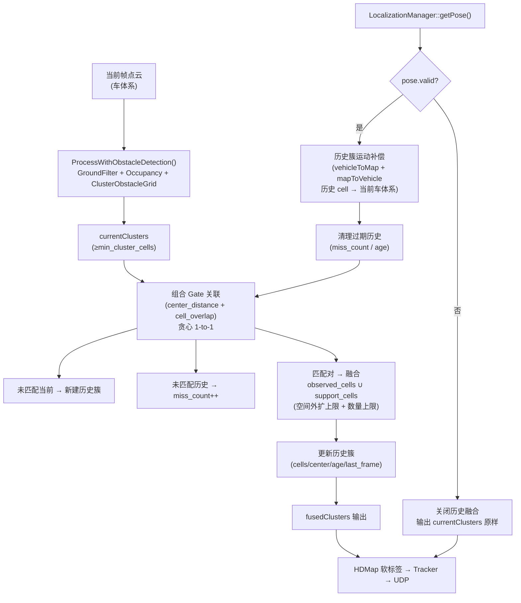
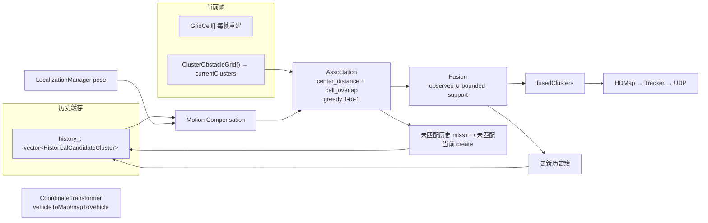

# Historical Candidate Cluster Fusion 设计文档

> 版本：v1.0（仅分析与设计，不修改项目代码）
> 范围：低矮障碍物检测 `ElevationMapGroundFilter` 的 **Grid 层短时时序支持**。
> 明确排除：OBB 算法、单帧聚类基础算法合理性、Track 内部算法。
>
> 标注约定：
> - ✅【已确认】= 已从项目实际代码逐行核实
> - 🧩【推导】= 由已确认代码逻辑推导得出
> - 📐【建议】= 本设计给出的方案（尚未实现）

---

## 1. 背景

当前项目是基于 LiDAR Elevation Map 的低矮障碍物检测系统。生产链路（✅ 已确认，见 `docs/ElevationMapGroundFilter完整分析.md` §2、`include/SuTengDriver.cpp` `ProcessPcapCloud()`）：

```
RS-LiDAR 原始点
  → SuTengDriver::PointCloudTransform（雷达系→车体系 + Body/ROI 过滤）
  → ElevationMapGroundFilter::ProcessWithObstacleDetection()
      → BuildGrid → ComputeSlope → RegionGrowing → GenerateGroundMask
      → ComputeGroundReference → AnalyzeVerticalOccupancy → ClusterObstacleGrid
  → outputClusters（std::vector<GridCluster>）
  → HDMap 软约束打标签（可选）
  → ConvertClustersToTrackedObstacles → m_tracker.update
  → ConvertTrackToS2ObstacleBox → UDP 输出
```

低矮障碍物（路沿石、减速带、石块）通常很小：单帧下只占 4~8 个 Grid Cell，甚至更少（✅ 已确认：当前 `grid_resolution = 0.1 m`、`min_cluster_cells = 3`，见 `config/debug_config.yaml` 与 `ElevationMapGroundFilter.h` 默认值）。因此同一障碍物在不同帧的 `Obstacle Cell → Cluster` 空间形状会发生明显变化（`■■■■/■■` → `■■■/■■■` → …），进而导致 Cluster center / length / width / OBB 角度变化。

当前阶段的结论（与既有分析一致）：**OBB 方向变化主要是单帧 Cluster cell 组成变化导致的**。因此本设计不研究 OBB，而是研究**如何利用历史帧 Candidate Cluster 信息，提高当前帧 Candidate Cluster 在 Grid 层的时序稳定性**。

---

## 2. 当前 ElevationMapGroundFilter 流程摘要

（✅ 已确认，逐行核对 `include/ElevationMapGroundFilter.cpp`）

### 2.1 一帧完整流程

| Step | 函数 | 关键行为 |
|---|---|---|
| 1 | `BuildGrid` | 一次遍历点云，`WorldToGrid` 映射 + ROI 过滤，统计 `min_z/max_z/mean_z/point_num/valid` |
| 2 | `ComputeGroundHeight` | 占位，实际 Ground 高度 = `min_z` |
| 3 | `ComputeSlope` | 每个 valid cell 与 8 邻域的最大坡度 |
| 4 | `RegionGrowing` | BFS 从车前 3 列种子扩展，`label>=0` = 地面区域 |
| 5 | `GenerateGroundMask` | `is_ground = valid && label>=0` |
| 6 | `ComputeGroundReference` | 逐列 ground cell `min_z` 中位数 → 插值 → fallback → 平滑；写 `ground_reference_z`、`top_height` |
| 7 | `AnalyzeVerticalOccupancy` | `height_range` + `layer_histogram` + `occupied_layers` + `top_height` → Rule0/1/2 → `is_obstacle_candidate`；TallNeighbor 反滤；`ReclassifyPointCloud` |
| 8 | `ClusterObstacleGrid` | 8 邻域 BFS 连通 `is_obstacle_candidate`；`size >= min_cluster_cells(3)` 才输出 |

### 2.2 关键数据结构

- `GridCell`（✅ 已确认）：`valid / min_z / max_z / mean_z / point_num / slope / is_ground / height_range / occupied_layers / layer_histogram / ground_reference_z / top_height / is_vertical_structure / is_obstacle_candidate / obstacle_label`。
- `GridCluster`（✅ 已确认）：`id / cell_indices / point_num / min_x..max_z / center_x..center_z / length / width / height / obb_* / has_obb / in_road / map_valid / map_confidence`。

### 2.3 对历史融合最重要的三个事实

1. ✅ **`m_vGridCell` 每帧被 `clear()+resize()` 完全重建**，所有 GridCell 字段不跨帧残留（见既有分析 §9）。
2. ✅ **`GridCluster` 只保存 `cell_indices`（本帧线性索引）+ 聚合统计量，不保存每个 cell 的 `point_num/min_z/max_z/top_height`**（见既有分析 §14、§21）。
3. ✅ **当前没有任何成员持久化 Candidate Cluster 跨帧状态**；`tracker_/tracked_clusters_` 存在但生产路径未使用（`ProcessWithObstacleTracking` 内 Step 10/11 被注释；驱动用自己的 `m_tracker`）。

---

## 3. 当前问题定义

### 3.1 问题

单帧 LiDAR 扫描的离散性导致：同一低矮障碍物在不同帧的 **Obstacle Cell 集合** 形状变化（✅ 已确认这是物理现象，不是 bug）。直接后果：

- Cluster 中心在 cell 级 AABB 意义下轻微漂移（✅ 已确认：`center = (min+max)/2`，由 cell 集合决定）；
- `length/width` 变化；
- 2D PCA 的 OBB 主轴方向变化（本设计不处理）。

### 3.2 实际数据观察（✅ 来自用户提供、与代码行为一致的记录）

| Frame | center_x | center_y | cells |
|---|---|---|---|
| 416 | 4.90 | -0.20 | 6 |
| 417 | 4.75 | -0.20 | 6 |
| 418 | 4.73 | -0.21 | 5 |
| 419 | 4.73 | -0.19 | 5 |
| 420 | 4.63 | -0.21 | 5 |
| 421 | 4.60 | -0.20 | 4 |
| 422 | 4.60 | -0.20 | 4 |
| 423 | 4.57 | -0.19 | 5 |

🧩【推导】分析：

1. **是否吻合车辆运动？** 吻合。x 单调减小（4.90 → 4.57），y 基本稳定（≈ -0.20），符合"车辆前向行驶、静止障碍物在车体系下向后（x 减小）移动"的定性规律。跨 7 帧 x 位移 ≈ 0.33 m，平均 ≈ 0.047 m/帧。
2. **哪些是同一目标？** 在 y 稳定 + x 单调连续的前提下，416~423 的 Cluster 极大概率是同一目标；相邻帧 center 位移 ≤ 0.15 m（416→417），远小于后续 §22 推导的关联阈值 0.5 m。
3. **历史支持能稳定哪些 cell？** 若把 416~418 的 cell 集（经运动补偿）叠加到 419，则 419 的 `5 cells` 之外，历史上存在但本帧缺失的 1~2 个边界 cell 可被"支持"恢复，使 419 的 cell 数接近 6~7，AABB/中心更稳定。
4. **哪些情况不能融合？** 若相邻帧 x 位移远超自车运动预期（如 416→417 出现 > 0.5 m 跳变）或 y 跳变，应判为不同目标/误检，不融合。

> 注意：以上数据只用于验证设计思路，不反向修改算法假设。

### 3.3 核心假设

> 若上一帧与当前帧实际检测到同一障碍物，则上一帧 Candidate Cluster 的部分 Grid Cell 可作为当前帧 Cluster 的短时历史支持，帮助恢复因 LiDAR 离散性造成的空间缺失。

必须满足前提：**先做 ego-motion 补偿 → 再做关联门控 → 匹配后才允许融合**，而不是 `previous_cells + current_cells` 的直接 Union（📐 设计铁律）。

---

## 4. Historical Candidate Cluster Fusion 的目标

1. 提高小目标在 **Grid 层 cell 集合** 的时序稳定性；
2. 稳定 Cluster 的 AABB center / length / width（OBB 作为下游受益者，不在本设计内）；
3. **不**引入复杂多目标跟踪（不引入 Kalman/Hungarian/JPDA/MHT/IMM）；
4. **不**绕过现有 `is_obstacle_candidate` 与 `min_cluster_cells` 约束；
5. **不**让历史信息在无当前观测时制造"幽灵障碍物"；
6. **不**让历史信息无限扩大 Cluster 空间范围。

---

## 5. 坐标系分析

（✅ 已确认，依据 `ElevationMapGroundFilter.cpp` 的 `BuildGrid/WorldToGrid/GridIndexToWorld`、`SuTengDriver.cpp` 的 `PointCloudTransform`、`mapfilter/coordinate_transformer.h/.cpp`）

### 5.1 Grid 的世界坐标如何定义

Grid 建立在 **车体系（主激光雷达系）** 下：
- x = 前向（forward），y = 左向（left），z = 向上（up）。`z<0` 表示低于雷达安装点。

✅ 依据：`BuildGrid` 注释 "x: 前向 (forward), y: 左向 (left)"；`PointCloudTransform` 注释 "雷达系 → 车体系"。

### 5.2 `GridIndexToWorld()` 的含义

`GridIndexToWorld(idx, cx, cy)` 返回 **cell 中心在车体系下的 (x, y)**：

```
row = idx / m_grid_cols; col = idx % m_grid_cols;
cx = m_effective_roi_x_min + (col + 0.5) * grid_resolution;
cy = roi_y_min            + (row + 0.5) * grid_resolution;
```

✅ 已确认（`GridIndexToWorld` 实现）。`+0.5` 使坐标落在 cell 中心。

### 5.3 Grid origin 是否固定

❌ **不固定**。Grid 锚定在 **当前车体系**：

- `m_effective_roi_x_min = max(roi_x_min, car_half_x + body_filter_x_threshold) = max(0.0, 0.8+0.1) = 0.9 m`（✅ 已确认，`BuildGrid` 内计算）。
- `roi_y_min = -3.0 m`。

即 Grid 左下角 origin 是 `(0.9, -3.0)`（车体系）。**车辆一动，整个 Grid 跟着车一起动**。

### 5.4 Grid 是否以当前车辆坐标系构建

✅ **是**。每帧点云先被变换到车体系，再进入 `BuildGrid`。

### 5.5 每帧 Grid 坐标系是否变化

✅ **是**。Grid 的"物理世界覆盖区域"随车辆运动而变化；但 ROI/resolution 固定 → `rows/cols` 每帧相同（当前 60×71，见 §8.3 既有分析）。

### 5.6 项目是否已存在 vehicle pose / localization / ego motion 等

✅ 已存在，列表如下：

| 能力 | 存在位置 | 说明 |
|---|---|---|
| 车辆地图位姿（ENU x/y + heading） | `mapfilter/localization_manager.h/.cpp` | `LocalizationManager::Pose {x, y, heading_deg, timestamp_ms, valid}`；来源 `STR_FUSIONLOC`（`strPoint3fInMap.fX/fY`、`fHeadingInMap`） |
| 车辆系↔地图系转换 | `mapfilter/coordinate_transformer.h/.cpp` | `vehicleToMap` / `mapToVehicle`，含"主雷达系↔融合IMU系"航向补偿 |
| 定位订阅 | `src/main.cpp` `CommInit` | `OpenfusionLocMCClient(FUSIONLOC_MC_PORT)` + `fusionLoc_set` 回调 |
| 每帧读取位姿 | `include/SuTengDriver.cpp` | `LocalizationManager::instance().getPose(loc_pose)`（**但仅包在 `if(m_hdmapEnabled)` 内**） |
| 时间戳 | `SuTengDriver.cpp` | 点云帧时间 `rec_timestamp_ms = msg->timestamp*1000`；定位时间 `ullTimestampModule` |

### 5.7 odometry / ego motion 是否可用于检测路径

✅ **有数据、但当前检测路径没有做 ego-motion 补偿**：

- 点云每帧都在"当前车体系"下重建 Grid，GroundFilter 本身 **不感知车辆运动**；
- 下游 `SimpleTracker` 只用"检测框在车体系下的相邻帧位移"估计速度（`track.vx/vy`），**没有把 ego motion 与目标运动解耦**；
- `LocalizationManager::getPose` 只在 `m_hdmapEnabled` 分支被调用。

🧩【推导】结论：要做历史融合，必须**独立于 HDMap 开关**地每帧获取位姿，并把位姿传给历史融合模块。

### 5.8 能否复用

✅ **可以直接复用**：

- `LocalizationManager::instance().getPose(pose)`：每帧读取最新位姿（`pose.valid` 为帧级有效性）；
- `CoordinateTransformer::vehicleToMap / mapToVehicle`：车辆系↔地图系互逆变换（已在 `hdmap_filter.cpp` 中验证过 `LocalizationManager::Pose → VehiclePose` 的适配写法）。

### 5.9 最合理的 ego-motion 传入方式

📐 **建议**：由 `SuTengDriver`（调用方）每帧读取 `LocalizationManager::Pose`，作为参数/Setter 传入历史融合模块；`ElevationMapGroundFilter` 不直接依赖 `LocalizationManager`（保持其纯算法职责，避免耦合单例）。

两种可选形态（推荐第 1 种）：

1. `ElevationMapGroundFilter` 增加 `SetFramePose(const LocalizationManager::Pose& pose, uint64_t frame_ts_ms)`，把位姿暂存为成员，供融合步骤使用；
2. 新增独立类 `HistoricalClusterFusion`，由 `SuTengDriver` 每帧调用 `fusion.update(currentClusters, pose, frame_ts_ms)`。

> 位姿无效（`pose.valid == false`）→ 本帧关闭历史融合（保留当前单帧结果），并做日志降级（见 §21-12）。

### 5.10 Frame N → Frame N+1 的坐标变换数学表达

设历史帧 k 与当前帧 k+1 的车辆地图位姿分别为：

$$pose_k = (x_k, y_k, \alpha_k),\quad pose_{k+1} = (x_{k+1}, y_{k+1}, \alpha_{k+1})$$

其中 $\alpha = (heading\_deg + gridHeadingOffsetDeg) \cdot \frac{\pi}{180}$（✅ 航向补偿由 `CoordinateTransformer` 内部统一应用）。

由 `coordinate_transformer.cpp` 推导（✅ 已确认公式）：

- 车辆系 → 地图系：

$$P_{map} = B(\alpha_k)\,P_{veh,k} + \begin{bmatrix}x_k\\y_k\end{bmatrix},\quad
B(\alpha)=\begin{bmatrix}\sin\alpha & -\cos\alpha\\ \cos\alpha & \sin\alpha\end{bmatrix}$$

- 地图系 → 车辆系：

$$P_{veh} = A(\alpha)\left(P_{map}-\begin{bmatrix}x\\y\end{bmatrix}\right),\quad
A(\alpha)=\begin{bmatrix}\sin\alpha & \cos\alpha\\ -\cos\alpha & \sin\alpha\end{bmatrix}=B(\alpha)^T=R(\alpha-90^\circ)$$

因此历史 cell 从帧 k 车体系变换到帧 k+1 车体系：

$$P_{veh,k+1} = A(\alpha_{k+1})\left(B(\alpha_k)P_{veh,k} + \begin{bmatrix}x_k\\y_k\end{bmatrix} - \begin{bmatrix}x_{k+1}\\y_{k+1}\end{bmatrix}\right)$$

化简为：

$$\boxed{P_{veh,k+1} = R(\Delta\alpha)\,P_{veh,k} + t}$$

其中：
- $\Delta\alpha = \alpha_{k+1}-\alpha_k$（同一 offset 在两次调用中抵消）；
- $R(\Delta\alpha)=A(\alpha_{k+1})B(\alpha_k)=R(\alpha_{k+1}-\alpha_k)$，是车体系 xy 平面内的 2D 旋转；
- $t = A(\alpha_{k+1})\begin{bmatrix}x_k-x_{k+1}\\y_k-y_{k+1}\end{bmatrix}$。

📐 **实现建议**：逐 cell 调用现成的 `vehicleToMap` + `mapToVehicle`（最简单、已被 HDMap 验证）；需要批量变换时再用上面的矩阵形式一次性构建 $R(\Delta\alpha)$ 与 $t$。

---

## 6. Ego Motion 分析（要点汇总）

| 问题 | 结论 |
|---|---|
| 车辆运动是否影响 Grid 坐标 | ✅ 是，Grid 锚定车体系，车动 Grid 动 |
| 是否已有 ego-motion 可用 | ✅ `LocalizationManager` + `CoordinateTransformer` 已具备 |
| 检测路径当前是否做了补偿 | ❌ 没有 |
| 时间戳是否对齐 | ⚠️ 点云帧时间 `rec_timestamp_ms` 与定位时间 `ullTimestampModule` 不同源；实现时用"处理该帧时最新可用位姿"，并记录两者供诊断 |
| 位姿丢失如何处理 | 📐 关闭融合、保留单帧结果、打印一次降级日志 |

---

## 7. Grid Index 跨帧问题

### 7.1 `idx = row * grid_cols + col` 是否可跨帧直接使用

❌ **不可**。

`idx` 是"当前帧 Grid 内部"线性索引。即使 `rows/cols` 每帧相同（ROI/res 固定），`idx` 也不代表固定世界位置，因为：

1. Grid origin 是车体系 `(m_effective_roi_x_min, roi_y_min)`，随车辆运动；
2. 同一个世界点在不同帧落入不同的 `(row, col)` → 不同 `idx`。

### 7.2 为什么不能直接保存上一帧 index 后在本帧使用

因为上一帧 `idx` 的物理含义是"上一帧车体系下的某个 cell"，而当前帧 Grid 的原点已经随车移动，直接用会导致空间错位（静态障碍物会被错误地"跟车跑"）。

### 7.3 完整转换流程（📐 必须遵守）

```
Previous frame index  idx_prev
   ↓ GridIndexToWorld()（上一帧车体系）
Previous vehicle coordinate  (x_prev, y_prev)
   ↓ ego-motion transform（§5.10）
Current vehicle coordinate  (x_cur, y_cur)
   ↓ WorldToGrid()（当前帧车体系）
Current grid index  idx_cur（或越界 → 丢弃）
```

🧩 越界处理：若 $(x_{cur}, y_{cur})$ 不在当前 ROI（`x∈[0.9,8)`、`y∈[-3,3)`），该历史 cell 对本帧无意义，**直接丢弃**（常见于 Cluster 位于 Grid 边缘，见 §21-13/14）。

---

## 8. Historical Cluster 数据结构设计

### 8.1 必须保存的最小集合

📐 建议 `HistoricalCandidateCluster` 至少保存：

```
history_id          : 稳定历史标识（内部自增，不对外承诺）
last_frame_ts_ms    : 最近一次匹配/创建的点云帧时间戳
first_frame_ts_ms   : 首次出现时间戳
age                 : 累计匹配次数
miss_count          : 连续未匹配次数
cells               : 该簇的 cell 空间位置集合（车体系坐标，存"最近一次匹配帧"的车体系）
center_x, center_y  : AABB 中心（最近一次匹配帧车体系）
min_x,max_x,min_y,max_y : AABB（最近一次匹配帧车体系）
```

### 8.2 方案 A（只存 cell 空间位置）vs 方案 B（存完整 GridCell observation）

| | 方案 A：只存 cell 位置 | 方案 B：存完整 cell observation |
|---|---|---|
| 保存内容 | `(cx, cy)` + 可选 `frame_id` | `(cx, cy, point_num, min_z, max_z, height_diff, top_height, ...)` |
| 优点 | 简单、内存小、语义清晰（"空间支持"）、不会诱导误用观测统计 | 信息完整，未来可做加权/置信度 |
| 缺点 | 无法回放"该 cell 当时多可信" | 复杂、易被误当成"真实观测"写回当前帧、内存大 |
| 是否满足第一阶段目标 | ✅ 满足（目标只是空间稳定性） | 超出第一阶段需要 |

📐 **推荐：方案 A**（第一阶段只存 cell 空间位置 + 帧时间戳）。理由：

1. 历史融合的目标是"空间支持"，不是"观测统计迁移"；
2. `point_num/min_z/max_z` 属于"当时帧的观测"，**不应被伪造进当前帧**（见 §14）；存了反而容易误用；
3. 后续若需要加权，再把方案 B 的字段作为可选扩展加入（数据结构预留即可）。

> 同时明确：**不建议只保存 `cell_indices`（线性索引）**，因为 index 不跨帧（§7）。必须保存**可反算到车体系坐标的空间位置**（cell 中心），或同时保存"cell 中心 + 当帧 grid 参数 + 当帧位姿"三件套。

---

## 9. Cluster Association 设计

输入：
- 运动补偿后的历史簇集合 $H=\{H_i\}$（cell 已投影到当前车体系）；
- 当前帧簇集合 $C=\{C_j\}$（`ClusterObstacleGrid` 输出，已过 `min_cluster_cells`）。

目标：判断 $H_i$ 与 $C_j$ 是否同一障碍物，并做全局 1-to-1 配对。

---

## 10. Center Distance（方法 A）

$$d_{ij} = \lVert C^{center}_{H_i,pred} - C^{center}_{C_j} \rVert_2$$

- ✅ 优点：计算 O(1)、稳定、物理意义直接。
- ⚠️ 缺点：对"两个距离很近的小目标"分辨力弱；对"形状变化导致 AABB 中心漂移"敏感（而本问题恰恰是 cell 组成变化）。
- 🧩 结论：**作为主 gate，但不单独作为唯一判据**。

---

## 11. Cell Overlap（方法 B）

将运动补偿后的历史 cell 与当前 cell **都量化到当前帧 Grid**（用 `WorldToGrid`），比较：

$$overlap = \frac{|H_i \cap C_j|}{\min(|H_i|, |C_j|)}$$

- ✅ 优点：直接度量"空间支撑重合度"，对小目标的 cell 级变化更鲁棒，天然利用 cell 语义。
- ⚠️ 缺点：当历史 cell 集与当前 cell 集恰好错位 1 个 cell 时 overlap 可能为 0（尤其目标仅 3~4 cells 时）。
- 🧩 结论：**作为第二 gate / 确认项**，不建议单独使用。

另两种变体（📐 记录，供扩展）：

$$IoU = \frac{|H\cap C|}{|H\cup C|},\qquad
\frac{|H\cap C|}{\max(|H|,|C|)}$$

第一阶段不采用 IoU（小目标下对并集敏感），采用 $\min$ 归一化。

---

## 12. Association Gate（方法 D：组合 Gate）

📐 **推荐组合 gate**：

```
match(H_i, C_j) 当且仅当：
  (1) d_ij < association_distance_threshold      // 主 gate
  (2) overlap_ij >= cell_overlap_threshold       // 确认 gate（可配置，可设为 0 降级为仅主 gate）
```

理由（🧩 推导）：

1. **中心距离** 能快速排除"明显不同目标"（如 §3 中 5.0→4.0 的异常情况，$d\approx0.9m$ 远超阈值）；
2. **cell overlap** 能在中心距离都通过时，进一步区分"两个近邻小目标"（距离接近但 cell 不重合）；
3. 组合 gate 比单一 gate 更可靠；且两个量都只用 cell 级信息，**不依赖 OBB**。

📐 关联算法（第一阶段）：

```
对每个 (i,j) 计算 d_ij 与 overlap_ij，仅当二者都过 gate 时才进入候选；
按 d_ij 从小到大贪心配对（每个 H 与 C 各用一次，1-to-1）。
```

> 不引入 Hungarian（复杂度低、目标数少；且 §22 已声明不引入复杂跟踪）。若未来目标数显著增多，再替换为全局最优（track.cpp 已有 `hungarianAssignment` 可参考，但第一阶段不依赖）。

---

## 13. Cluster Fusion 设计

对每个匹配对 $(H_i, C_j)$，定义融合产物：

### 方案 A：Cell Union（`history ∪ current`）

- ❌ 缺点：历史错误检测被无条件固化为当前真实 cell；多帧沿运动方向无限扩大（§10 的 5.0→4.9→… 问题）；无衰减、无优先级。
- 🧩 结论：**不采用**。

### 方案 B：只保留重叠区 + 当前（`(history ∩ current) + current` = current）

- 数学上退化为"只保留 current"（因为 `∩` 是 current 的子集，再 `+ current` 仍等于 current），历史信息完全不起作用。
- 🧩 结论：**不采用**（对"恢复缺失 cell"无意义）。

### 方案 C：历史 cell 仅作 "support"，与当前观测 cell 分开保存

📐 **推荐方案 C**，具体语义：

```
observed_cells  = C_j 的 cell（当前帧真实 is_obstacle_candidate，可信）
support_cells   = H_i 的运动补偿 cell 中：
                  (a) 不与 observed_cells 重合；
                  (b) 位于 observed_cells 的 AABB 外扩 max_spatial_expansion 之内；
                  (c) 数量受 max_support_cells 上限约束；
fused_cell_set  = observed_cells ∪ support_cells
```

关键规则：

1. **观测统计（point_num/min_z/max_z/height/top_height）只由 `observed_cells` 计算**，support_cells 不贡献任何观测统计（见 §14）。
2. **输出几何（AABB center/length/width）可由 `fused_cell_set` 计算**，但受 `max_spatial_expansion` 约束，不会无限外扩（见 §22）。
3. support_cells 会被写入下一帧的历史（作为下一帧 $H$ 的 cells），从而形成"短时空间记忆"；但每次都会重新投影 + 重新 gate + 重新约束，天然带衰减（旧的、不再被观测的 support cell 会在空间约束下被自然丢弃）。

> 回答"哪种方案不会把历史错误检测变成当前真实障碍物"：**方案 C**。因为历史 cell 永远以 `support_cells` 身份存在，不写入 `GridCell`、不改变 `is_obstacle_candidate`、不贡献观测统计、且被"必须有当前观测簇 + 空间外扩上限"双重约束。

---

## 14. Current Cell vs Historical Support（架构选择 + point_num 处理）

### 14.1 架构 1：修改 GridCell（写回后重跑 BFS）

流程：历史 cell → 写回当前 `GridCell`（如置 `is_obstacle_candidate=true`）→ 重新 `ClusterObstacleGrid()`。

| 优点 | 缺点 |
|---|---|
| 复用现有 BFS | 历史与当前观测混在一起，难以区分来源；`point_num/min_z/max_z/top_height` 对历史 cell 无值可填；会污染 Ground/Obstacle 判定与 `point_num` 汇总；侵入核心算法 |

🧩 结论：**不推荐作为第一阶段**。

### 14.2 架构 2：Cluster 层融合

流程：当前 `ClusterObstacleGrid()` 结果 + 运动补偿后的历史簇 → 关联 → 融合（§13 方案 C）。

| 优点 | 缺点 |
|---|---|
| 不改核心 Ground/Obstacle 判定；观测与历史清晰分离；可独立测试/关闭 | 不能"救活"已被 `min_cluster_cells` 丢弃的 1~2 cell 小簇（这是刻意保留的约束，见 §19） |

📐 **第一阶段推荐架构 2**。

### 14.3 point_num 等数据处理（必须明确）

📐 **结论：历史融合只影响 Cluster 的"空间结构"，不修改当前 GridCell 的真实观测统计。**

具体：

- 若某 cell 只存在于 `support_cells`（当前无观测）：
  - 它**不进入** `observed_cells`；
  - 它**不参与** `point_num/min_z/max_z/height/top_height` 的聚合；
  - 它只影响 `fused_cell_set` 的空间覆盖（进而影响 AABB center/length/width），并受空间外扩上限约束。
- `point_num` 等字段**始终等于当前帧 `observed_cells` 的统计**（即"单帧真实观测值"），历史不会凭空增加 `point_num`。

> 这样避免"凭空假设 point_num/min_z/max_z"的问题。

---

## 15. 历史生命周期

### 15.1 状态机

```
create ──(匹配)──▶ update ──(匹配)──▶ update ──...
                     │
                     └──(未匹配)──▶ miss ──(连续未匹配)──▶ expire
                                      │
                                      └──(再次匹配)──▶ update（miss_count 清零）
```

### 15.2 最小字段（✅ 呼应 §8.1）

```
age                 : 累计匹配次数
miss_count          : 连续未匹配次数
last_frame_ts_ms    : 最近一次匹配的点云帧时间
first_frame_ts_ms   : 首次创建时间
```

### 15.3 第一版最小可行结构（📐 示意，不实现）

```cpp
struct HistoricalCellSample {
    float cx, cy;            // cell 中心（最近匹配帧的车体系坐标）
    uint64_t frame_ts_ms;    // 该 cell 最后一次被观测/支持的帧
};

struct HistoricalCandidateCluster {
    uint64_t history_id = 0;
    uint64_t first_frame_ts_ms = 0;
    uint64_t last_frame_ts_ms = 0;
    int  age = 0;
    int  miss_count = 0;
    std::vector<HistoricalCellSample> cells;   // 方案 A：仅空间位置
    float center_x = 0.f, center_y = 0.f;
    float min_x = 0.f, max_x = 0.f, min_y = 0.f, max_y = 0.f;
};
```

📐 清理规则（第一版）：

- `miss_count > max_missed_frames` → 删除；
- `age > max_history_age` → 删除（防止长期静止目标被无限保留）；
- 删除只影响历史缓存，**不影响任何当前帧输出**。

---

## 16. 漏检处理

### 16.1 方案 A vs 方案 B

| 方案 | 行为 | 评价 |
|---|---|---|
| A：只保存上一帧 | N→N+1 丢失后，N+2 无法利用 N | 太弱，无法应对 1~2 帧抖动 |
| B：保存短时历史 | 允许 N+2 重新关联 N | ✅ 推荐 |

### 16.2 是否需要多帧 history

📐 **需要，但很短**：保存最近若干帧的历史簇（以"历史簇对象"形式，而不是逐帧快照）。每个历史簇内部已经用 `cells` 承载"最近一次匹配帧"的空间状态，并带 `miss_count/age`。第一版无需维护逐帧快照列表。

### 16.3 最大保存帧数

📐 由 `max_missed_frames` 控制（推荐 3 帧）。即：一个历史簇最多"连续 3 帧没有当前观测"仍被保留；超过即删除。

### 16.4 没有当前检测时，历史是否单独生成 Candidate Cluster

📐 **不允许**。历史簇只有在"当前帧存在真实当前簇且通过关联 gate"时才参与融合；**当前帧没有任何当前簇时，历史簇只做 miss_count++，不输出任何融合产物**。

### 16.5 是否要求"当前帧至少有一个真实 cell"

📐 **是**。融合产物必须包含至少一个当前帧 `observed_cell`（实际上 = 一个已通过 `min_cluster_cells` 的当前簇）。这是防止"幽灵障碍物"的硬约束。

---

## 17. Cluster split / merge（第一版策略）

| 场景 | 第一版策略 | 理由 |
|---|---|---|
| 历史 1 个 → 当前 split 成 2 个 | **不允许 split**（只允许 1-to-1，另一个当前簇视为新目标） | 简化；split 语义留给 Track |
| 历史 2 个 → 当前 merge 成 1 个 | **不允许 merge**（只匹配距离最近且过 gate 的 1 个，另一个历史簇 miss++） | 简化；merge 语义留给 Track |
| 历史 A → 当前 A'（正常 1-to-1） | 融合 | 核心场景 |

📐 结论：**第一版只允许 1-to-1；不允许 split；不允许 merge。** 多目标配对采用贪心最近距离（§12）。

---

## 18. 多 Cluster Association

- 输入：历史簇集合 $H$、当前簇集合 $C$。
- 约束：每个 $H$ 至多匹配一个 $C$，每个 $C$ 至多匹配一个 $H$。
- 算法（📐 第一版）：

```
1. 对每个 (H_i, C_j) 计算 d_ij 与 overlap_ij；
2. 仅保留同时通过两个 gate 的候选对；
3. 按 d_ij 升序排序；
4. 贪心取对：若 H_i 与 C_j 都未被占用 → 配对；
5. 未配对的 H → miss_count++（可能 expire）；
6. 未配对的 C → 创建新历史簇。
```

> 该贪心在最常见规模（$|H|,|C| \le 10$）下足够，且能保证不出现"A→A' 且 B→A'"的冲突。

---

## 19. 与 Cluster Filtering 的关系

### 19.1 三个候选位置

- 方案 A：`Obstacle Cell → Historical Fusion → Cluster`（cell 级融合后聚类）
- 方案 B：`Obstacle Cell → Cluster → Historical Fusion → Cluster Filtering`
- 方案 C：`Obstacle Cell → Cluster → Cluster Filtering → Historical Fusion`

### 19.2 代码事实

✅ 当前 `ClusterObstacleGrid()` 内部唯一的"簇级过滤"是 `min_cluster_cells`（返回前执行）；其余过滤（HDMap 软标签）在 `SuTengDriver` 下游。

### 19.3 推荐位置

📐 **方案 B**：`ClusterObstacleGrid()` 之后、HDMap/`min_cluster_cells` 之外的下游之前。更精确地说：

```
AnalyzeVerticalOccupancy（is_obstacle_candidate 判定，含 TallNeighbor）
   ↓
ClusterObstacleGrid（8 邻域 BFS + min_cluster_cells=3 过滤）
   ↓
HistoricalCandidateClusterFusion（本设计）   ← 在这里介入
   ↓
HDMap 软约束打标签（下游）
   ↓
Tracker（下游）
```

理由（🧩 推导）：

1. 历史信息**不绕过** `is_obstacle_candidate` 判定（Rule0/1/2 + TallNeighbor）——因为它只在"已成簇的当前 cell"之上做支持；
2. 历史信息**不绕过** `min_cluster_cells`——1~2 cell 的当前小簇仍会被丢弃，历史不能把它"救活"；
3. 融合发生在聚类之后，天然是"簇级"操作，改动面最小、可独立关闭。

> 特别注意：**第一版不允许**历史把"当前只有 1~2 cell 的连通分量"补成 ≥3 输出。若未来确有需要，再作为独立开关讨论，且必须重跑 BFS（架构 1），本设计不采纳。

---

## 20. 与 Track 的职责边界

| 模块 | 职责 | 输出 |
|---|---|---|
| `ElevationMapGroundFilter` + Historical Fusion | 空间检测 + **短时历史空间支持**（cell 级，无身份/速度/轨迹语义） | 稳定 cell 集、稳定 AABB |
| `SimpleTracker`（Track） | 目标身份（持久 ID）+ 长期状态 + 速度 + 轨迹 + 匹配 | 稳定 ID、vx/vy、age |

📐 硬性边界：

1. Historical Fusion **不分配全局 ID**（内部 `history_id` 只用于历史缓存管理，不输出、不对下游承诺）；
2. Historical Fusion **不估计速度/轨迹**；
3. Historical Fusion **不跨长时间维持目标**（`max_missed_frames=3`、`max_history_age=30`）；
4. Track 继续负责它已有的"身份 + 速度 + 长期状态"。

两者是**串行互补**关系，不是替代关系。

---

## 21. 异常情况

| # | 场景 | 📐 推荐处理 |
|---|---|---|
| 1 | 当前帧无任何 Candidate Cluster | 历史簇全部 `miss_count++`；不输出融合产物；不输出幽灵 |
| 2 | 历史有、当前没有 | 同上；超过 `max_missed_frames` 删除历史 |
| 3 | 当前有多个 Cluster | 正常多目标 1-to-1 贪心配对（§18） |
| 4 | 历史有多个 Cluster | 同上 |
| 5 | 两个 Cluster 距离非常近 | 组合 gate 中靠 `cell_overlap` 区分；仍无法区分时按最近距离配对（确定性，不崩溃） |
| 6 | 一个 Cluster split 成两个 | 不允许 split；其一继续匹配，另一视为新目标（§17） |
| 7 | 两个 Cluster merge 成一个 | 不允许 merge；未匹配的历史簇 miss++（§17） |
| 8 | LiDAR 丢包 | 表现为"当前无/少检测"，由 `max_missed_frames` 吸收；不输出幽灵 |
| 9 | 车辆急停 | ego-motion 位移≈0，历史 cell 基本原位，正常融合 |
| 10 | 车辆急加速 | ego-motion 位移大；若位姿更新滞后，补偿误差增大 → 由 `association_distance_threshold` 拒掉异常匹配；位姿不可用则关闭融合 |
| 11 | 车辆转弯 | 用 heading 差做旋转补偿（§5.10）；heading 变化大时，AABB 形状变化大，cell overlap 可能下降 → 依赖中心距离主 gate，必要时放宽 overlap |
| 12 | Localization / ego motion 暂时不可用 | `pose.valid==false` → 本帧关闭融合，输出单帧结果，打印一次降级日志 |
| 13 | Grid boundary（历史 cell 越出当前 ROI） | 投影后越界 cell 直接丢弃（§7.3） |
| 14 | Cluster 位于 Grid 边缘 | 历史支持 cell 可能越界；只保留 ROI 内 cell；若当前簇仍 ≥1 观测 cell，照常融合 |
| 15 | 历史 Cluster 已过期 | 关联前先清理 `miss_count > max_missed_frames` 或 `age > max_history_age` 的簇 |
| 16 | 当前 Cluster 是新出现障碍物 | 未匹配 → 创建新历史簇（`age=1, miss_count=0`），本帧输出 = 当前单帧结果 |

---

## 22. 参数设计

### 22.1 参数与物理意义

| 参数 | 物理意义 | 第一版建议值 | 推导 |
|---|---|---|---|
| `association_distance_threshold` | 补偿后中心距离主 gate（m） | **0.5 m** | `k_d·res + v_max·dt`：取 `k_d≈2~3`（覆盖小簇形状抖动），`v_max=2 m/s`（城市），`dt=0.1s`（10Hz）→ `0.2~0.3 + 0.2 ≈ 0.4~0.5` |
| `cell_overlap_threshold` | cell 重合度确认 gate | **0.2**（可设 0 降级） | 小目标 3~6 cells 时，同目标相邻帧通常 ≥0.2；设 0 表示仅靠中心距离 |
| `max_missed_frames` | 连续漏检容忍帧数 | **3 帧** | 10Hz 下 ≈0.3s 短暂遮挡/丢包 |
| `max_history_age` | 历史簇最大寿命（帧） | **30 帧** | 防止静止目标被无限保留 |
| `max_spatial_expansion` | support cell 相对当前 AABB 的最大外扩（m） | **0.1 m（= 1 cell）** | 只能补"边界缺失的 1 个 cell"，杜绝沿运动方向无限扩大 |
| `max_support_cells` | 单簇 support cell 数量上限 | **= observed_cells 数量** | 历史支持不超过当前观测规模，防止支持喧宾夺主 |

### 22.2 参数来源原则

- 由 **Grid resolution** 推导：`max_spatial_expansion = 1 × grid_resolution`；`association_distance_threshold` 中的 `k_d·res` 项。
- 由 **车辆运动速度** 推导：`v_max·dt` 项（转弯场景可适当放大，但第一版固定）。
- 由 **LiDAR frame rate** 推导：`dt`、`max_missed_frames`（按秒折算）。
- **固定**：`max_spatial_expansion`（与分辨率绑定）、`max_support_cells`（与 observed 绑定）。
- **配置化**：`association_distance_threshold`、`cell_overlap_threshold`、`max_missed_frames`、`max_history_age`（建议进 YAML）。
- **第一版可先用常量**：全部先硬编码默认值，留出配置接口即可（与当前 `min_cluster_cells` 等参数现状一致）。

---

## 23. Debug / Log 设计

### 23.1 文本日志

📐 建议格式（每次关联打印一行，每帧融合打印一行）：

```
[HISTORY] frame=417 history_cluster=3 current_cluster=5
          pair=(h2,c1) predicted_center=(4.90,-0.20) current_center=(4.75,-0.20)
          center_distance=0.15 cell_overlap=0.67 association=MATCH
```

```
[HISTORY-FUSION] frame=417 cluster_id=1
          observed_cells=6 support_cells=1 fused_cells=7 added_history_cells=1
          center_before=(4.75,-0.20) center_after=(4.77,-0.20)
```

```
[HISTORY-LIFECYCLE] frame=418 create=1 update=2 miss=0 expire=1
```

### 23.2 Debug Image（第一阶段建议，可分步实现）

| 图层 | 内容 | 用途 |
|---|---|---|
| Current Cluster | 当前 `observed_cells` | 基线 |
| Historical Cluster | 上一帧历史 cell（变换前） | 对照 |
| Predicted Historical Cluster | 运动补偿后的历史 cell | 验证 ego-motion |
| Fused Cluster | `observed ∪ support`（support 高亮不同颜色） | 验证融合效果 |

📐 推荐：第一版先做**文本日志 + 帧计数统计**；Debug Image 优先实现"Fused Cluster（support 高亮）"，因为它是直接验证对象。可复用现有 `DebugViewer` 的 cell 绘制能力。

### 23.3 可离线验证的指标

- 融合前后 `center_x` 的帧间方差（期望下降）；
- 融合前后 `cell` 数量的帧间方差（期望下降）；
- `support_cells` 占比（应远小于 observed，防止历史主导）；
- `association` 命中率、`miss`、`expire` 统计。

---

## 24. 三套方案比较

### Design A：最小改动方案

- 目标：最小侵入现有代码。
- 做法：新增独立 `HistoricalClusterFusion` 类；在 `SuTengDriver::ProcessPcapCloud` 中、`ProcessWithObstacleDetection` 之后调用；`ElevationMapGroundFilter` 完全不动（仅通过已有的 `GetGrid/GetConfig` 公开接口取 cell 中心）。
- 优点：核心算法零改动、可整体开关、风险最低。
- 缺点：融合在 GroundFilter 外部，无法接触私有 `m_vGridCell`；需要复制/暴露 `GridIndexToWorld` 逻辑；未来若要 cell 级融合（架构 1）扩展受限。

### Design B：推荐方案

- 目标：稳定性 + 安全性 + 可维护性。
- 做法：
  1. 在 `ElevationMapGroundFilter` 内新增一个**只读辅助阶段** `FuseWithHistory(...)`（或 friend 类 `HistoricalClusterFusion`），复用私有 `GridIndexToWorld/m_vGridCell/m_grid_cols`；
  2. `SuTengDriver` 每帧独立读取 `LocalizationManager::getPose` 并传入；
  3. 运动补偿复用 `CoordinateTransformer`；
  4. 组合 gate + 贪心 1-to-1 关联；
  5. `observed_cells ∪ support_cells`（方案 C），观测统计只来自 observed；
  6. 生命周期（`age/miss_count/expire`）+ 空间外扩上限；
  7. 完整日志（§23）。
- 优点：安全（不伪造观测、不产出幽灵、空间有界）、可测试、可配置、可独立关闭。
- 缺点：需要新增结构体/成员与少量胶水代码（但不动核心判定）。

### Design C：长期扩展方案

- 目标：多帧历史 + Track 集成 + 更复杂 temporal model。
- 做法：多帧逐帧快照、support cell 加权/时间衰减、Kalman 预测、Hungarian 全局分配、split/merge 处理、cell 级写回 BFS（架构 1）、与 `SimpleTracker` 深度整合。
- 优点：理论上限最高。
- 缺点：复杂度高、调试成本高、与"短时空间支持"目标不成比例。
- 状态：**仅设计，不实现**。

---

## 25. 推荐方案

📐 **第一阶段推荐 Design B。**

1. **为什么**：它同时满足"稳定性（cell 级时序支持）+ 安全性（不伪造观测/不产幽灵/空间有界）+ 可维护性（独立辅助阶段、可关闭、可配置、可日志验证）"，且完全落在"Obstacle Cell → Candidate Cluster"附近，不越界到 Track。
2. **为什么不是 Design A**：A 虽然侵入最小，但把融合放在 GroundFilter 之外会丢失私有 Grid 访问能力，长期要么重复实现坐标工具、要么把私有接口暴露出来，维护成本反而更高；且 A 没有明确"支持 cell 与观测分离"的数据结构约束，容易被实现成不安全的 Union。
3. **为什么不是 Design C**：C 的复杂度远超第一阶段需要；在单帧簇本身尚不稳定时引入复杂时序模型属于过度设计，且与本任务"不引入复杂 tracking"的约束冲突。
4. **对现有代码侵入程度**：中低。核心判定（Ground/Occupancy/BFS/OBB/Track）零改动；新增一个融合阶段 + 少量结构体 + 调用点（`SuTengDriver`）+ 配置项。
5. **风险**：位姿不同步/无效时补偿误差 → 已用"位姿无效关闭融合 + 距离 gate 拒掉异常匹配"缓解；历史支持被误当成真实观测 → 已用"support 与 observed 分离 + 观测统计只来自 observed"规避。
6. **预计能解决**：小目标 cell 集合的帧间抖动、AABB center/length/width 的短时波动、1~2 帧漏检后的快速空间恢复。
7. **不能解决**：真正的目标级跟踪（身份/速度/轨迹）、长期遮挡、多目标交互（split/merge）、OBB 方向稳定性（本设计明确不处理）、以及"当前帧根本没有观测"时的检测能力（历史不产幽灵）。

---

## 26. 推荐方案完整流程图



---

## 27. 推荐方案伪代码

```cpp
// 每帧调用一次（SuTengDriver 中 ProcessWithObstacleDetection 之后）
std::vector<GridCluster> FuseWithHistory(
        const std::vector<GridCluster>& currentClusters,
        const LocalizationManager::Pose& pose,
        uint64_t frame_ts_ms)
{
    // 0. 位姿无效 → 原样返回，不更新历史
    if (!pose.valid) {
        for (auto& h : history_) h.miss_count++;
        purgeExpired();
        return currentClusters;
    }

    // 1. 运动补偿：把每个历史簇的 cells 投影到当前车体系
    std::vector<HistoryProjected> projected;
    for (auto& h : history_) {
        Projected p;
        for (auto& cell : h.cells) {
            // veh_k → map → veh_{k+1}
            double mx, my, cx, cy;
            VehiclePose vp_prev = makePose(h.pose);       // 存历史帧位姿
            CoordinateTransformer::vehicleToMap(cell.cx, cell.cy, vp_prev, mx, my);
            VehiclePose vp_cur = makePose(pose);
            CoordinateTransformer::mapToVehicle(mx, my, vp_cur, cx, cy);
            // 投影回当前 Grid；越界丢弃
            int r, c;
            if (WorldToGrid((float)cx, (float)cy, r, c))
                p.cells.push_back({ (float)cx, (float)cy, GridIndex(r,c) });
        }
        p.history_id = h.history_id;
        projected.push_back(p);
    }

    // 2. 关联：组合 gate + 贪心 1-to-1
    vector<Match> matches;
    for (i in projected) for (j in currentClusters) {
        float d = centerDistance(projected[i], currentClusters[j]);
        float ov = cellOverlap(projected[i], currentClusters[j]); // 当前 Grid 下
        if (d < cfg.association_distance_threshold &&
            ov >= cfg.cell_overlap_threshold) {
            matches.push_back({i, j, d, ov});
        }
    }
    sort(matches by d);
    vector<bool> usedH(projected.size(), false), usedC(currentClusters.size(), false);
    vector<Fused> fused;
    for (m in matches) {
        if (!usedH[m.i] && !usedC[m.j]) {
            usedH[m.i] = usedC[m.j] = true;
            fused.push_back(fuse(projected[m.i], currentClusters[m.j]));
            history_[m.i].miss_count = 0;
            updateHistory(history_[m.i], fused.back(), frame_ts_ms);
        }
    }

    // 3. 未匹配历史 → miss；未匹配当前 → 新建
    for (i in projected) if (!usedH[i]) history_[i].miss_count++;
    for (j in currentClusters) if (!usedC[j])
        history_.push_back(createHistory(currentClusters[j], pose, frame_ts_ms));

    // 4. 清理过期
    purgeExpired();   // miss_count > max_missed_frames || age > max_history_age

    // 5. 输出：matched 用 fused，unmatched current 原样
    return buildOutput(currentClusters, usedC, fused);
}

Fused fuse(const Projected& h, const GridCluster& c) {
    Fused f;
    f.observed_cells = c.cell_indices;                 // 当前真实观测
    // support：历史 cell，且不与 observed 重合，且在 observed AABB 外扩上限内
    for (cell in h.cells) {
        if (!cellInsideObserved(cell, c) &&
            cellWithinExpansion(cell, c, cfg.max_spatial_expansion)) {
            f.support_cells.push_back(cell);
            if (f.support_cells.size() >= c.cell_indices.size()) break; // max_support_cells
        }
    }
    // 几何：observed ∪ support（有界）；统计：仅 observed
    f.geometry = computeAABB(f.observed_cells ∪ f.support_cells);
    f.point_num = sumPointNum(c.cell_indices);         // 只来自 observed
    f.min_z/max_z/height = fromObservedOnly(c.cell_indices);
    f.history_id = h.history_id;
    return f;
}
```

> 说明：伪代码为设计示意，不含实现细节；`makePose` 为 `LocalizationManager::Pose → VehiclePose` 适配（写法同 `hdmap_filter.cpp`）。

---

## 28. 数据流图



关键数据属性：

- `observed_cells`：当前帧真实 `is_obstacle_candidate` cell（可信，贡献观测统计）。
- `support_cells`：运动补偿后的历史 cell（只贡献空间，不贡献观测统计）。
- 历史缓存 `cells`：存"最近一次匹配帧的车体系 cell 中心"，下一帧重新补偿。

---

## 29. 实现阶段划分

### Phase 0：基础设施（不改算法）
- 每帧独立读取 `LocalizationManager::getPose`（移出 `m_hdmapEnabled` 分支）；
- 新增配置项（YAML + `SELF_DEBUG_CONFIG`）与默认值；
- 新增 `HistoricalCandidateCluster` / `HistoricalCellSample` / `FusedCluster` 结构体。

### Phase 1：运动补偿 + 关联（只日志，不改输出）
- 实现历史簇保存、运动补偿、组合 gate 关联；
- 只打印 `[HISTORY]` 日志，输出仍为 `currentClusters` 原样；
- 用离线数据验证 center_distance / overlap 分布，标定阈值。

### Phase 2：融合 + 生命周期
- 实现 `observed ∪ bounded support` 融合、生命周期、`[HISTORY-FUSION]` 日志；
- 输出 `fusedClusters`，验证 `center/cell` 帧间方差下降。

### Phase 3：Debug 可视化 + 参数调优
- Debug Image（Fused Cluster 高亮 support）；
- 参数 YAML 化与标定；边界/异常场景回归。

### Phase 4（可选，长期）
- support 加权 / 多帧快照 / 与 Track 整合（Design C，仅评估）。

---

## 30. 风险分析

| 风险 | 影响 | 缓解 |
|---|---|---|
| 位姿与点云帧不同步 | 补偿误差 → 误关联/误支持 | 距离 gate 拒掉大偏差；`pose.valid==false` 关闭融合；记录双时间戳诊断 |
| heading 补偿错误（offset 设置不当） | 转弯时历史 cell 旋转错误 | 复用与 HDMap 完全一致的 `CoordinateTransformer`（offset 统一在内部应用） |
| 历史把误检固化成真实 cell | 误检持续 | support 与 observed 分离；support 不贡献观测统计；必须"当前有真实簇"才融合 |
| Cluster 无限扩大 | 沿运动方向拖尾 | `max_spatial_expansion=1 cell` + `max_support_cells≤observed` + 每次重投影 |
| 近邻小目标错配 | A→B' | 组合 gate（center + overlap）+ 1-to-1 贪心 |
| Grid 边缘截断 | 历史 cell 越界 | 越界丢弃；当前簇仍有 ≥1 观测即正常融合 |
| 性能 | 历史数量 × 当前数量 × cell 数 | 规模小（各 ≤ 20、cells ≤ 数十），O(n²·m) 可忽略；必要时用 Grid 哈希加速 overlap |
| 对现有行为回归 | 融合改变输出 | 融合可整体开关；未匹配当前簇输出原样；HDMap/Tracker 不变 |

---

## 31. 后续实现建议

1. 先落地 **Phase 0 + Phase 1**（只观测、只日志、不改输出），用现有 pcap 离线数据把 `center_distance / cell_overlap` 的分布跑出来，再定阈值，避免拍脑袋。
2. 融合输出增加 `FusedCluster` 或对 `GridCluster` 增加可选扩展字段时，**保持 `GridCluster` 现有字段语义不变**，避免影响 HDMap/Tracker/UDP 转换。
3. 把 `LocalizationManager::getPose` 的调用从 HDMap 分支中独立出来，供 HDMap 与 Historical Fusion 共用（一次取位姿、两处消费）。
4. 保持"历史只做空间支持、不伪造观测统计"的红线，后续任何加权扩展都不得把 support 当 observed 用。
5. 完成 Phase 2 后，用 §23.3 的指标（center/cell 帧间方差、support 占比、命中率）做量化验收。
6. 在动 OBB 或 Track 之前，先确认 Historical Fusion 已稳定；本设计不触碰 OBB 与 Track 内部逻辑。

---

## 附：事实分类汇总

**✅ 已从代码确认：**
- Grid 在车体系（x 前向、y 左向、z 向上）构建；`GridIndexToWorld` 返回 cell 中心（车体系）。
- Grid origin 不固定，锚定当前车体系；每帧 `m_vGridCell` 完全重建，不跨帧残留。
- `GridCluster.cell_indices` 是本帧线性索引；`GridCluster` 不保存逐 cell 观测统计。
- `LocalizationManager` + `CoordinateTransformer::vehicleToMap/mapToVehicle` 已存在并可复用；heading 补偿由 transformer 内部统一应用。
- 生产路径：`ProcessWithObstacleDetection → ClusterObstacleGrid → HDMap(可选) → m_tracker → UDP`；`getPose` 当前只在 HDMap 分支调用。
- 参数实值：`grid_resolution=0.1`、`effective_roi_x_min=0.9`、`roi_y=±3`、`roi_x_max=8`、`min_cluster_cells=3`、`near_range_boundary=2.0`。

**🧩 根据代码推导：**
- 运动补偿的数学形式 $P_{cur}=R(\Delta\alpha)P_{prev}+t$（由 `vehicleToMap/mapToVehicle` 公式推导）。
- 位姿与点云时间戳不同源，需按"处理帧时最新位姿"使用并记录诊断。
- 历史融合应放在 `ClusterObstacleGrid` 之后、HDMap/Tracker 之前，不绕过 `min_cluster_cells`。

**📐 设计建议：**
- 第一版采用 Design B（簇级融合、support/observed 分离、组合 gate、1-to-1、生命周期、有界空间外扩、不产幽灵）。
- 历史 cell 只存空间位置（方案 A）；观测统计只来自当前 observed cell。
- 参数第一版先常量、后 YAML 化；用日志先行验证阈值。
