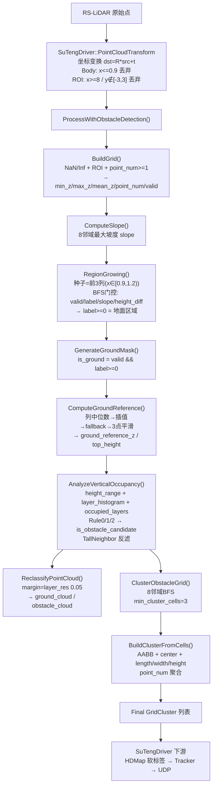

# ElevationMapGroundFilter 完整分析

> 本文档基于对以下文件的逐行代码核对编写，是后续修改（尤其是"历史帧 Candidate Cluster 融合"）的技术基础。
>
> - 类头文件：`include/ElevationMapGroundFilter.h`（749 行）
> - 类实现：`include/ElevationMapGroundFilter.cpp`（2849 行）
> - 调用方：`include/SuTengDriver.cpp`
> - 类型定义：`include/Type.h`，`common/ReadYamlFile.h/.cpp`
> - 实际参数：`config/debug_config.yaml`（`MapGroundFilter:` 段）
>
> 分析原则：以实际代码为准，不根据函数名猜测；区分「代码 Bug / 算法设计 / 参数选择 / LiDAR 固有离散性」。
> 本次明确不涉及：OBB、Tracker、`point_num >= 10` 过滤、前后帧 Cluster 变化原因。

---

## 1. 类的总体职责

`ElevationMapGroundFilter`（命名空间 `Lidar_Low_Detection`）是一个 **基于 Elevation Grid 的地面滤波 + 低矮障碍物检测** 模块，其核心设计范式是：

```
先建立 2D Grid（Elevation Map）→ 在 Grid 层做地面分割（Region Growing）
→ 在 Grid 层做体素占据分析（低矮障碍物候选判定）
→ 在 Grid 层做 8 邻域 BFS 聚类（Obstacle Cluster）
→ 输出 GridCluster 列表
```

关键设计思想（来自代码注释，均已核实）：
1. **先在 Grid 层 Label，再回溯到 Point 层 Split**：Grid 数量（本配置下 4260 个）远小于点数量，Region Growing / 聚类都在 Grid 上进行，效率高。
2. **Ground Height 用 `min_z` 而非 `mean_z`**：一个 cell 可能同时含地面点与障碍物点，`min_z` 对障碍物点更鲁棒。
3. **`ComputeGroundHeight()` 是占位函数**：当前 Ground 高度就是 `min_z`，无实际操作，为将来替换 PMF/CSF 预留接口。
4. **低矮障碍物判定基于 `ground_reference_z` 派生的 `top_height`**（v2 重设计），而非单纯 `height_range`。

---

## 2. 完整处理流程（一帧）

生产路径入口是 `SuTengDriver`，最终调用 `ProcessWithObstacleDetection()`。完整链路如下：

```
RS-LiDAR 原始点 (RoboSense PointCloudMsg)
   │  SuTengDriver::driverReturnPointCloudToCallerCallback()
   ▼
pInputCloud（按安装方式做坐标翻转，airy 特殊处理）
   │  PointCloudTransform(pInputCloud, R_Combined, pFilteredPointCloud)
   │    └ 刚体变换 dst = R*src + t（雷达系 → 车体系）
   │    └ Body Filter：x <= 0.9m 丢弃
   │    └ ROI：x >= 8.0 / y <= -3 / y >= 3 丢弃
   ▼
pFilteredPointCloud
   │  ElevationMapGroundFilter::ProcessWithObstacleDetection()
   ▼
┌─ Step 1  BuildGrid(*cloud)              → Grid 建立 + min/max/mean_z、point_num、valid
├─ Step 2  ComputeGroundHeight()          → 占位（Ground Height = min_z）
├─ Step 3  ComputeSlope()                 → 每个 valid cell 与 8 邻域最大坡度 slope
├─ Step 4  RegionGrowing()                → BFS 从种子(前3列)扩展，label>=0 = 地面区域
├─ Step 5  GenerateGroundMask()           → is_ground = valid && label>=0
├─ Step 6  ComputeGroundReference()       → 逐列 ground cell min_z 中位数→插值→fallback→平滑
│                                           → ground_reference_z, top_height=max_z-ref
├─ Step 7  AnalyzeVerticalOccupancy()     → height_range / layer_histogram / occupied_layers
│                                           → Rule0/1/2 判定 is_obstacle_candidate
│                                           → TallNeighbor Filter（高大邻域过滤）
│                                           → ReclassifyPointCloud（重分类 ground/obstacle 点云）
├─ Step 8  ClusterObstacleGrid()          → 8 邻域 BFS 聚类，min_cluster_cells=3 过滤
│                                           → BuildClusterFromCells → GridCluster 列表
└─ 输出 clusters（std::vector<GridCluster>）
   │  SuTengDriver 下游
   ▼
outputClusters → hdmapFilter.filterClusters（软约束打标签，不删簇）
   → ConvertClustersToTrackedObstacles → m_tracker.update（跨帧 ID）
   → ConvertTrackToS2ObstacleBox → UDP 发送 newS2AviodObject
```

> 注：`Process()`（旧版）与 `ProcessWithObstacleTracking()`（含 Tracker 版本）当前均不是生产路径：
> - `Process()` 中 `SplitPointCloud` 已被注释，实际只跑到 `GenerateGroundMask()` 就 return true；
> - `ProcessWithObstacleTracking()` 中 Step 10/11（Tracker 调用与回写）已被注释，功能上等同 `ProcessWithObstacleDetection` 但不输出 clusters。

---

## 3. 类成员变量

| 成员 | 类型 | 含义 | 生命周期 | 初始化位置 | 每帧清空 | 写入者 | 读取者 | 最终用途 |
|---|---|---|---|---|---|---|---|---|
| `m_elevationGridConfig` | `ElevationGridConfig` | 全部算法参数 | 构造后不变 | 构造函数 | 否 | `SuTengDriver::Init` 构造时 | 几乎所有函数 | 参数化（见 §15） |
| `m_vGridCell` | `std::vector<GridCell>` | 1D 展平 Grid，`idx=row*cols+col` | 每帧重建 | `BuildGrid` | **是**（`clear()+resize()`） | `BuildGrid` 及后续各步 | 各函数 + `GetGrid()` 外部可视化 | 地面/障碍物/聚类的载体 |
| `m_grid_rows` | `int` | Grid 行数（y 方向） | 每帧重算 | `BuildGrid` | 是 | `BuildGrid` | 各函数 | 索引计算 |
| `m_grid_cols` | `int` | Grid 列数（x 方向） | 每帧重算 | `BuildGrid` | 是 | `BuildGrid` | 各函数 | 索引计算 |
| `m_inv_resolution` | `float` | `1/grid_resolution` | 每帧重算 | `BuildGrid` | 是 | `BuildGrid` | `WorldToGrid` | 快速索引 |
| `m_effective_roi_x_min` | `float` | `max(roi_x_min, car_half_x+body_filter_x_threshold)`，默认 0.9m | 每帧重算 | `BuildGrid` | 是 | `BuildGrid` | `WorldToGrid`/种子/`GridIndexToWorld` 等 | 排除车身区域 |
| `m_yamlConfig` | `SELF_DEBUG_CONFIG` | Debug/可视化配置 | 构造后不变 | 构造函数(重载) | 否 | 构造 | **当前 cpp 中未使用**（仅成员存在） | 遗留，未接入 |
| `m_debugViewer` | `DebugViewer*` | 可视化注入 | 外部管理 | `SetDebugViewer` | 否 | 外部 | `BuildGrid` 等各步末尾 | 调试图 |
| `tracker_` | `unique_ptr<SimpleTracker>` | 跨帧跟踪器 | 懒初始化 | `ProcessWithObstacleTracking`/`SetTrackerMatchThreshold` | 否（跨帧累积） | tracker | 仅 Tracking 路径 | **当前生产路径未用** |
| `tracked_clusters_` | `vector<GridCluster>` | 跟踪结果缓存 | 每帧覆盖 | Tracking 路径 | 是 | `SyncTrackedResultsToClusters` | `GetTrackedClusters()` | **当前生产路径未用** |

> 结论：**Grid 相关的全部数据（`m_vGridCell`、`rows/cols`、`effective_roi_x_min` 等）都是"每帧独立、帧间不残留"的**。这是后面讨论"历史帧融合"的关键前提（见 §21）。

---

## 4. 数据结构

### 4.1 `ElevationGridConfig`（参数结构体，`ElevationMapGroundFilter.h`）

字段见 §15 参数表。含 ROI、车身、Grid 分辨率、Ground 判定阈值、传感器高度、体素占据分析阈值、聚类阈值、高大物体邻域过滤开关。

### 4.2 `GridCell`（单个 Grid 格，`ElevationMapGroundFilter.h`）

| 字段 | 类型 | 默认 | 含义 | 产生/更新位置 | 是否参与 obstacle 判定 | 是否参与 cluster |
|---|---|---|---|---|---|---|
| `valid` | `bool` | false | 是否有效（`point_num>=min_points_per_cell`） | `BuildGrid` 后处理 | 前置门控 | 前置门控 |
| `min_z` | `float` | FLT_MAX | cell 内最低 Z | `BuildGrid` 逐点 min | 经 `height_range`/`top_height` | 经 `BuildClusterFromCells` 汇总 |
| `max_z` | `float` | -FLT_MAX | cell 内最高 Z | `BuildGrid` 逐点 max | 经 `top_height`/`height_range` | 经 `BuildClusterFromCells` 汇总 |
| `mean_z` | `float` | 0 | cell 内平均 Z | `BuildGrid` 累加后除以 point_num | 否（备用特征） | 否 |
| `point_num` | `int` | 0 | cell 内点数 | `BuildGrid` 逐点 ++ | **否**（详见 §14） | 仅汇总为 `cluster.point_num` |
| `slope` | `float` | 0 | 与 8 邻域最大坡度 | `ComputeSlope` | 否（仅 Ground 扩展用） | 否 |
| `is_ground` | `bool` | false | 属于 Ground Surface | `GenerateGroundMask` | 经 TallNeighbor 反作用于候选 | 间接 |
| `is_interpolated_ground` | `bool` | false | 插值地面标记 | **当前恒 false**（跨越逻辑被注释） | 否 | 否 |
| `label` | `int` | -1 | 地面块 BFS 访问标记 | `RegionGrowing` | 经 `is_ground` 间接 | 否 |
| `height_range` | `float` | 0 | `max_z - min_z` | `AnalyzeVerticalOccupancy` Phase1 | **是**（Rule2 `range_ok`） | 间接 |
| `occupied_layers` | `int` | 0 | 非空层数 | `AnalyzeVerticalOccupancy` Phase3 | **是**（Rule2 `layers_ok`） | 间接 |
| `layer_histogram` | `vector<uint8_t>` | 空 | Z 向 5cm 分层直方图 | `AnalyzeVerticalOccupancy` Phase1/2 | 经 `occupied_layers` | 否 |
| `is_vertical_structure` | `bool` | false | 竖直结构（杆/墙） | `AnalyzeVerticalOccupancy` Rule1 | 是（排除候选） | 否 |
| `is_obstacle_candidate` | `bool` | false | 低矮障碍物候选 | `AnalyzeVerticalOccupancy` Rule2 + TallNeighbor | **是（核心）** | **是（BFS 种子）** |
| `ground_reference_z` | `float` | 0 | 参考地面高度 | `ComputeGroundReference` Phase6 | 是（派生 top_height） | 间接 |
| `top_height` | `float` | 0 | `max_z - ground_reference_z` | `ComputeGroundReference` Phase6 | **是（核心）** | 间接 |
| `obstacle_label` | `int` | -1 | 障碍物簇访问标记 | `ClusterObstacleGrid` 开头重置 | 否 | **是（BFS 访问标记）** |

### 4.3 `GridCluster`（聚类结果，`ElevationMapGroundFilter.h`）

| 字段 | 类型 | 含义 | 产生位置 |
|---|---|---|---|
| `id` | `int` | 簇 ID（从 0 递增，本帧内） | `ClusterObstacleGrid` |
| `cell_indices` | `vector<int>` | 簇内 GridCell 线性索引 | `ClusterObstacleGrid` BFS 收集 |
| `point_num` | `int` | 簇内总点数（各 cell point_num 之和） | `BuildClusterFromCells` |
| `min_x/max_x/min_y/max_y/min_z/max_z` | `float` | AABB 极值 | `BuildClusterFromCells` |
| `center_x/y/z` | `float` | AABB 中心 = (min+max)/2 | `BuildClusterFromCells` |
| `length/width/height` | `float` | `max-min`（X/Y/Z 尺寸） | `BuildClusterFromCells` |
| `obb_*` / `has_obb` | — | OBB 数据（本次不分析） | `ComputeClusterOBB` |
| `in_road/map_valid/map_confidence` | — | HDMap 软约束标签 | `hdmapFilter.filterClusters`（SuTengDriver 下游） |

> 注意：`GridCluster` **不保存每个 cell 的 point_num / min_z / max_z / top_height**，只保存聚合值与 cell 的线性索引。这对历史融合是重要约束（见 §21）。

---

## 5. PointCloud 输入

- 输入类型：`PointCloud2Intensity` = `pcl::PointCloud<pcl::PointXYZI>`（`Type.h`）。
- 坐标定义：车身坐标系，`x` 前向（forward）、`y` 左向（left）、`z` 向上。`z` 为负表示低于雷达安装点。
- 进入点：`ProcessWithObstacleDetection(const PointCloud2Intensity::Ptr& cloud, ...)`（`ElevationMapGroundFilter.cpp` ~L964）。
- 输入点云在进入前，已经在 `SuTengDriver::PointCloudTransform` 做过：坐标变换 + 车身过滤 + ROI 过滤（见 §6）。`ElevationMapGroundFilter` 内部对 `BuildGrid`、`AnalyzeVerticalOccupancy`、`ReclassifyPointCloud` 都再次做 NaN/Inf 过滤（防御性）。

---

## 6. PointCloud 预处理

发生在 **两个位置**：`SuTengDriver::PointCloudTransform`（进入前）和 `ElevationMapGroundFilter::BuildGrid::WorldToGrid`（进入后）。

### 6.1 `SuTengDriver::PointCloudTransform`（`SuTengDriver.cpp` ~L279）

对每个点依次执行：

```
原始点（已按安装方式做坐标翻转）
  ↓ 刚体变换：dst = R_Combined * src + t     （雷达系 → 车体系）
  ↓ Body Filter：x <= expand_x 丢弃           expand_x = car_half_x + body_filter_x_threshold = 0.9m
  ↓ ROI：x >= roi_x_max(8.0) 丢弃
  ↓ ROI：y <= roi_y_min(-3) 丢弃
  ↓ ROI：y >= roi_y_max(3) 丢弃
  ↓ pFilteredPointCloud
```

- **pcd 调试模式**下该函数不执行变换/过滤（else 分支直接拷贝），此时过滤完全交给 `BuildGrid::WorldToGrid` 完成，效果一致（`x<0.9` 与越界点在 `WorldToGrid` 中被丢弃）。
- **无高度过滤、无距离过滤、无强度过滤**：`z` 不做任何阈值。

### 6.2 `ElevationMapGroundFilter::BuildGrid`（`ElevationMapGroundFilter.cpp` ~L134）

```
for each point:
  ↓ NaN/Inf 过滤（isfinite）
  ↓ WorldToGrid(x,y,row,col)  →  ROI 检查（x∈[0.9,8.0), y∈[-3,3)）
  ↓ idx = row*cols+col
  ↓ 更新 GridCell：min_z/max_z/mean_z/point_num
后处理：
  ↓ point_num >= min_points_per_cell(1) → valid=true, mean_z/=point_num
  ↓ 否则 → valid=false, min_z=FLT_MAX, max_z=-FLT_MAX, mean_z=0, point_num=0
```

`WorldToGrid`（~L282）：
- 半开区间 `[min, max)`，`x==roi_x_max` 会被提前排除。
- `row = floor((y - roi_y_min) * inv_res)`；`col = floor((x - effective_roi_x_min) * inv_res)`。
- 防御性 clamp：`row/col` 若等于 `rows/cols` 则减 1。

> 结论：进入 Grid 之前的过滤条件为 —— **NaN/Inf 过滤 + ROI(x/y) 过滤 + point_num 下限过滤**。ROI 参数来自 YAML `MapGroundFilter:` 段。

---

## 7. Ground Filtering

### 7.1 Ground 的定义（逐步链）

```
cell.valid                                   （BuildGrid: point_num>=1）
  → cell.slope <= dynamic_slope_thresh       （ComputeSlope: 与 8 邻域最大 |Δz|/dist）
  → |current.min_z - neighbor.min_z| <= dynamic_height_diff_thresh
  → label = group_id（RegionGrowing BFS 从种子扩展）
  → is_ground = valid && label >= 0          （GenerateGroundMask）
```

- **种子**（`GetSeedCells`）：`x∈[effective_roi_x_min, effective_roi_x_min+3*res)` = `[0.9, 1.2)` 的前 3 列，所有 60 行，条件 `valid && point_num>=1`。
- **扩展条件**（`RegionGrowing` skip=0 分支，8 邻域）：
  1. `neighbor.valid`
  2. `neighbor.label == -1`（未访问；若已访问则 break，不再尝试更远）
  3. `neighbor.point_num >= min_points_per_cell`（否则 break）
  4. `neighbor.slope <= dynamic_slope_thresh(neighbor_cx)`（否则 break）
  5. `|current.min_z - neighbor.min_z| <= dynamic_height_diff_thresh(neighbor_cx)`（否则 break）
- **跨越 Invalid cell 的插值扩展（skip=1,2）整段被注释**：`is_interpolated_ground` 恒为 false。

### 7.2 非 Ground / 障碍物的定义

一个 cell 是 **obstacle（候选）** 当且仅当（`AnalyzeVerticalOccupancy` Rule2）：

```
is_obstacle_candidate =
    cell.valid
 && !is_vertical_structure            （Rule1 未命中：非高且稀疏的竖直结构）
 && top_height >= 0                   （Rule0 通过：非下沉区域）
 && top_height ∈ [top_min, top_max]   （分段，按 cell 中心 x 近/远）
 && height_range >= 0.02m             （自身厚度 ≥2cm）
 && occupied_layers >= min_occupied_layers_obstacle(=1)
```

### 7.3 使用的高度量（各量含义）

| 量 | 含义 | 计算位置 |
|---|---|---|
| `min_z` | cell 内最低点 Z，作为"该 cell 地面高度"估计 | `BuildGrid` |
| `max_z` | cell 内最高点 Z | `BuildGrid` |
| `height_range` | `max_z - min_z`，cell 自身 Z 跨度（内部视角） | `AnalyzeVerticalOccupancy` |
| `ground_reference_z` | 逐列 ground cell `min_z` 中位数（经插值/fallback/平滑），即"真实地面高度" | `ComputeGroundReference` |
| `top_height` | `max_z - ground_reference_z`，障碍物顶部距参考地面高度（外部视角，**核心指标**） | `ComputeGroundReference` Phase6 |

### 7.4 `ComputeGroundReference` 六阶段（~L1075）

```
Phase1  逐列收集 is_ground 或 is_interpolated_ground 的 min_z
Phase2  每列取中位数 → column_ref[col]（无 ground 列 = FLT_MAX）
Phase3  无效列线性插值 / 边界外推
Phase4  仍无效 → fallback = sensor_height_nominal（注意：未取反，见 §19-5）
Phase5  3 点滑动窗口平滑（col 1..cols-2）
Phase6  分发：cell.ground_reference_z = column_ref[col]；cell.top_height = max_z - ref
```

---

## 8. Elevation Grid

### 8.1 范围与分辨率

| 项 | 值 | 来源 |
|---|---|---|
| `roi_x_min` | 0.0（YAML） | `MapGroundFilter.roi_x_min` |
| `effective_roi_x_min` | 0.9 = max(0.0, 0.8+0.1) | `BuildGrid` 内计算 |
| `roi_x_max` | 8.0 | YAML |
| `roi_y_min` / `roi_y_max` | -3.0 / 3.0 | YAML |
| `grid_resolution` | 0.1 m | YAML |

### 8.2 rows / cols 计算

```
m_inv_resolution = 1 / 0.1 = 10
m_grid_cols = ceil((roi_x_max - effective_roi_x_min) * 10) = ceil(7.1*10) = 71   // x→col（前向，内存连续）
m_grid_rows = ceil((roi_y_max - roi_y_min) * 10)        = ceil(6.0*10) = 60    // y→row（左右，内存不连续）
m_vGridCell.resize(60 * 71) = 4260
```

> 头文件注释里出现的 ~80,000 是旧配置（更大 ROI）的数值，当前配置为 4260。

### 8.3 坐标转换（双向）

```
WorldToGrid(x, y)：
  row = floor((y - roi_y_min) * inv_res)                     // y∈[-3,3) → row∈[0,60)
  col = floor((x - effective_roi_x_min) * inv_res)           // x∈[0.9,8) → col∈[0,71)
  idx = row * m_grid_cols + col

GridIndexToWorld(idx)：
  row = idx / m_grid_cols；col = idx % m_grid_cols
  cx = effective_roi_x_min + (col + 0.5) * resolution        // cell 中心
  cy = roi_y_min            + (row + 0.5) * resolution        // cell 中心
```

内存布局：`col`（前向 x）在内存中连续，`row`（左右 y）跨行不连续。

---

## 9. GridCell 生命周期（关键确认）

```
一帧开始
  ↓ BuildGrid: m_vGridCell.clear() + m_vGridCell.resize(rows*cols)
  ↓   → 所有 GridCell 被默认构造：valid=false, min_z=FLT_MAX, max_z=-FLT_MAX,
  ↓     point_num=0, label=-1, obstacle_label=-1, is_ground=false, layer_histogram 空, ...
  ↓ 点云逐点更新 min_z/max_z/mean_z/point_num
  ↓ ComputeSlope / RegionGrowing / GenerateGroundMask
  ↓ ComputeGroundReference / AnalyzeVerticalOccupancy
  ↓ ClusterObstacleGrid（开头再重置所有 obstacle_label=-1）
下一帧
  ↓ 再次 clear()+resize()，完全重建
```

**结论（针对"上一帧数据是否残留"）**：
- `m_vGridCell` 每帧由 `clear()+resize()` **完整重置**，`GridCell` 所有字段（含 `label`、`obstacle_label`、`layer_histogram`、`is_obstacle_candidate` 等）**均不会跨帧残留**。
- `ClusterObstacleGrid` 开头还单独把 `obstacle_label` 重置为 -1（双保险）。
- 全文件中不存在 `memset`/`assign`（对 GridCell 整体）这类只清部分字段的操作；唯一按字段重置的是 `BuildGrid` 后处理中对无效 cell 的重置。
- 因此 **GridCell 是严格的"当前帧独立数据"**。

---

## 10. Obstacle Cell 判定（核心）

最终"一个 cell 是否为 obstacle cell"= `is_obstacle_candidate == true`，由 `AnalyzeVerticalOccupancy`（~L1375）按以下顺序判定：

```
for each valid cell（layer_histogram 非空）:
    occupied_layers = 非零层数
    is_vertical_structure = false; is_obstacle_candidate = false

    ── Rule 0 ──  top_height < 0            → 下沉区域，跳过（不是候选）
    ── Rule 1 ──  height_range > 0.5 && occupied_layers <= 3
                                           → is_vertical_structure = true，跳过
    ── Rule 2 ──（第二次按 row/col 遍历，需 col 求 cx）
        top_min/top_max 按 cx 与 near_range_boundary(2.0) 分段：
            cx < 2.0  → near:  [0.10, 0.40]
            cx >= 2.0 → far:   [0.00, 0.50]
        top_ok   = top_height ∈ [top_min, top_max]
        range_ok = height_range >= 0.02            （硬编码 constexpr kMinHeightRange）
        layers_ok= occupied_layers >= min_occupied_layers_obstacle(1)
        is_obstacle_candidate = top_ok && range_ok && layers_ok

    ── Rule 3（Phase 3.5）TallNeighbor Filter ──
        对每个 is_obstacle_candidate cell：
            统计 8 邻域中满足  valid && is_ground && top_height >= max_far(0.5)  的"tall 邻居"数
            若 >= min_tall_neighbors_for_filter(2) → 取消 is_obstacle_candidate
```

写成逻辑表达式：

```
ObstacleCell =
    valid
 && top_height >= 0
 && !(height_range > 0.5 && occupied_layers <= 3)
 && top_height ∈ 分段阈值
 && height_range >= 0.02
 && occupied_layers >= 1
 && (tall邻居数 < 2 或 未启用 TallNeighbor Filter)
```

> 参数来源：`obstacle_top_height_*`、`near_range_boundary` 来自 YAML；`min_occupied_layers_obstacle`、`vertical_structure_height_min`、`max_occupied_layers_vertical`、`enable_tall_neighbor_filter`、`min_tall_neighbors_for_filter` **不在 YAML 中、也不在 SuTengDriver::Init 设置**，使用头文件默认值（`1 / 0.5 / 3 / true / 2`）。

---

## 11. Candidate Cluster 生成

`ClusterObstacleGrid()`（~L2090）——这是**唯一的聚类函数**，同时承担"生成候选"与"生成最终"：

```
算法：8 邻域 BFS（连通分量分析）
  - 重置所有 cell.obstacle_label = -1
  - 遍历所有 cell：
      若 is_obstacle_candidate && obstacle_label == -1：
        → 新簇，BFS 初始化（标记、入队、收集 cell_indices）
        → BFS 扩展：8 邻域中 is_obstacle_candidate && obstacle_label==-1 者加入
        → 若 cluster_cells.size() >= min_cluster_cells(3)：
              BuildClusterFromCells → 压入 clusters
        → cluster_id++
```

回答十中的问题：
1. **连通域算法**：BFS（`std::queue`）。
2. **邻域**：8 邻域（`GetNeighborOffsets`，N/NE/E/SE/S/SW/W/NW）。
3. **允许对角连接**：是（8 邻域含对角线）。
4. **如何开始**：扫描到第一个 `is_obstacle_candidate && obstacle_label==-1` 的 cell。
5. **如何扩展**：`obstacle_candidate` 且未访问的 8 邻域。
6. **如何结束**：BFS 队列空。
7. **一个 cell 能否属于多个 cluster**：不能（`obstacle_label` 全局唯一标记）。
8. **是否合并**：不会（BFS 一次性形成连通分量，簇间不会合并）。
9. **是否拆分**：不会。
10. **是否存在临时 cluster**：有——BFS 收集的 `cluster_cells` 是临时容器；且 `< min_cluster_cells` 的簇被丢弃（见 §12）。

---

## 12. Candidate Cluster → Final Cluster

代码中**没有显式的"候选簇"与"最终簇"两个命名阶段**。实际区分是：

```
ClusterObstacleGrid 的 BFS 连通分量  ==  Candidate Cluster（临时，cluster_cells）
        ↓  过滤条件：cluster_cells.size() >= min_cluster_cells(3)
ClusterObstacleGrid 返回的 clusters  ==  Final Cluster（本帧输出的 GridCluster）
```

即：
- **候选簇** = BFS 得到的连通分量（含 1~2 个 cell 的孤立噪点）。
- **最终簇** = 通过 `min_cluster_cells` 阈值后的簇，才是 `ProcessWithObstacleDetection` 返回、交给下游的。

> 另外，真正的"最终输出级"过滤在 `SuTengDriver` 下游：HDMap 只打标签不删簇；Tracker 只输出 `age>=3` 的稳定轨迹（但 Tracker 不在本次分析范围，仅说明存在这一层）。

---

## 13. Cluster 筛选条件

| 条件 | 值/来源 | 判断位置 | 失败后 |
|---|---|---|---|
| 最小 cell 数 | `min_cluster_cells = 3`（头文件默认，不可配） | `ClusterObstacleGrid` | 整个簇被丢弃（不产生输出） |
| 车身附近过滤 | 注释掉的 `center_x < effective_roi_x_min+0.3` | 注释 | 无 |

> 关键结论：**在 `ClusterObstacleGrid` 内，除了 `min_cluster_cells` 之外没有任何其他簇级过滤**（无最大 cell 数、无点数上下限、无长宽阈值、无高度阈值、无面积、无密度、无长宽比）。
> 簇的"语义有效性"完全由上游 `is_obstacle_candidate` 的 Rule0/1/2 + TallNeighbor 保证。
> 用户之前关心的 `point_num >= 10` 并不在本帧最终筛选里（仅 OBB 实验被注释）。

---

## 14. Cluster 数据统计（如何计算）

全部由 `BuildClusterFromCells`（~L2285）计算，基于 **cell**（非原始 point）：

| 统计量 | 计算方法 | 基于 |
|---|---|---|
| `point_num` | `Σ cell.point_num` | cell 聚合值 |
| `min_x/max_x/min_y/max_y` | 遍历 `cell_indices`，`GridIndexToWorld` 得 cell 中心，± `half_res` 扩展 | cell 中心 ± 半格 |
| `min_z/max_z` | `min/max` 各 cell 的 `min_z`/`max_z` | cell 的 min/max_z |
| `center_x/y` | `(min+max)/2`（AABB 中心，**不是点云 centroid**） | AABB |
| `center_z` | `(min_z+max_z)/2`（AABB 中心） | AABB |
| `length/width` | `max_x-min_x`、`max_y-min_y`（含半格扩展） | cell 中心 |
| `height` | `max_z-min_z` | cell 的 min/max_z |
| `density` | **未计算** | — |

> 特别注意：**Cluster 的 center 是 cell 级 AABB 中心，不是点云 centroid，也不是加权中心**。`point_num` 仅作累加统计，不参与任何加权或筛选。

---

## 15. 参数体系

### 15.1 参数分类总表

| 分类 | 参数 | 默认/实际值 | 单位 | 使用函数 | 作用 |
|---|---|---|---|---|---|
| A. ROI | `roi_x_min` | 0.0 | m | `BuildGrid`/`WorldToGrid` | x 下限（被 effective 覆盖） |
| A. ROI | `roi_x_max` | 8.0 | m | `WorldToGrid`/动态阈值 | x 上限（前向最远） |
| A. ROI | `roi_y_min`/`roi_y_max` | -3.0/3.0 | m | `WorldToGrid` | 左右范围 |
| A. ROI | `car_half_x` | 0.8 | m | `BuildGrid` | 半车长 |
| A. ROI | `car_half_y` | 0.4 | m | （当前算法内未直接用，仅配置） | 半车宽 |
| A. ROI | `body_filter_x_threshold` | 0.1 | m | `BuildGrid` | 车头外扩 → effective_roi_x_min=0.9 |
| A. ROI | `body_filter_y_threshold` | 0.0 | m | （算法内未用，PointCloudTransform 用） | 车身 y 外扩 |
| B. Grid | `grid_resolution` | 0.1 | m | `BuildGrid` 全部 | cell 尺寸；越小分辨率越高 |
| C. Ground | `slope_threshold` | 0.35 | 无量纲(Δz/m) | `GetDynamicSlopeThreshold`→`RegionGrowing` | 近距坡度门控 |
| C. Ground | `height_diff_threshold` | 0.35 | m | `GetDynamicHeightDiffThreshold`→`RegionGrowing` | 近距高度差门控 |
| C. Ground | `min_points_per_cell` | 1 | 个 | `BuildGrid`/`RegionGrowing`/`GetSeedCells` | cell 有效性下限 |
| C. Ground | `sensor_height` | 1.1（YAML，废弃） | m | 未使用 | 遗留 |
| C. Ground | `sensor_height_nominal` | =reviseGroudHeight（≈-1.39） | m | `ComputeGroundReference` fallback | 无 ground 列时的参考高度 |
| D. Cell | `layer_resolution` | 0.05 | m | `AnalyzeVerticalOccupancy` | Z 分层；兼作 Reclassify margin |
| D. Cell | `min_occupied_layers_obstacle` | 1（头文件默认） | 层 | Rule2 `layers_ok` | 最低占据层数 |
| D. Cell | `vertical_structure_height_min` | 0.5（头文件默认） | m | Rule1 | 竖直结构高度下限 |
| D. Cell | `max_occupied_layers_vertical` | 3（头文件默认） | 层 | Rule1 | 竖直结构稀疏上限 |
| D. Cell | `obstacle_top_height_min_near` | 0.10 | m | Rule2 近段 | 近距 top_height 下限 |
| D. Cell | `obstacle_top_height_max_near` | 0.40 | m | Rule2 近段 | 近距 top_height 上限 |
| D. Cell | `obstacle_top_height_min_far` | 0.0 | m | Rule2 远段 | 远距 top_height 下限 |
| D. Cell | `obstacle_top_height_max_far` | 0.50 | m | Rule2 远段 + TallNeighbor 阈值 | 远距上限 / 高大判定 |
| D. Cell | `near_range_boundary` | 2.0 | m | Rule2 分段 | 近/远分界 |
| E. Cluster | `min_cluster_cells` | 3（头文件默认，不可配） | cell | `ClusterObstacleGrid` | 最小簇尺寸 |
| F. Height | `kMinHeightRange` | 0.02（硬编码 constexpr） | m | Rule2 `range_ok` | 最小自身厚度 |
| G. Point | `min_points_per_cell` | 1 | 个 | 见上 | 同上 |
| H. 其他 | `max_ground_height_range` | 0.15（头文件默认） | m | 未使用 | 预留 |
| H. 其他 | `enable_tall_neighbor_filter` | true（头文件默认） | — | Phase 3.5 | 高大邻域过滤开关 |
| H. 其他 | `min_tall_neighbors_for_filter` | 2（头文件默认） | 个 | Phase 3.5 | 触发过滤的 tall 邻居数 |

### 15.2 YAML → 成员 → 使用位置

```
config/debug_config.yaml  MapGroundFilter: 段
   → SELF_DEBUG_CONFIG（ReadYamlFile.cpp ~L214 读取）
   → SuTengDriver::Init 中填充 ElevationGridConfig grid_config
   → std::make_unique<ElevationMapGroundFilter>(grid_config)   // 构造时仅传 config
   → m_elevationGridConfig 供各函数使用
```

> 重要：YAML 中没有 `layer_resolution / min_occupied_layers_obstacle / vertical_structure_height_min / max_occupied_layers_vertical / min_cluster_cells / enable_tall_neighbor_filter / min_tall_neighbors_for_filter / max_ground_height_range`，它们全部使用 `ElevationGridConfig` 头文件默认值，且 `SuTengDriver::Init` 也没有设置它们。若后续要调这些参数，需补 YAML/Init。

### 15.3 增大/减小的效果（简要）

| 参数 | 增大 | 减小 |
|---|---|---|
| `slope_threshold`/`height_diff_threshold` | Ground 扩展更激进，易把低矮物顶吸收为地面 | Ground 扩展更保守，地面覆盖更少 |
| `obstacle_top_height_*` | 范围变宽 → 更多 cell 成候选（误检↑） | 范围变窄 → 漏检↑ |
| `near_range_boundary` | 近段（更严 0.10 下限）范围扩大 | 近段缩小 |
| `min_occupied_layers_obstacle` | 过滤更多单层扁平物 | 更易放过扁平物 |
| `min_cluster_cells` | 孤立小簇被丢弃更多 | 小簇保留更多（噪声↑） |
| `grid_resolution` | cell 变大 → 统计更稳但分辨率低，小目标易被邻域吞并 | cell 变小 → 分辨率高但点稀疏、内存↑ |
| `layer_resolution` | 层变粗 → occupied_layers 变小，易触发 Rule1 竖直结构 | 层变细 → occupied_layers 变大，扁平物更易过 layers_ok |

---

## 16. 函数调用关系

### 16.1 生产入口 `ProcessWithObstacleDetection`（~L964）

```
ProcessWithObstacleDetection(cloud, ground, obstacle, clusters)
 ├── BuildGrid(cloud)
 │     ├── WorldToGrid(x,y,row,col)
 │     ├── GridIndex(row,col)
 │     └── m_debugViewer->DrawHeightMap
 ├── ComputeGroundHeight()          // 占位，无子调用
 ├── ComputeSlope()
 │     ├── GetNeighborOffsets()
 │     ├── InBounds()
 │     └── ComputeCellSlope()
 ├── RegionGrowing()
 │     ├── GetSeedCells()
 │     ├── GridIndexToWorld()       // 动态阈值用
 │     ├── GetDynamicSlopeThreshold(x)
 │     └── GetDynamicHeightDiffThreshold(x)
 ├── GenerateGroundMask()           // m_debugViewer->DrawGroundMask
 ├── ComputeGroundReference()       // m_debugViewer->DrawReference
 ├── AnalyzeVerticalOccupancy(cloud, ground, obstacle)
 │     ├── WorldToGrid()  ×2 遍历
 │     ├── GetNeighborOffsets()     // TallNeighbor
 │     └── ReclassifyPointCloud(cloud, ground, obstacle)
 │           └── WorldToGrid()
 ├── ClusterObstacleGrid()
 │     ├── GetNeighborOffsets()
 │     ├── BuildClusterFromCells()
 │     │     ├── GridIndexToWorld()
 │     │     └── ComputeClusterOBB()      // OBB，本次不分析
 │     └── m_debugViewer->DrawCluster / DrawBoundingBox
 └── return clusters
```

### 16.2 其它入口

- `Process()`（~L71）：BuildGrid→ComputeGroundHeight→ComputeSlope→RegionGrowing→GenerateGroundMask（SplitPointCloud 被注释）。
- `ProcessWithObstacleTracking()`（~L2755）：与 16.1 相同直到 clusters，之后 Tracker 相关（Step 9/10/11）被注释。
- 静态转换：`ConvertClustersToS2ObstacleBox`、`ConvertTrackToS2ObstacleBox`（SuTengDriver 调用后者）。

---

## 17. 数据生命周期（逐对象）

| 数据对象 | 创建 | 更新 | 清理/重置 | 销毁 | 天然仅当前帧？ |
|---|---|---|---|---|---|
| 输入 PointCloud | SuTengDriver 每帧 | 坐标变换 | 每帧 clear | 每帧 | 是 |
| `m_vGridCell`（GridCell 数组） | `BuildGrid` | 各步骤 | `BuildGrid` 每帧 clear+resize | 每帧重建 | **是（严格每帧）** |
| `is_obstacle_candidate`（obstacle cell 标记） | `AnalyzeVerticalOccupancy` | Rule0/1/2+TallNeighbor | 随 GridCell 重建 | 帧末随 GridCell | **是** |
| Candidate Cluster（BFS 连通分量） | `ClusterObstacleGrid` 内局部 `cluster_cells` | BFS 扩展 | 每簇临时 | 函数内释放 | **是** |
| Final Cluster（`clusters`/`outputClusters`） | `ClusterObstacleGrid` 返回 | 本帧内下游打标签/跟踪 | 每帧新 vector | 帧末随调用栈释放 | 是（但可被下游持久化） |
| `tracker_`/`tracked_clusters_` | 懒初始化 | 跨帧 | 不自动清（有跟踪生命周期） | 对象析构 | 否（跨帧状态，当前未启用） |

> 对历史融合的关键启示：
> - **天然只能存在于当前帧**：`GridCell`（含 `is_obstacle_candidate`、逐 cell 的 `point_num/min_z/max_z/top_height`）。
> - **适合保存到历史帧**：`GridCluster`（含 `cell_indices`，可反算世界坐标；聚合统计量），但缺少逐 cell 细节。

---

## 18. 当前算法设计总结

`ElevationMapGroundFilter` 本质是一条 **"Grid 层级的五段流水线"**：

1. **建图**（BuildGrid）：一次遍历点云 → 统计 min/max/mean_z、point_num，标 valid。
2. **地面分割**（ComputeSlope + RegionGrowing + GenerateGroundMask）：以"车前最近 3 列"为种子，8 邻域 BFS 按坡度/高度差门控扩展，得到 `is_ground` 掩码。
3. **地面参考估计**（ComputeGroundReference）：逐列 ground cell `min_z` 中位数 → 插值 → fallback → 平滑 → `ground_reference_z`、`top_height`。
4. **低矮障碍物候选判定**（AnalyzeVerticalOccupancy）：`height_range` + `layer_histogram` + `occupied_layers` + `top_height` 综合判定，配 TallNeighbor 反滤。
5. **聚类输出**（ClusterObstacleGrid + BuildClusterFromCells）：8 邻域 BFS → `min_cluster_cells` 过滤 → GridCluster。

全程 **Grid 层做决策、Point 层只回溯**，复杂度 O(N + R·C)，无 KD-Tree / 无 PCL 聚类依赖。

---

## 19. 已有设计的优点

1. **一次遍历建图**：min/max/mean/point_num 单次遍历完成，利用数据局部性（注释中明确设计意图）。
2. **`min_z` 而非 `mean_z` 作为地面高度**：对含障碍物点的混合 cell 更鲁棒。
3. **Ground Reference 用逐列中位数**：对离群误标 ground 的 cell 鲁棒，且自动跟随坡道/起伏；插值 + fallback + 3 点平滑分层处理合理。
4. **`top_height`（相对地面）代替绝对高度**：区分"贴近地面的低矮障碍物"与"悬空/高大物体"是正确方向。
5. **体素占据分析用 `layer_histogram`**：用 5cm 分层直方图替代直接点云，既压缩内存又便于判定"稀疏竖直结构"。
6. **8 邻域 BFS 网格聚类**：O(1) 邻域查询，天然连通分量分析，无外部依赖。
7. **参数化充分**：核心阈值（ROI/坡度/高度差/obstacle 高度范围/近远分界）全部 YAML 可配。
8. **动态阈值**（`GetDynamicSlopeThreshold`/`GetDynamicHeightDiffThreshold`）：近处严格、远处放宽，符合点云密度随距离衰减的物理特性（方向正确，公式有疑点见 §20-1）。
9. **接口分层**：`Process` / `ProcessWithObstacleDetection` / `ProcessWithObstacleTracking` 三入口互不影响；DebugViewer 注入不侵入算法。
10. **半开区间 + 防御性 clamp**：`WorldToGrid` 边界处理（`x==roi_x_max` 排除、越界减 1）正确。

---

## 20. 潜在架构优化点

### 20.1 已经存在的问题（代码级事实）

| # | 文件 | 函数/位置 | 具体逻辑 | 性质 |
|---|---|---|---|---|
| 1 | `.cpp` ~L310 | `GetDynamicSlopeThreshold` | `else 分支：slope_threshold + (x - slope_threshold) * 0.1` —— 不是线性插值，x=3.5 处不连续（右侧从 0.35 起），x=8 时高达 ≈1.115 | 疑似笔误（算法设计/参数选择） |
| 2 | `.cpp` ~L1780 | `AnalyzeVerticalOccupancy` | `obstacle_count++` 整段被注释，日志 `"[VoxelOccupancy v2] obstacle: %d"` **恒打印 0** | 日志 Bug（不影响算法） |
| 3 | `.cpp` ~L640-690 | `RegionGrowing` | skip=1/2 跨 Invalid cell 的插值扩展整段被注释，`is_interpolated_ground` 恒 false，但 `ComputeGroundReference` 仍保留对其判断 | 死代码/遗留（不影响结果） |
| 4 | `.cpp` ~L695 | `GetSeedCells` | 种子区 `x∈[0.9,1.2)`：若低矮障碍物恰好在此区域，会被标为 ground，且污染 Ground Reference | 设计取舍（已知风险） |
| 5 | `.cpp` ~L1248 | `ComputeGroundReference` | `fallback_z = sensor_height_nominal`（未取反）；其正确性依赖 `reviseGroudHeight` 为负（lidar.cfg 中 ≈-1.39）。若有人把它配成正数会出错 | 符号约定陷阱 |
| 6 | `SuTengDriver.cpp` ~L56-80 | `Init` | `layer_resolution/min_occupied_layers/vertical_structure_*/min_cluster_cells/tall_neighbor_*` 均未从 YAML/Init 注入，全部用头文件默认值 | 参数不可配（易误以为可调） |

### 20.2 未来可优化（架构级，不修改）

1. **消除每帧分配抖动**：`BuildGrid` 每帧 `clear+resize`（4260 个 GridCell 默认构造）+ `layer_histogram.assign` 每帧新建 vector。可引入"帧持久化 buffer"复用。
2. **参数全面 YAML 化**：把 §20.1-6 中的头文件默认参数接入配置，消除隐式默认。
3. **动态阈值公式规范化**：将 `GetDynamicSlopeThreshold` 改为真正的分段线性，或统一为与 HeightDiff 一致的形式。
4. **为历史融合预留数据接口**：`GridCluster` 缺少逐 cell 细节（point_num/min_z/max_z/top_height），若要支持历史候选融合，需在簇上持久化逐 cell 摘要或世界坐标（见 §21）。
5. **Ground Reference 的种子污染治理**：种子区恰为车前最近区域，天然易含障碍物；可考虑"多帧确认种子"或"种子区排除 top_height 高者"。

> 严格区分：§20.1 是"代码/日志/配置层面的既有问题"；**LiDAR 扫描离散性导致的前后帧 obstacle cell 数量与分布变化（如 `■■`/`■■■`）不是 Bug**，是 §20.2 需要接受的物理现象。

---

## 21. 为"历史帧 Candidate Cluster 融合"准备的数据接口（仅分析，不设计）

基于当前代码逐一回答：

1. **Candidate Cluster 数据保存在哪里？**
   `ClusterObstacleGrid` 内的局部 `cluster_cells`（临时），以及经 `min_cluster_cells` 过滤后返回的 `clusters`（`GridCluster`）。均在帧内局部/返回值中，**没有任何成员变量持久保存**。

2. **Candidate Cluster 生命周期多久？**
   一帧内：从 `ClusterObstacleGrid` 创建 → 返回给 `ProcessWithObstacleDetection` 的 `clusters` → 在 `SuTengDriver` 帧处理函数中被使用（HDMap 打标签、转 TrackedObstacle、跟踪）→ 帧末销毁。

3. **当前帧什么时候生成 Candidate Cluster？**
   `ProcessWithObstacleDetection` 的 Step 8：`ClusterObstacleGrid()`，在 `AnalyzeVerticalOccupancy`（Step 7）把 `is_obstacle_candidate` 判定完之后。

4. **什么时候变成 Final Cluster？**
   就在 `ClusterObstacleGrid` 内部：BFS 连通分量 ≥ `min_cluster_cells` 即成为返回的"最终"簇；低于阈值被丢弃。

5. **Candidate Cluster 是否包含完整的 cell_indices？**
   **是**。`GridCluster.cell_indices` 保存了簇内所有 GridCell 线性索引（`GridIndexToWorld` 可反算世界坐标）。

6. **Candidate Cluster 是否包含每个 cell 的 point_num？**
   **否**。只有聚合值 `GridCluster.point_num`（各 cell point_num 之和）。逐 cell 的 `point_num/min_z/max_z/top_height` 存在 `GridCell` 中，而 `GridCell` 每帧重建、不随簇保留。

7. **GridCell 是不是当前帧独立数据？**
   **是，严格独立**（见 §9）。历史帧的 `GridCell` 完全不存在。

8. **历史 Cluster 能否直接重新加入当前 Cluster？**
   **不能直接**。原因：
   - 历史 `cell_indices` 是"历史帧 Grid"的线性索引，尺寸/起点可能一致（ROI 固定时 rows/cols/effective_roi_x_min 相同，索引可复用），但该位置在当前帧的 `GridCell` 可能 `valid=false` 或 `is_obstacle_candidate=false`；
   - 若直接把历史 cell 塞进当前 BFS，需要把这些 cell 的"候选标记"在当前帧重建，而当前代码只在 `is_obstacle_candidate` 上做 BFS 种子。

9. **如果不能，缺少什么数据？**
   - 逐 cell 的属性（`point_num`、`min_z/max_z`、`top_height`、`is_ground`）未持久化于 `GridCluster`；
   - 历史 cell 与当前帧 cell 的"对齐信息"（如何把历史索引映射到当前帧世界坐标/网格）未设计；
   - 历史 cell 进入当前帧后应具有的"候选资格"（是直接并入，还是与当前 `is_obstacle_candidate` 取并/加权）没有现成字段承载。

10. **如果未来做历史融合，应该在哪个函数附近介入最合理？**
    最自然的介入点是 **`ClusterObstacleGrid()` 的 BFS 种子判定之前 / 内部**：
    - 因为该函数是"cell → cluster"的唯一转化点，且其输入是 `is_obstacle_candidate` 标记；
    - 方案 A（cell 级融合）：在 `AnalyzeVerticalOccupancy` 之后、`ClusterObstacleGrid` 之前，把"历史帧障碍 cell"以某种标记合并进当前 `GridCell`（或一个并行持久层），再走现有 BFS；
    - 方案 B（簇级融合）：在 `ClusterObstacleGrid` 内部对已形成的 `clusters` 做跨帧 cell 集合并（`cell_indices` 取并集）→ 重新 `BuildClusterFromCells` → 再过 `min_cluster_cells`。
    - 无论是 A 还是 B，都需要先解决 §21-9 的"逐 cell 数据持久化 + 索引对齐"问题。
    - 需要注意：历史帧来源的时间基准 / 自车运动补偿（若历史 cell 是在不同车辆位姿下观测，需先变换到当前车体系）——当前 `GridCluster` 没有位姿时间戳字段，这也是未来融合要补的数据。

> 本次不判断"历史融合"方案对错，仅指出代码结构上的可行性与缺口。

---

## 22. 后续建议

1. 以本文 §2 的流水线 + §16 调用关系作为修改 `ElevationMapGroundFilter` 的基准，避免逐行重读。
2. 在动历史融合之前，先补齐 §21-9 的"逐 cell 数据持久化"层（例如给 `GridCluster` 增加逐 cell 摘要数组，或引入帧持久化的 cell 摘要 buffer）。
3. 顺手修复 §20.1 中不影响算法但不该误导的项：#2（日志恒 0）、#3（死代码）、#6（参数不可配），并复核 #5 的符号约定。
4. 将 `min_cluster_cells`、`layer_resolution`、tall neighbor 等参数接入 YAML，避免隐式默认。
5. 保留 §19 中已合理的 Grid 设计；不要把 LiDAR 离散性（前后帧 cell 数量/分布变化）当作 bug 去"修"。

---

## 23. 核心数据流图



关键参数标注（写在各节点旁）：
- ROI：`effective_roi_x_min=0.9`、`roi_x_max=8`、`roi_y=±3`、`res=0.1`
- Ground：`slope_threshold=0.35`、`height_diff_threshold=0.35`、`min_points_per_cell=1`、动态阈值近 3.5m 分界
- 候选：`near_boundary=2.0`、near `[0.10,0.40]` / far `[0.0,0.50]`、`height_range>=0.02`、`occupied_layers>=1`、tall 邻居≥2
- 聚类：`min_cluster_cells=3`

---

## 24. 后续修改入口（针对"历史帧 Candidate Cluster + 当前帧 Candidate Cluster"）

根据当前代码结构，未来若要研究历史融合，最需要关注：

| 优先级 | 函数/数据结构 | 原因 |
|---|---|---|
| 1 | `ClusterObstacleGrid()` | 唯一 "cell → cluster" 转化点；BFS 种子判定前是合并历史候选 cell 的天然入口 |
| 2 | `AnalyzeVerticalOccupancy()` | 生成 `is_obstacle_candidate` 的唯一位置；历史融合若做 cell 级并集，需要在此后对齐"历史标记" |
| 3 | `BuildClusterFromCells()` | 若采用簇级并集（`cell_indices` 取并后重建统计），此函数会被复用 |
| 4 | `GridCluster`（数据结构） | 需评估是否增加逐 cell 摘要（point_num/min_z/max_z/top_height）或时间戳字段 |
| 5 | `m_vGridCell` / `GridCell`（数据结构） | 需引入"帧持久化"的 cell 层，否则历史 cell 无载体 |

> 本次不修改任何代码，不实现历史融合。以上仅为基于现有代码结构给出的介入点与数据缺口清单。
