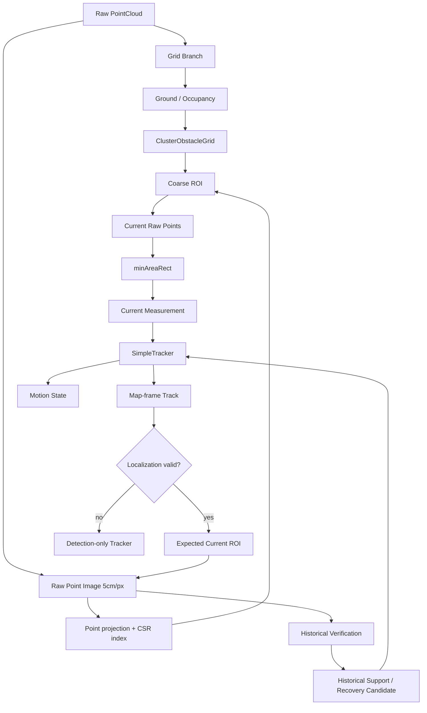

# Map-frame Historical Feedback + Raw Point Image 最终架构分析

> 版本：Phase 0（仅分析与设计，不修改任何生产代码）
> 日期：2026-09-08
> 依据：以下文件逐行核对
> - `include/ElevationMapGroundFilter.h`（数据结构与接口）
> - `include/ElevationMapGroundFilter.cpp`（BuildGrid / WorldToGrid / GridIndexToWorld / AnalyzeVerticalOccupancy / ClusterObstacleGrid / BuildClusterFromCells / ComputeClusterOBB / ConvertClustersToS2ObstacleBox / ConvertTrackToS2ObstacleBox / ConvertClusterToTrackedObstacle）
> - `include/track.h` / `include/track.cpp`（TrackedObstacle / SimpleTracker::update / update_V2 / removeLostTargets）
> - `include/SuTengDriver.cpp`（ProcessPcapCloud / ConvertClustersToTrackedObstacles / PointCloudTransform）
> - `mapfilter/localization_manager.{h,cpp}`、`coordinate_transformer.{h,cpp}`、`hdmap_filter.{h,cpp}`、`hdmap_manager.{h,cpp}`
> - `src/main.cpp`（定位订阅开关、PcapLocalizationFeed）
> - `config/debug_config_EMX.yaml`
> - `docs/ElevationMapGroundFilter完整分析.md`、`Historical_Candidate_Cluster_Fusion_Design.md`、`1.md`
>
> 标注约定：
> - ✅【已确认】= 已从项目实际代码逐行核实
> - 🧩【推导】= 由已确认代码逻辑推导
> - 📐【建议】= 本设计给出的方案（尚未实现）

---

## 0. 结论速览（先读这段）

1. **为什么 Grid 仍然存在？** Grid = 粗定位 + 地面分析。它是 O(1) 邻域查询的规则网格，`RegionGrowing / ComputeGroundReference / AnalyzeVerticalOccupancy / ClusterObstacleGrid` 全部建立在 Grid 之上，点数量 << Grid 数量，效率与语义都无法被 Raw Point Image 替代。
2. **为什么还需要 Raw Point Image？** Raw Point Image = 当前帧点云的高保真空间结构。它摆脱了 Grid Cell Center 的 10cm 量化，为 `minAreaRect` 提供"连通域内的原始点集合"，从而把最终几何精度从"cell 中心"提升到"原始点"。
3. **为什么需要 Map-frame Track？** Map-frame Track = 时间上的稳定状态 + 静态障碍物持续性。车辆在动、点云在动、Grid 跟着车动，只有把 Track 锚定在地图系，才能把"自车运动"与"目标物理运动"解耦。
4. **Raw Point Image 推荐分辨率：统一 5cm/pixel**（理由见 §7、§8、§9）。
5. **本项目最终定位：基于 Localization 的 Map-frame Spatiotemporal Low-obstacle Tracker**（理由见 §27.4）。

---

## 1. 当前系统真实流程（✅ 已确认）

生产路径唯一入口为 `SuTengDriver::ProcessPcapCloud()`，每帧依次执行：

```
msg = stuffed_cloud_queue.popWait()
   │  【帧序闸门】若 DebugViewer.GetFrameCountValue()==1 → 存 g_previousTimestamp 后 continue（第一帧点云不用）
   ▼
PointCloudTransform(pInputCloud, R_CombinedTransMatrix, pFilteredPointCloud)
   │   R_Combined = R_X_Exchange_Y * (toCarInfo * toMainLidarInfo)
   │   雷达系 → 车体系（x 前、y 左、z 上）；Body/ROI 过滤
   ▼
m_pElevationMapGroundFilter->ProcessWithObstacleDetection(pFilteredPointCloud, ...)
   │   BuildGrid → ComputeGroundHeight → ComputeSlope → RegionGrowing
   │   → GenerateGroundMask → ComputeGroundReference
   │   → AnalyzeVerticalOccupancy（内部 ReclassifyPointCloud）
   │   → ClusterObstacleGrid → std::vector<GridCluster> outputClusters
   ▼
【仅 m_hdmapEnabled】LocalizationManager::getPose(loc_pose)
   → buildDrivablePolygons → m_hdmapFilter.filterClusters(outputClusters, ...)   ← 软约束打标签
   ▼
ConvertClustersToTrackedObstacles(outputClusters, detections)
   │   ⚠️ 内含硬过滤：if(cluster.in_road || !m_hdmapEnabled) 才入 detections
   ▼
m_tracker.update(detections, rec_timestamp_ms)          ← 贪心匹配 + ID 分配（9999 起）
   ▼
m_debugViewer->DrawTrackOverlay / DrawAllOverlay        ← 可视化
   ▼
【仅 onlineModel】ConvertTrackToS2ObstacleBox(vtrackings) → sendUdpMsg
```

✅ 已确认的关键事实：

- 第一帧点云被显式跳过（`GetFrameCountValue()==1` 分支 `continue`），仅记录 `g_previousTimestamp`。
- `ProcessWithObstacleTracking()` 中的 `tracker_/tracked_clusters_` 不是生产路径；生产路径用的是 `SutengDriver` 自己的 `m_tracker`（`SimpleTracker`）。
- `SimpleTracker::update()` 当前是 V1 贪心匹配（`match_threshold = 0.5f`，`track.h`），`update_V2` 存在但未使用。
- `removeLostTargets()` 当前删除条件：`lastSeen > 10`。

### 1.1 EMX 配置下的 Grid 真实几何（✅ 已确认，重要）

`config/debug_config_EMX.yaml` 的 `MapGroundFilter:` 段与 `BuildGrid()` 计算：

| 参数 | 值 | 说明 |
|---|---|---|
| `roi_x_min` | 0.0 | 原始 ROI X 下界 |
| `roi_x_max` | 20.0 | ROI X 上界 |
| `roi_y_min / roi_y_max` | -4.0 / 4.0 | ROI Y |
| `grid_resolution` | 0.1 m | Grid 分辨率 |
| `car_half_x` | 0.8 | 车身半长 |
| `body_filter_x_threshold` | **2.5** | 车身外扩 |
| **`m_effective_roi_x_min`** | **max(0.0, 0.8+2.5) = 3.3 m** | 实际 Grid 起点 |
| `near_range_boundary` | 3.0 | 近/中分界 |

🧩【推导】两个重要结论：

1. **EMX 下 Grid 实际覆盖 x ∈ [3.3, 20.0)，y ∈ [-4, 4)**；`cols = ceil(16.7/0.1) = 167`，`rows = ceil(8/0.1) = 80`，总 cell = **13,360**。
2. **`near_range_boundary = 3.0` 但 `effective_roi_x_min = 3.3`** → 所有 cell 的 `cx >= 3.3 > 3.0`，**永远走 "far" 分支**（`top_height ∈ [0.05, 0.40]`）。即 EMX 配置下 `obstacle_top_height_min_near/max_near` 实际不生效，这直接解释了"6~7m 漏检"的部分成因（该段位于 far 区间，动态阈值 `GetDynamicSlopeThreshold / GetDynamicHeightDiffThreshold` 在 x>3.5 后开始放宽，且 `top_height_min_far=0.05` 偏松）。

> 设计结论：本架构不通过"改 Grid 阈值"去解决漏检（强制禁止项 2），而是通过 Raw Point 二次验证 + Historical Feedback 兜底。

### 1.2 当前几何的来源与量化问题（✅ 已确认）

- `GridIndexToWorld()` 返回 **Grid Cell Center**：`cx = effective_roi_x_min + (col+0.5)*res`，`cy = roi_y_min + (row+0.5)*res`。
- `ComputeClusterOBB()` 用 **cell 中心坐标** 做 2D PCA（不是原始点）→ `obb_center/obb_length/obb_width/obb_angle/obb_corners` 全部被 10cm 网格量化。
- `BuildClusterFromCells()` 的 AABB 用 `cell center ± half_res`（即整格边界），中心/尺寸同样是 10cm 量化的。

因此 OBB 中心量化/跳变、尺寸跳变、0°↔180° 跳变的根因之一就是 **"用 cell center 当几何点"**。Raw Point Image + 原始点 `minAreaRect` 正是为了移除这一层量化。

---

## 2. Localization 前置条件（✅ 已确认真实接口）

### 2.1 真实代码中的定位能力

| 能力 | 真实接口（不假设） | 位置 |
|---|---|---|
| 定位管理器单例 | `LocalizationManager::instance()` | `mapfilter/localization_manager.h` |
| 位姿读取 | `bool getPose(Pose& out)`；`Pose{x,y,heading_deg,timestamp_ms,valid}` | 同上 |
| 帧级有效性 | `bool isValid()`；`out.valid`（has_data && latest.valid && 新鲜度<=timeout） | 同上 |
| 新鲜度 | `uint64_t lastUpdateAgeMs()`（墙钟差） | 同上 |
| 最近有效位姿 | `Pose lastValidPose()` | 同上 |
| 累计帧数 | `uint64_t receivedCount()` | 同上 |
| 车↔地图变换 | `CoordinateTransformer::vehicleToMap / mapToVehicle`（含 gridHeadingOffset 补偿） | `mapfilter/coordinate_transformer.h` |
| 定位数据源 | `STR_FUSIONLOC`（MC 0x0a @ 9110）；pcap 模式经 `PcapLocalizationFeed` 独立线程回放 | `src/main.cpp`、`mapfilter/pcap_localization_feed.*` |

✅ 已确认：`LocalizationManager::Pose.valid` 的判定 = `has_data_ && latest_.valid && (now_ms - last_wall_ms_) <= timeout_ms_`；`getPose()` 返回值是 `has_data_`（"是否收到过至少一帧"），`out.valid` 才是"本帧是否新鲜有效"。

✅ 已确认：当前 `getPose()` 只在 `ProcessPcapCloud()` 的 `if (m_hdmapEnabled)` 分支内被调用。`m_hdmapEnabled` 由 `mapFilterModel` 派生（EMX = 1）。**这意味着：若 `mapFilterModel=0`，生产路径完全不读定位。** 本架构要求 Historical Feedback 必须独立于 HDMap 开关读取定位（见 §22）。

### 2.2 `LocalizationAvailable()` 的逻辑概念（📐 建议）

不要假设接口名。建议在 `SuTengDriver` 层定义一个组合判定（真实可用的拼图来自上述接口）：

```
LocalizationAvailable()  ⇔
     LocalizationManager::instance().enabled()        // 订阅开关已开
  && LocalizationManager::instance().getPose(pose)    // 收到过数据
  && pose.valid                                       // 本帧新鲜有效
```

以及"上一帧位姿可用"：

```
PreviousLocalizationAvailable()  ⇔
     上一帧缓存了 LocalizationManager::Pose
  && 该缓存 pose.valid == true
  && 当前 pose.valid == true（两帧都有效才谈得上帧间变换）
```

### 2.3 Localization 有效 / 无效 的两条能力边界（📐 核心原则）

**Localization 有效**：允许

```
Radar Frame → Map Frame → Historical Track → Map → Current Radar Frame → Historical Feedback
```

**Localization 无效**：只能运行

```
Current LiDAR → Current Grid → Current Raw Point Image → Current Detection → Detection-only Tracker
```

且**不得执行依赖 Map Frame 的 Historical Feedback**（强制禁止项 9）。

降级策略（与 HDMapFilter 一致）：定位无效时只保留"单帧检测 + 雷达系 tracker"，不产出 map_x/map_y、不做历史反馈、不把上一帧地图位姿用于任何变换。

---

## 3. Frame 1 / 2 / 3 时序（✅ 已从代码确认）

### 3.1 实际时序（不假设，直接看代码）

| 帧 | `ProcessPcapCloud` 行为 | 定位状态（pcap + PcapLocalizationFeed 实际链路） | 可执行的 Historical Feedback |
|---|---|---|---|
| Frame 1 | `GetFrameCountValue()==1` → `continue`，只存 `g_previousTimestamp` | 可能已收到或未收到首帧定位（feed 与 cloud 都从 pcap 头部开始按节奏回放） | ❌ 无（本帧被跳过，没有 detection 也没有 track） |
| Frame 2 | 首个被处理的帧：BuildGrid→…→Cluster→tracker.update（此时 tracker 从空开始，所有 cluster 都是 `new_track`） | 可能已有 current pose；但 **没有 previous pose 缓存、没有 previous track** | ❌ 无法做完整 Historical Feedback（缺少 previous map track / previous pose） |
| Frame 3+ | tracker 已有 Frame 2 创建的 track | 若 Frame 2、Frame 3 的 pose 都 valid 且 Frame 2 已产生 valid track | ✅ 条件满足时允许 |

### 3.2 允许 Historical Feedback 的判定（📐 建议，非 `frame_id > 1`）

禁止 `if (frame_id > 1)` 这种粗判（强制禁止项 11）。正确判定为：

```
AllowHistoricalFeedback(f) ⇔
     LocalizationAvailable()                    // 当前定位有效
  && PreviousLocalizationAvailable()            // 上一帧定位有效（缓存）
  && 存在 age >= kMinTrackAge 的历史 Track      // 历史 Track 已确认（如 age>=3）
  && 该 Track 已具备有效 map pose               // map_x/map_y 已用上一帧位姿建立
```

其中"上一帧位姿"必须由 `SuTengDriver` 每帧在**成功取到位姿后**缓存到成员变量（例如 `m_prevLocPose`），下一帧开始时才可用。pcap 模式下位姿来自 `PcapLocalizationFeed`，其第一帧定位到达的早晚取决于 9110 包在 pcap 中的位置，**不能假设"第 2 帧必有定位"**——必须以 `getPose()` + `out.valid` 的实际返回值判断。

---

## 4. Raw Point Image 坐标系设计（📐 建议）

### 4.1 坐标约定（✅ 与现有一致）

- 车体系：`x = forward`，`y = left`，`z = up`。
- 图像：`col ↔ x`（前向），`row ↔ y`（左右）。

### 4.2 映射公式（📐 建议，与 `WorldToGrid` 同构）

设 Raw Image 分辨率 `res_img`（m/pixel），ROI 复用 Grid 的物理边界（但**原点不取 cell center，取像素左下角坐标**）：

```
col = floor((x - effective_roi_x_min) / res_img)      // x 前向 → 列
row = floor((roi_y_max - y) / res_img)                // 顶部 = y_max（车左），底部 = y_min（车右）
```

> 选择 `row = (roi_y_max - y)` 使 `row 0` 在图像顶部（车左），与现有 `DebugViewer` 的可视化方向一致（顶部=Y+），且符合 OpenCV `cv::Mat` 的行序习惯。若后续直接复用 `WorldToGrid` 的 `row=(y-roi_y_min)` 也可以，但必须在所有消费点保持一致。

### 4.3 image 是否固定尺寸（📐 建议：固定）

- **固定尺寸**：`W = ceil((roi_x_max - effective_roi_x_min)/res_img)`，`H = ceil((roi_y_max - roi_y_min)/res_img)`。
- 由于 Grid 的 ROI/resolution 每帧固定（`rows/cols` 不变），Raw Image 也固定尺寸，每帧 `Mat` 复用，避免反复分配。
- **不随 ROI 自动变化**：ROI 由 YAML 固定，不动态改。

### 4.4 与项目 A 的区别

项目 A 的 `300×800 / cx=100 / cy=150 / 0.1m/px` 是针对其近场相机式投影设计的。本项目的投影面是**俯视 BEV**，原点锚定 `(effective_roi_x_min, roi_y_max)`，**不复制项目 A 的 cx/cy**。

---

## 5. Image Resolution 定量比较（10 / 5 / 2 / 1 cm）

以下按 EMX 全 ROI 计算（x 跨度 16.7m，y 跨度 8m）：

| 分辨率 | 图像尺寸 (W×H) | 像素总数 | occupancy(CV_8UC1) | z_min+z_max(2×CV_16UC1) | 典型 CPU（dilate/connectedComp） | 几何分组粒度 | 结论 |
|---|---|---|---|---|---|---|---|
| 10 cm/px | 167 × 80 | 13,360 | 13 KB | 53 KB | 极小（= Grid 尺寸） | 与 Grid 一致，无增量价值 | ❌ 退化为 Grid |
| **5 cm/px** | 334 × 160 | 53,440 | 53 KB | 214 KB | 小（4×Grid，依然 <1ms 级） | 半格，3×3 dilate≈15cm 连接半径 | ✅ **推荐** |
| 2 cm/px | 835 × 400 | 334,000 | 334 KB | 1.34 MB | 中（25×5cm 的像素量） | 精细，但受点密度上限约束 | ⚠️ 可选（仅近场局部 ROI） |
| 1 cm/px | 1670 × 800 | 1,336,000 | 1.34 MB | 5.34 MB | 高（100×5cm 像素量） | 过采样，空洞密集 | ❌ 不建议 |

### 5.1 关键认知：像素分辨率 ≠ 最终几何精度（✅ 重要）

最终 `minAreaRect` 的输入是 **被选中的原始点 (x,y,z) 浮点坐标**，不是像素坐标。像素分辨率只决定"哪些点被分到同一个连通域"，**不决定 minAreaRect 输出的小数精度**。因此：

- 10cm 的坏处不是"中心精度 10cm"，而是"把 0~10cm 内不同目标/同一目标边界点混在同一个像素里，连通性差"；
- 1cm 的好处也不会转化为"亚厘米几何"，而只会产生大量空像素与破碎连通域。

所以分辨率选择的**第一指标是"LiDAR 空间采样间距的匹配度"与"连通性"，而不是几何精度**。

### 5.2 定量依据（LiDAR 空间采样间距）

🧩【推导】RSEMX（128 环，EMX 配置）在典型 10Hz 回放、20w 点/帧情况下：
- 5m 处水平采样间距约 **2~4 cm**、相邻环垂直（在 BEV 下表现为径向）间距约 **3~5 cm**；
- 5w 点/帧稀疏情况下间距翻倍（约 **4~8 cm** 甚至更大）；
- 4~6m 区域是低矮障碍物检测的黄金距离，此处的点间距大致落在 **2~6 cm**。

由此：
- **5cm/px 恰好覆盖 4~6m 处"多数相邻点落同一像素或相邻像素"**，3×3 dilation（15cm 半径）能可靠连接同一障碍物的点；
- **2cm/px 低于点间距下限**，大量像素为空，连通依赖更大的 dilation 半径，收益边际递减；
- **1cm/px 完全过采样**，morphology 半径需 8~15 像素才能等效 5cm 图的 3 像素，CPU 白费。

---

## 6. 稀疏点云问题（✅ 重要：高分辨率 ≠ 高密度）

> **提高 Image Resolution 不能解决 LiDAR 本身的稀疏采样。**

若 5w 点云在 4~6m 区域出现 `point ── gap ── point`（gap 可达 8~15cm），则：
- 在 1cm 图中该 gap 是 8~15 个空像素，3×3 dilate 无法连接；
- 在 5cm 图中该 gap 是 2~3 个空像素，3×3 dilate（等效 15cm）可以连接；
- 在 10cm 图中 gap 落入相邻像素，8 邻域 BFS 天然连通。

三者关系（📐 核心公式化描述）：

```
连接概率 ≈ f(点间距, pixel_resolution, dilation_radius)
点间距 随距离增大而增大（range-dependent sparsity）
dilation_radius 必须 >= 点间距 - pixel_resolution
```

因此分辨率、morphology 半径、空间采样、距离相关稀疏性必须**成组设计**，不能只调分辨率。

---

## 7. Near/Far 是否需要（📐 比较）

| 方案 | 复杂度 | 收益 | 评价 |
|---|---|---|---|
| A. Near 高分辨率 + Far 低分辨率 + 映射回高分辨率（项目 A 思路） | 高（两套图 + 映射） | Far 省内存，但 BEV 下 far 区域面积是 near 的数倍，管理复杂 | ❌ 当前不值得 |
| **B. 统一 5cm Raw Image + range-dependent morphology** | 低（一张图） | 用 dilation 半径随距离增大来补偿稀疏 | ✅ **首选** |
| C. 统一 5cm Raw Image + Grid 负责稀疏区连接 | 低（一张图 + 已有 Grid） | 近场靠 image 精细，远场靠 Grid 连通兜底 | ✅ 作为 B 的补充 |
| D. 多尺度金字塔 | 很高 | 过度设计 | ❌ 不采用 |

📐 **推荐：B + C 组合**：
- 全局统一 **5cm/pixel** Raw Image；
- morphology 使用 **range-dependent radius**（近距离小、远距离大，如 §8）；
- 若某簇原始点过少导致 image 连通失败，则**回退用该 Grid Cluster 的 cell 覆盖区**作为候选 ROI（Grid 已经做了 10cm 级稀疏连接），再从该 ROI 取原始点跑 `minAreaRect`（点少时退化为 AABB 或放弃）。

> 原则：当前不为"先进"引入多尺度系统（强制禁止项 1 的精神）。

---

## 8. Morphology 策略（📐 建议）

### 8.1 原则

- **DILATE 只用于"决定哪些原始点属于同一 Candidate Object"**，不用于计算最终 Box（强制禁止项 5）。
- 最终 `minAreaRect` 基于**原始点**（或其 mask 内的原始点），**禁止基于 dilated mask 直接算 Box**。
- 图像上的连通分量只输出 **point-id 集合**，然后回到原始点做几何。

### 8.2 range-dependent dilation（📐 建议）

```
kernel 半径 r(x) ≈ clamp(ceil((max_gap(x) - res_img) / res_img), 1, r_max)
max_gap(x) 随 x 增大而增大（近 3~4cm，远 8~15cm）
```

简化实现：把图像按 x 分成 2~3 个 band（如 x<6m / 6~12m / >12m），分别用 3×3 / 5×5 / 7×7（对应 15/25/35cm）做 dilate。**不要**对整图用一个巨大 kernel。

### 8.3 结构元素

- 用方形/圆形核即可；BEV 下障碍物无固定朝向，圆形核更公平，但方形核更便宜。建议方形 `cv::MORPH_RECT`。

---

## 9. Raw Point Image 不负责最终几何（✅ 核心设计）

```
Raw PointCloud
      │
      ├──→ Raw Point Image          （空间索引 / 连通性 / ROI / candidate region / morphology）
      │        ↓
      │   Connected Region → Candidate Point IDs
      │
      └──────────────────┐
                         ↓
              Original Raw Points        （center / length / width / yaw / corners）
                         ↓
                    minAreaRect
                         ↓
                  Current Box
```

- **Image 负责**：空间索引、连通性、ROI、候选区域、morphology。
- **Original Raw Point 负责**：center、length、width、yaw、corners（全部基于原始浮点坐标）。
- **禁止**：把 dilated image 直接拿来当最终障碍物几何（dilation 会人为扩大障碍物）。

---

## 10. Grid Cluster → Raw Point ROI 映射（📐 建议）

### 10.1 目标

把 `GridCluster.cell_indices` 转成 Raw Point Image 中的一个 ROI（像素矩形），再找出"属于该簇的原始点"。

### 10.2 映射方法

`cell_indices` → `(row, col)`（`row = idx/cols, col = idx%cols`）。簇的 Grid 空间范围：

```
cell_min_col = min(col), cell_max_col = max(col)
cell_min_row = min(row), cell_max_row = max(row)
```

Grid 空间 ↔ 物理空间（cell center ± half_res）：

```
x_range = [effective_x_min + cell_min_col*res, effective_x_min + (cell_max_col+1)*res]
y_range = [roi_y_min + cell_min_row*res, roi_y_min + (cell_max_row+1)*res]
```

再换算到 Raw Image 像素（含 margin，margin 建议 = 1~2 个 cell + dilation 半径）：

```
pix_c0 = floor((x_range.min - margin) / res_img)
pix_c1 = ceil ((x_range.max + margin) / res_img)
pix_r0 = floor((roi_y_max - (y_range.max + margin)) / res_img)
pix_r1 = ceil ((roi_y_max - (y_range.min - margin)) / res_img)
```

### 10.3 point-index mapping（📐 建议：O(N) 一次构建）

优先在 `BuildGrid` 的单次点云遍历中**同时**完成（不额外遍历点云，强制禁止项"不要重复遍历点云"）：

| 结构 | 类型 | 说明 |
|---|---|---|
| `point_pixel_idx[i]` | `std::vector<int32_t>`（长度 N） | 第 i 个有效点的 Raw Image 线性像素索引；无效点填 -1 |
| `point_cell_idx[i]` | `std::vector<int32_t>`（长度 N） | 第 i 个有效点所属 Grid cell 线性索引 |
| `pixel_point_start[p]` | `std::vector<int32_t>`（长度 W*H+1） | CSR 偏移：像素 p 的点在 `pixel_point_ids` 中的起止 |
| `pixel_point_ids[]` | `std::vector<int32_t>`（长度 N） | 按像素排序后的点 id 列表 |

构建方式：第一遍先对每个像素计数（`point_count[p]++`），前缀和得到 `pixel_point_start`，第二遍回填 `pixel_point_ids`。两次都是 O(N)，且都在已有 `BuildGrid` 点循环附近完成。

> 备选（更省内存）：只维护 `point_cell_idx` + 每 cell 的点列表，查询簇时用哈希集合判点属于簇。适合当前阶段（不改 BuildGrid 太多）。最终推荐 CSR 方案，内存 O(N + W*H)。

### 10.4 结论

- 需要保存 point index / (x,y,z) 映射：✅ 需要（至少 `point_pixel_idx`、`point_cell_idx`）。
- 需要 `vector<int> point_indices`：✅ 需要（CSR 形式）。
- 需要 Image → point index lookup：✅ 需要（`pixel_point_start` 提供 O(1)）。
- 是否 O(N) 构建：✅ 是（与 BuildGrid 同一次遍历）。

---

## 11. Raw Point → minAreaRect（✅ 最终几何链路）

```
Candidate Point IDs（来自连通域，原始点）
   → 收集 (x, y) 浮点
   → 若点数 >= kMinPointsForRect（建议 3~5）
   → cv::minAreaRect(points)
   → 输出 center(x,y) / size(length,width) / angle
   → angle 归一化到 [-90°, 90°) 并做 180° 等价折叠（见 §17）
   → corners = 4 角点
```

- 点数不足时退化为 AABB（或放弃该候选）。
- 高度 `height` 仍取簇内原始点 `z` 的 max - min（或用 `ground_reference_z` 派生，与现有语义一致）。
- `minAreaRect` 的 angle 语义与现有 OBB 的 `obb_angle` 不同，必须统一为"长轴与 X 轴夹角 ∈ [-90°, 90°)"。

---

## 12. Measurement vs Track State（📐 最小修改方案）

### 12.1 当前问题（✅ 已确认）

`TrackedObstacle` 把 measurement 与 state 混在 `pos_x/pos_y/depth/width/Rotation` 里；`SimpleTracker::update()` 每帧**直接用 detection 覆盖 track 的位置/尺寸/角点**（只有未匹配时位置才不动），没有独立的"稳定状态"。

### 12.2 建议的数据分层

```
Measurement（当前帧，雷达系或地图系均可，建议保留雷达系）:
    measurement_x / measurement_y / measurement_z
    measurement_length / measurement_width / measurement_height
    measurement_yaw
    measurement_valid

Track State（跨帧稳定，地图系）:
    map_x / map_y
    stable_length / stable_width / stable_height
    stable_yaw
    motion_state (UNKNOWN / STATIC / MOVING)
    motion_confidence

Motion:
    vx / vy（保留，但语义改为"地图系速度"）
    motion_evidence（见 §13）

History:
    recent_map_positions（最近 N 帧）
    recent_measurements（最近 N 帧）
    missed_frames / age / last_seen_frame
```

### 12.3 最小修改建议（不一次性大改 SimpleTracker，强制禁止项 12）

1. 给 `TrackedObstacle` **增加字段**（新增，不改现有字段语义，避免破坏拷贝构造/赋值）：
   - `double map_x, map_y;`
   - `float stable_yaw;`
   - `int motion_state;`（或 `enum class MotionState`）
   - `std::vector<Point2D> recent_map_positions;`（或定长 ring buffer）
2. `ConvertClustersToTrackedObstacles()` 产出的是 **Measurement**（原始 `pos_x/...` 不变，作为 measurement）。
3. `SimpleTracker::update()` 内**新增**一段"state update"，把 measurement 经 ego-motion 补偿后更新 `map_x/map_y/stable_yaw`，而不是直接覆盖（逐步替换，不删旧逻辑）。

---

## 13. UNKNOWN / STATIC / MOVING（📐 运动判断设计）

### 13.1 语义定义

```
UNKNOWN : 历史不足，无法判断（新 track 默认）
STATIC  : 地图系位置在噪声范围内稳定（默认先验）
MOVING  : 地图系位置连续多帧同向位移且超过阈值
```

### 13.2 先验：默认 STATIC

低矮障碍物（路沿石、减速带、石块）绝大多数是静态的。`motion prior = STATIC`，`motion_state` 初始为 `UNKNOWN`（因为没有历史），但状态更新时按静态先验解释位移（只有"连续同向且超阈值"才转向 MOVING）。

### 13.3 历史不足时的运动判断（✅ 重点案例）

```
Frame 1: center = 5.0m  → new track, motion = UNKNOWN, prior = STATIC
Frame 2: center = 4.5m  → 位移 0.5m，记录 motion evidence（方向、幅度）
                         → 不确认 MOVING，track state 不立即跟随 4.5
Frame 3: center = 4.0m  → 同向、同趋势、持续位移 → MOVING confirmed
```

而：

```
5.0 → 4.5 → 5.0 → 4.9 → 5.1 → 最终 STATIC（振荡，非持续同向）
```

### 13.4 状态机与规则（📐 建议参数）

```
motion_evidence 累计条件:
    displacement = |map_pos(k) - map_pos(k-1)|
    direction    = sign 归一化后的位移方向
    consistent   = 连续 M 帧方向一致（M 建议 >= 3）
    sustained    = 连续 M 帧每帧位移 >= d_min（d_min 建议 0.08~0.12m，超过测量噪声）
    velocity     = 位移/dt 的 EMA（地图系）

转换规则:
    UNKNOWN → STATIC : 连续 K1 帧位移 < d_min（K1 建议 3）
    UNKNOWN → MOVING : consistent && sustained（M 帧）
    STATIC  → MOVING : consistent && sustained（且方向一致）
    MOVING  → STATIC : 连续 K2 帧位移 < d_min（K2 建议 5，滞回避免抖动）
```

- **两帧位移不直接判 MOVING**（强制禁止项 7）。
- 位移阈值须在**地图系**计算（先 ego-motion 补偿），否则车辆运动会被误判为目标运动。
- `d_min` 必须 > 测量噪声（当前 Grid 量化 ±0.1m，Raw Point 后预计 ±0.03~0.05m），建议取 0.10m 左右。

---

## 14. 禁止 History + Current Geometry Union（✅ 强制项 15）

```
Frame 1: x = 5.0
Frame 2: x = 4.5
```

❌ 禁止 `5.0 ────── 4.5` union 成 50cm 长障碍物。

历史信息只能理解为 **prior / expected ROI**：

```
Historical Track → Expected ROI → Current Raw Point Verification → Current Measurement
```

而不是 `Historical Box + Current Box = New Box`。

---

## 15. Missed Track 生命周期（📐 分析）

### 15.1 现状（✅ 已确认）

`removeLostTargets()`：`lastSeen > 10` 删除。10Hz 下 = 1s。

### 15.2 参数分析

| 因素 | 值 | 对 miss 阈值的影响 |
|---|---|---|
| LiDAR 帧率 | ~10Hz（帧间隔 ~100ms） | 1 帧 = 0.1s |
| 定位频率 | 100Hz | 远高于点云，位姿不成为瓶颈 |
| 车辆速度 | 城区 0~5 m/s | 1s 自车位移可达 5m，雷达系 ROI 内目标会快速漂出 |
| 目标丢失典型时长 | 遮挡/漏检通常 0.2~0.6s | 2~6 帧 |
| ROI 大小 | x∈[3.3,20)，y∈[-4,4] | 较宽，允许较长 coast |

📐 **建议**：
- 雷达系匹配窗：`max_missed_frames = 5`（0.5s）作为雷达系重关联的短窗；
- 地图系 track 生命周期：`max_map_missed_frames = 10~15`（1~1.5s），因为 map position 不随自车漂移，静态目标可保留更久；
- miss 时：`missed_frames++`，**保留 map position / stable yaw / size / motion state**，不立即删除（✅ 与现状 `lastSeen` 语义兼容，只是阈值与"地图系保留"策略分开）。

---

## 16. Track Re-association（✅ 结合 Map Position）

```
Frame N:   track 10011（map 位置 M）
Frame N+1: missing（missed_frames=1）
Frame N+2: missing（missed_frames=2）
Frame N+3: 新 detection 出现
```

📐 **建议**：
1. 对 miss 中的 track，用其 **map position** 与 ego-motion 把"期望雷达系位置"投影到当前帧（`mapToVehicle`）。
2. 新 detection 也换算到地图系（`vehicleToMap`）。
3. 匹配代价优先用 **map-frame 距离**（静态先验），其次用雷达系距离。
4. 关联门随 `missed_frames` 放宽：`gate = gate_base + missed_frames * gate_growth`（如 0.5 + n*0.15 m）。
5. 命中则恢复 ID 10011，`missed_frames=0`，**不新建 ID**。
6. 未命中才新建 ID。

> 前提：当前 `ConvertClustersToTrackedObstacles()` 的硬过滤 `if(cluster.in_road || !m_hdmapEnabled)` 会导致 off-road 静态目标永不形成 track（✅ 已确认，与"软约束"注释矛盾）。Re-association 要在**地图系**做，能部分缓解 HDMap 对准残差（~0.92m）造成的 in_road 标签抖动，但该硬过滤本身应作为独立风险项处理（见 §26）。

---

## 17. Stable Yaw（✅ 角度等价折叠）

### 17.1 问题

- 现有 PCA `obb_angle` 与 `cv::minAreaRect` 的 `angle` 都存在 **0° ↔ 180° 等价跳变**（长轴方向无向）。
- 表现为 `5° → 175°`，实际同一朝向差 10°。

### 17.2 设计

1. 把角度归一化到 `[-90°, 90°)`：
   ```
   normalize(θ) = atan2(sinθ, cosθ) 的 180° 折叠
   ```
2. 角度差用**圆形差**：
   ```
   diff = normalize(θ_meas - θ_stable)   // 结果 ∈ [-90°, 90°)
   ```
   于是 `175°` 与 `5°` 的差 = `normalize(175-5)=normalize(170)= -10°`。
3. `stable_yaw` 用 EMA 更新，且只在 `motion_state`/观测可靠时更新：
   ```
   stable_yaw += α * diff
   ```
4. **不要**每帧 `track.yaw = measurement.yaw`（强制禁止项 21）。

---

## 18. Map-frame Track（📐 完整设计）

```
Localization（本帧 pose）
    ↓
vehicleToMap(measurement_x, measurement_y)
    ↓
Track State 更新（map_x/map_y/stable_yaw/motion）
    ↓
mapToVehicle（下一帧反馈用）
    ↓
Expected Current ROI
```

- `map_x/map_y` 是 Track 的**主状态**，在**地图系**维护，不再跟随自车漂移。
- 雷达系 `pos_x/pos_y` 降级为"最近一次观测表达"或"输出用投影"。
- 建立/更新 `map_x/map_y` 的前置条件 = 本帧 pose valid；否则本帧只更新雷达系测量，不更新 map 状态（降级）。

---

## 19. Historical Feedback 的定位（📐 三方案比较 + 推荐）

### 19.1 三方案

| 方案 | 介入点 | 对 Ground Filter 影响 | 对 Tracker 影响 | 评价 |
|---|---|---|---|---|
| A. 在 `is_obstacle_candidate` 阶段直接改 Grid | AnalyzeVerticalOccupancy / ClusterObstacleGrid 之前 | ❌ 破坏现有 Ground Filter，强制禁止项 2/8 | 无 | ❌ 不采用 |
| B. 只产生 `historical_support`，不修改 `is_obstacle_candidate`，Cluster 后另建 Recovery Candidate | ClusterObstacleGrid 之后 | ✅ 不碰 | ✅ 小 | ✅ 可接受 |
| C. 完全进入 Tracker：Current Detection + Historical Evidence → Tracker | Tracker 内部 | ✅ 不碰 | 需在 update 内加逻辑 | ✅ 推荐 |

📐 **推荐：B + C 混合**：
- Historical Feedback **只产生** `historical_support` + `expected ROI`，**不修改** `is_obstacle_candidate`（强制禁止项 8）；
- 在 `ClusterObstacleGrid()` 之后、`m_tracker.update()` 之前，为"历史存在但当前 `normal_detection=false` 的 track"生成 **Historical Recovery Candidate**（方案 B），该候选**必须经过 Raw Point 二次验证**后才允许进入 tracker（方案 C 的入口）。

### 19.2 Historical Feedback 不是强制 `is_obstacle_candidate = true`

```
Historical Track says: "这里过去存在一个 obstacle"
    ↓
Project historical track to current Radar Frame（mapToVehicle）
    ↓
Current Raw Point Image / Current Raw Point Cloud
    ↓
Check: point count / spatial coverage / continuity / height evidence / ROI overlap
    ↓
Historical Support Score（0~1）
```

`normal_detection` 与 `historical_support` 保持独立（✅ 强制禁止项 8 的对应设计）。

---

## 20. 8~9m → 6~7m → 4~5m 场景（✅ 针对性分析）

```
Frame N:   normal_detection = true   (8~9m，远场 far 阈值内可检)
Frame N+1: normal_detection = false  (6~7m，Ground Filter 误判为地面 / 动态阈值放宽)
Frame N+2: normal_detection = true   (4~5m，近场重新检出)
```

### 20.1 处理策略（📐）

1. Frame N 已形成 map track（`map_x/map_y` 有效）。
2. Frame N+1 `normal_detection=false`：
   - 不强制 `is_obstacle_candidate=true`（不碰 Ground Filter）；
   - 用 `mapToVehicle` 把 track 的 map 位置投影到当前雷达系 → `expected ROI`；
   - 在 `expected ROI` 内取 **Current Raw Points** 做二次验证；
3. 二次验证通过条件（缺一不可）：
   - ROI 内存在足够原始点（`point_count >= kMin`）；
   - 存在高于局部地面参考的点（`z > ground_ref + margin` 的高度证据，防止把纯地面误当障碍物）；
   - 空间覆盖/连续性达标（点非孤立、覆盖合理比例）；
4. 验证通过 → 生成 `Historical Recovery Candidate` → 交给 tracker 恢复（保持 ID，不新建）；
   验证不通过 → **不恢复**，track 进入 miss（`missed_frames++`）。
5. Frame N+2 `normal_detection=true` → 正常检测，track 直接恢复关联。

### 20.2 防止历史 Track 把地面误认为障碍物

- 必须用 **Current Raw Point Evidence** 做二次验证（§20.1 第 3 条），历史本身只提供"在哪里找"，不提供"它就是障碍物"。
- 高度证据必须用**当前帧** ground reference（`ground_reference_z`）判定，不能用历史帧的高度。

---

## 21. Localization 失效场景（✅ 降级设计）

| 场景 | 行为 |
|---|---|
| 定位未订阅 / `getPose()` 返回 false / `out.valid=false` | 只跑"当前 LiDAR → 当前 Grid → 当前 Raw Point Image → 当前 Detection → Detection-only Tracker" |
| 定位在帧间丢失（本帧 invalid，上帧 valid） | 本帧不做 Historical Feedback、不更新 map 状态；雷达系 tracker 照常 |
| 定位长时间丢失 | map 状态冻结（不更新），track 退化为雷达系 tracker；恢复后需重新建立 map 状态 |
| pcap 无 9110 数据（无 PcapLocalizationFeed / 失败） | 同上，等同"Localization 无效" |

✅ 关键：**Historical Feedback 的执行必须显式被 `LocalizationAvailable() && PreviousLocalizationAvailable()` 门控**（见 §2、§3），不允许在无定位时执行（强制禁止项 9）。

---

## 22. 三阶段实施方案（Phase 1 / 2 / 3，本阶段不实施）

### Phase 1：Raw Point Image + 精确当前几何

内容：
- 新增 `RawPointImage` 数据结构（occupancy + z_min/z_max + CSR point-index）。
- 分辨率：统一 **5cm/pixel**（固定尺寸）。
- 在 `BuildGrid` 的单次点遍历中同步投影 + 建 CSR 索引。
- `GridCluster.cell_indices → Raw Point ROI`。
- connected component + range-dependent morphology。
- original point extraction → `cv::minAreaRect` → Current Measurement。
- 输出保持"雷达系 measurement"，暂不动 tracker。

### Phase 2：Map-frame Stable Track

内容：
- `TrackedObstacle` 增加 `map_x/map_y/stable_yaw/motion_state/recent_history`。
- `Measurement / State` 分离（§12）。
- MotionState：`UNKNOWN / STATIC / MOVING`（§13）。
- missed frames / re-association / lifecycle（§15、§16）。
- 每帧独立于 HDMap 开关读取 `LocalizationManager::getPose`，缓存 `m_prevLocPose`。

### Phase 3：Historical Track → Current Radar Frame Feedback

内容：
- previous Map Track + current Localization → `mapToVehicle` → expected ROI。
- Raw Point Image verification（point count / coverage / continuity / height evidence）。
- `historical_support` 独立于 `normal_detection`。
- Historical Recovery Candidate（经验证后进 tracker）。
- 处理 8~9m → 6~7m → 4~5m 案例。

---

## 23. 每阶段需要修改的文件（📐 建议）

### Phase 1
| 文件 | 修改 |
|---|---|
| `include/ElevationMapGroundFilter.h` | 新增 `RawPointImage` 结构（或独立头文件）；`ElevationMapGroundFilter` 增加成员与接口 |
| `include/ElevationMapGroundFilter.cpp` | `BuildGrid` 扩展点投影与 CSR；新增 `BuildRawPointImage` / `ExtractClusterRawPoints` / `ComputeMinAreaRectMeasurement` |
| `include/SuTengDriver.cpp` | `ProcessPcapCloud` 中调用 Raw Point 几何（替换/增强 `ConvertClustersToTrackedObstacles` 的几何来源） |
| `CMakeLists.txt` | 若新增独立源文件则纳入（当前 AUX 可能已自动纳入，需核对） |

### Phase 2
| 文件 | 修改 |
|---|---|
| `include/track.h` | `TrackedObstacle` 增加 map 状态字段 + `MotionState` |
| `include/track.cpp` | `SimpleTracker::update` 内新增 state 更新段（不删旧逻辑）；重写关联代价用地图系 |
| `include/SuTengDriver.cpp` | 每帧读取并缓存位姿，传入 tracker；`ConvertClustersToTrackedObstacles` 保持 measurement 语义 |

### Phase 3
| 文件 | 修改 |
|---|---|
| `include/SuTengDriver.cpp` | 在 Cluster 之后、tracker 之前插入 Historical Feedback 块 |
| `mapfilter/coordinate_transformer.*` | 复用 `vehicleToMap/mapToVehicle`（无需改） |
| 新文件（可选）`mapfilter/historical_feedback.{h,cpp}` | 封装 expected ROI + raw point 验证 + recovery candidate |
| `include/track.cpp` | 支持 recovery candidate 的重新关联（带 ID 恢复） |

---

## 24. 数据结构修改建议（📐 汇总）

```cpp
// 建议新增（命名示意，非最终接口）
enum class MotionState : uint8_t { UNKNOWN = 0, STATIC = 1, MOVING = 2 };

struct RawPointImage {
    int W = 0, H = 0;
    float res = 0.05f;                 // m/pixel
    float x_min = 0.0f, y_min = 0.0f, y_max = 0.0f;  // 物理锚点
    cv::Mat occupancy;                 // CV_8UC1
    cv::Mat z_min, z_max;              // CV_16UC1 或 CV_32FC1
    std::vector<int32_t> point_pixel;  // 每点像素索引（-1 无效）
    std::vector<int32_t> pixel_start;  // CSR 偏移 (W*H+1)
    std::vector<int32_t> pixel_ids;    // CSR 点 id
};

struct RawMeasurement {
    float x, y, z;
    float length, width, height;
    float yaw;                         // 已归一化 [-90,90)
    Point2D corners[4];
    bool valid;
};

// TrackedObstacle 增量字段
struct TrackedObstacle {
    // ... 现有字段不变 ...
    double map_x = 0.0, map_y = 0.0;
    bool   has_map_pose = false;
    float  stable_yaw = 0.0f;
    MotionState motion_state = MotionState::UNKNOWN;
    float  motion_confidence = 0.0f;
    int    missed_frames = 0;          // 与 lastSeen 语义分离
    // 最近 N 帧历史（定长 ring buffer）
};
```

---

## 25. 性能与内存分析（✅ 定量）

| 项 | 数值（EMX 全 ROI） | 说明 |
|---|---|---|
| Grid cell 数 | 13,360 | 现状 |
| Raw Image（5cm） | 334×160 = 53,440 px | occupancy 53KB + z 214KB |
| CSR 索引 | O(N + W*H)，N≤20w → ~0.8MB + 0.2MB | 一次构建 |
| BuildGrid 额外开销 | 每点多 1 次像素索引计算 + 1 次计数 | 可忽略（~1 次整数运算/点） |
| morphology（5cm，band kernel） | 5.3 万像素，3~7 核 | <1ms 级 |
| minAreaRect | 每候选 O(k log k)，k=簇内点数 | 可忽略 |
| 每帧总增量 | 预计 < 2~5ms（相对现有 ~百 ms 级总耗时） | 可接受 |

> 5cm 是内存与 CPU 的甜点；2cm 像素量是 5cm 的 6.25 倍，1cm 是 25 倍，收益递减。

---

## 26. 风险分析（✅ 逐项）

| # | 风险 | 影响 | 缓解 |
|---|---|---|---|
| 1 | HDMap 对准残差 ~0.92m / 2.112°（✅ 已知） | in_road 标签抖动，硬过滤误删 off-road 目标 | 地图系 track 不受 in_road 硬过滤；重新关联用地图系 |
| 2 | `ConvertClustersToTrackedObstacles` 的硬过滤 `cluster.in_road` 与"软约束"设计矛盾 | off-road 静态障碍物永不进 tracker | 独立修正（放开为软约束），Phase 2 前置 |
| 3 | pcap 定位时序不确定（9110 与点云非同步回放） | Frame 2/3 位姿可用时机不定 | 用 `getPose()+valid` 实际值门控，不假设帧序 |
| 4 | `near_range_boundary=3.0 < effective_roi_x_min=3.3` → near 阈值永不生效 | 近场行为偏离设计意图 | 文档化；后续单独评估 body_filter 与 near_boundary 的关系，本阶段不改 |
| 5 | Raw Image 5cm 仍可能在高距离稀疏区断裂 | 远场几何退化 | range-dependent morphology + Grid 回退（§7 方案 C） |
| 6 | 角度 180° 等价跳变 | yaw 抖动 | 圆形差 + stable_yaw EMA（§17） |
| 7 | 历史反馈把地面误当障碍物 | 误检 | Current Raw Point 高度证据二次验证（§20.2） |
| 8 | 历史 + 当前几何 union 产生长障碍物 | 尺寸膨胀 | 历史只当 expected ROI，不当 footprint（§14） |
| 9 | 运动误判（测量噪声当运动） | STATIC 误标 MOVING | 连续同向 + 阈值 + 滞回（§13） |
| 10 | Localization 失效时执行 map 反馈 | 漂移/错位 | `LocalizationAvailable()` 硬门控（§2、§21） |

---

## 27. 最终推荐方案

### 27.1 推荐架构（✅ 最终）



### 27.2 三个核心问题（✅ 明确回答）

1. **为什么 Grid 仍然存在？**
   Grid = coarse obstacle localization + ground analysis。`RegionGrowing / ComputeGroundReference / AnalyzeVerticalOccupancy / ClusterObstacleGrid` 的语义与 O(1) 邻域查询都依赖规则网格；Grid 数量（1.3w）远小于点数（20w），是地面分割的唯一高效载体。Raw Point Image 不承担地面分析，无法替代 Grid。

2. **为什么还需要 Raw Point Image？**
   Raw Point Image = high fidelity current-frame spatial representation。它保留"原始点 → 像素"的索引，把最终几何从"cell center 10cm 量化"提升到"原始点浮点精度"，是 `minAreaRect` 的唯一正确输入来源。

3. **为什么需要 Map-frame Track？**
   Map-frame Track = temporal stability + static obstacle persistence。车辆运动使雷达系目标持续漂移，只有把 Track 锚定到地图系，才能解耦"自车运动"与"目标物理运动"，才能做稳定的静态判断与短时保持。

### 27.3 最终回答 1：Raw Point Image 采用什么分辨率？

> **统一 5cm/pixel。**

理由（定量）：
- 10cm = Grid 分辨率，无增量价值；
- 5cm 的像素量（334×160=5.3w）极小，与 4~6m 处 LiDAR 点间距（2~6cm）匹配，3×3 dilate（15cm）能可靠连接同一障碍物；
- 2cm 像素量 6.25 倍、1cm 25 倍，但受 LiDAR 稀疏采样限制，几何精度不因像素变细而提高（minAreaRect 用原始浮点坐标），只是连通性破碎、CPU 浪费；
- 5cm 是"内存 / CPU / 连通性 / 几何"四者的甜点，远场稀疏用 range-dependent morphology + Grid 回退兜底。

### 27.4 最终回答 2：为什么这个项目应被理解为"基于 Localization 的 Map-frame Spatiotemporal Low-obstacle Tracker"？

- **Spatial**：Grid（粗）+ Raw Point Image（精）共同构成当前帧的空间结构；
- **Temporal**：SimpleTracker + Map-frame Track 提供跨帧稳定 ID 与持久状态；
- **Map-frame**：只有借助 Localization 把 Track 锚定到地图系，才能把"自车运动"从"目标运动"中解耦，从而正确判断静态/运动、支持漏检恢复与 re-association；
- **Low-obstacle**：整个系统围绕 5~50cm 低矮障碍物的判定（top_height / layer_histogram / Ground Reference）展开；
- **Localization 前置**：Localization 有效时才是完整 Tracker；无效时退化为 Detection-only Tracker。

因此本项目的最终形态不是"Grid 检测器"，而是"**以 Grid + Raw Point Image 为前端、以 Map-frame Track 为后端、以 Localization 为时空锚点的低矮障碍物时空跟踪器**"。

---

## 28. 强制禁止事项对照（本阶段遵守情况）

| # | 禁止项 | 本阶段遵守 |
|---|---|---|
| 1 | 修改生产代码 | ✅ 未改 |
| 2 | 修改 Ground Filter 核心算法 | ✅ 未改 |
| 3 | 删除现有 Grid | ✅ 保留并明确其职责 |
| 4 | 用 Grid Cell Center 作最终几何 | ✅ 设计改为 Raw Point |
| 5 | 用 Dilated Image 直接算 Box | ✅ 设计为"仅连通性" |
| 6 | History+Current Union | ✅ 禁止（§14） |
| 7 | 两帧位移直接判 MOVING | ✅ 连续多帧确认（§13） |
| 8 | Historical Feedback 强制 is_obstacle_candidate | ✅ 只产生 historical_support（§19） |
| 9 | 无 Localization 执行 Map-frame Feedback | ✅ 硬门控（§2、§21） |
| 10 | 假设 Localization API | ✅ 用真实接口（§2.1） |
| 11 | 假设 frame 1/2/3 时序 | ✅ 从代码确认（§3） |
| 12 | 一次性大改 SimpleTracker | ✅ 增量字段 + 新增 state 更新段（§12.3） |

---

> 本阶段结论：**只分析并生成本文档，不修改生产代码。** Phase 1/2/3 的实施需在后续阶段按 §22~§24 逐步进行，并在每阶段前重新以代码为准核对。
