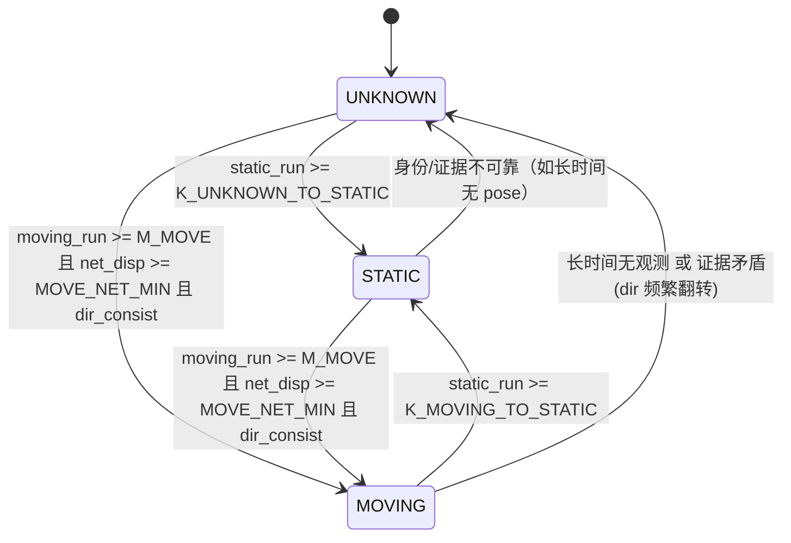

# Phase 3 分析：Motion State（UNKNOWN / STATIC / MOVING）与 Historical Geometry 策略

> 日期：2026-09-10
> 性质：**纯分析文档（Analysis Only）——本轮不修改任何源代码，等待下一阶段 Prompt。**
> 前置：
> - `docs/Phase2_3_HistoricalTrack_CurrentAssociation_Validation.md`（Phase 2 实测：A → 3×3 → Current Cluster/Track 关联）
> - `docs/MapFrameHistoricalFeedbackRawPointImage_FinalArchitecture.md`（总体架构，只读参考）
>
> 本文档**不重新设计 Phase 2**，不修改 3×3 Search。

---

## 0. 结论速览

1. Phase 2 已证明“**Historical Track 能不能找到当前目标**”不再是核心问题（A 稳定、miss 期 anchor 稳定、3×3 可跨 1~2 Grid 命中、目标重现可重关联）。
2. Phase 3 第一优先级 = **运动状态判断（UNKNOWN / STATIC / MOVING）**，因为 **Motion State 必须优先于 Historical Geometry Policy**。
3. 运动判断必须在 **Map / World Frame** 上做（消除自车运动），复用现有 `Localization` + `CoordinateTransformer::vehicleToMap/mapToVehicle`；**不重新实现定位**。
4. 关键约束：Grid resolution = **0.1 m**，中心存在 **±1 Grid 抖动** → motion threshold **必须明显大于 jitter**（建议单帧位移门限 ≥0.12 m，并叠加“多帧同向 + 净位移”条件）。
5. STATIC / MOVING / UNKNOWN 三态必须使用**不同的 Historical Geometry Policy**；MOVING 禁止做 `Historical ∪ Current` cell 融合（会拉长成假目标）。
6. 建议使用**简单可解释的滞回状态机**（计数器 + 双门限死区），**不引入** Kalman / Hungarian / JPDA / MHT。
7. 本文档同时给出：阈值推荐、STATIC+MISS、partial detection、OBB 重算、yaw 稳定、近邻冲突处理、日志与验证实验、最小改动范围、Phase 4 建议。

---

## 1. Current pipeline（已核实）

生产路径唯一入口：`SutengDriver::ProcessPcapCloud()`（`include/SuTengDriver.cpp`）

```
stuffed_cloud_queue.popWait()
  │  Frame 1 → 存 g_previousTimestamp 后 continue（跳过）
  ▼
PointCloudTransform(R_Combined) → pFilteredPointCloud        （雷达系→车体/主雷达系）
  ▼
ElevationMapGroundFilter::ProcessWithObstacleDetection(...)
  │  BuildGrid → ComputeGroundHeight → ComputeSlope → RegionGrowing
  │  → GenerateGroundMask → ComputeGroundReference → AnalyzeVerticalOccupancy
  │  → ClusterObstacleGrid → BuildClusterFromCells → ComputeClusterOBB
  │  → std::vector<GridCluster> outputClusters
  ▼
[HDMap] filterClusters(只打 in_road/map_valid 标签，不删除)
  ▼
ConvertClustersToTrackedObstacles()  ⚠️ 硬过滤 `if (cluster.in_road || !m_hdmapEnabled)`
  ▼
SimpleTracker::update(detections, ts)                            ← 雷达系贪心匹配
  ▼
ComputeHistoricalFeedback()   ← Phase 2：A → 3×3 → 关联（Debug only，不改 3×3）
  ▼
UpdateMapAnchors()            ← 帧末维护 MapAnchoredTrack 侧表
  ▼
[onlineModel] ConvertTrackToS2ObstacleBox(vtrackings) → sendUdpMsg
```

### 1.1 已核实的关键事实（Phase 3 设计的地基）

| 事实 | 值 / 位置 | 对 Phase 3 的影响 |
|---|---|---|
| Grid resolution | `grid_resolution = 0.1 m` | 一切阈值必须 > 量化噪声 |
| Grid 索引 | `row=floor((y-roi_y_min)/res)`, `col=floor((x-eff_roi_x_min)/res)`, `idx=row*cols+col` | Historical footprint 栅格化复用同式 |
| 有效 ROI X 起点 | `eff_roi_x_min = max(roi_x_min, car_half_x+body_filter_x_threshold)` | 边界合法性检查 |
| GridCluster 坐标 | 主雷达系（x 前, y 左） | 与 Track 同系 |
| OBB 计算 | `ComputeClusterOBB()`：**用 cell 中心做 2D PCA**，`n>=3` 才有 OBB，否则 `has_obb=false`（AABB 回退） | 几何**被 10cm 网格量化**；cell 数少时 yaw 不稳 |
| OBB 角度 | `obb_angle = atan2(axis_primary.y, axis_primary.x)`，范围约 `[-π/2, π/2]`，**特征向量符号任意 → 0°/180° 等价跳变** | yaw 必须折叠 + 平滑 |
| OBB 置信度 | `orientation_confidence = (λmax-λmin)/(λmax+λmin)` **已计算但未存储（当前是 unused variable）** | Phase 3 可直接落库作为 yaw 可信度 |
| OBB 角点顺序 | 左下→右下→右上→左上 | 重算 corners 必须保持同序 |
| TrackedObstacle 字段 | `id, cluster_id, pos_x/y/z, corners[4], depth, width, height, age, lastSeen, Translation[3], Rotation[9], vx, vy, kf` | **没有 map_x/map_y / yaw / motion_state**（Phase 3 需新增） |
| `depth`/`width` 语义 | `depth=obb_length`(x 主方向), `width=obb_width` | length/width prior 可复用 |
| UDP 输出字段 | `S2obstacleBox{ id, depth, width, height, pos_x/y/z, corners[4] }`（`ConvertTrackToS2ObstacleBox`） | **UDP 无显式 yaw**；yaw 稳定体现为 **corners/depth/width 稳定** |
| Tracker 匹配 | 贪心最近邻，`match_threshold = 0.5 m`，代价用速度外推位置，赋值用**原始检测位置** | 不引入 Hungarian |
| `Track.age` | **匹配成功帧计数**（匹配 +1；miss 不增），birth=0 | 运动状态不能用“存在即 STATIC” |
| `Track.lastSeen` | **连续 miss 计数**（匹配清零，miss +1） | 生命周期依据 |
| `removeLongLostTargets()` | 实测 `t.lastSeen > 5`（**连续 6 帧 miss 删除**） | ⚠️ 与架构文档旧写 `>10` 不符，以代码为准 |
| `Track.cluster_id` | **只在诞生时写一次，匹配时不回写** | 不能当“本帧簇 ID” |
| miss（`detections.empty()` 分支） | `pos += vx*dt`，`corners += vx*dt`（雷达系外推） | ⚠️ 自车运动下这是错误外推，应改为 map 投影 |
| miss（有检测但本 track 未匹配） | 只 `lastSeen++`，**位置/角点不更新（保持旧值）** | 静默 stale |
| Historical 侧表 | `MapAnchoredTrack{ id, map_x, map_y, has_map, depth, width, map_corners[4], age, lastSeen }` | **已含 map OBB，但无 cell footprint、无 yaw 字段、无 map 位置历史** |
| Historical 反馈结构 | `HistoricalFeedbackRegion`：`projected_x/y(A)`, `base cell`, `search_window_indices`, `candidate_cluster_ids`, `association_*`, `projected_cell_indices`(历史 OBB 栅格化) | **`projected_cell_indices` 可直接复用为“predicted cells”** |
| Historical 时序 | `ComputeHistoricalFeedback()` 在 `UpdateMapAnchors()` **之前** → 帧 N 用帧 N-1 帧末锚点（差 1 帧） | 运动状态同样差 1 帧，需容忍 |
| Historical 门槛 | `anchor.has_map && anchor.age >= kMinTrackAgeForFeedback(3)` | 前几帧 `hist_tracks=0` 属正常（见 Phase 2 文档 §21） |

### 1.2 与架构文档的差异修正

- 架构文档 §15.1 写 `removeLongLostTargets(): lastSeen > 10`；**实测代码为 `> 5`**（`track.cpp`），即**连续 6 帧 miss 即删除**。Phase 3 的 coast 设计必须以 `>5` 为现状基线。
- 架构文档提到的 `map_x/map_y/stable_yaw/motion_state` 在 `TrackedObstacle` 上**当前并不存在**；Phase 2 只是用外部侧表 `MapAnchoredTrack` 做了最小等价。

---

## 2. Phase 2 validation summary（已实测结论）

| # | Phase 2 结论 | 证据 |
|---|---|---|
| 1 | Historical Track 可稳定投影到当前 Radar frame（A 稳定） | `ProjectedCurrent=(9.60,3.46)` 等逐帧稳定；miss 期 A 仍打印 |
| 2 | 连续 miss frame 中 Historical Anchor 仍稳定 | 271~278 期间 anchor 冻结、age 冻结、lastSeen 递增，A 仍可投影 |
| 3 | 当前 detection 与历史存在 1~2 Grid 离散误差时，3×3 可命中 | 278 帧 `baseCell=(74,63)`，C8 落在窗口内，`inWindow=1` |
| 4 | 目标重现后可重新关联 | 278 帧 `reason=SAME_TRACK_ID`，`Distance=0.025` |
| 5 | 关联判定：优先 `SAME_TRACK_ID`，否则 `GEOMETRIC`（≤0.5 m，且仅当同 ID 已不存在） | `ComputeHistoricalFeedback()` |
| 6 | **新目标前几帧 `hist_tracks=0` 属正常**：`anchor.age<3` | 271(age0)…277(age3 帧末) → 278 首次通过 |

**Phase 2 之后仍存在的缺口（= Phase 3 的输入）**：
1. 没有运动状态 → 无法区分“静态 jitter”与“真实运动”；
2. 没有“历史几何策略” → 无法决定历史 footprint 怎么参与当前帧；
3. `anchor` 生命周期绑定 tracker 删除（`lastSeen>5`）→ 长 miss 后无先验；
4. 雷达系外推（`vx*dt`）在自车运动下不可靠；
5. yaw 未稳定，3~6 cell 目标 PCA yaw 跳变明显。

---

## 3. Motion State problem definition

### 3.1 状态语义

```
UNKNOWN : 历史/证据不足，无法判断（新 Track 默认；证据落入死区）
STATIC  : 地图系位置在噪声范围内稳定（低矮障碍物的默认先验）
MOVING  : 地图系位置连续多帧同向位移且显著超过噪声
```

### 3.2 为什么 Motion State 必须优先于 Historical Geometry

- STATIC：历史几何是**强 prior**，可用于补全缺失 cell。
- MOVING：历史几何**可能已位移/转向**，直接 union 会生成“拉长的假目标”（架构文档 §14 明确禁止）。
- UNKNOWN：历史几何**只能保守使用**，不能被当作 ground truth。

因此顺序必须是：

```
Motion State  →  Historical Geometry Policy  →  Geometry Fusion
```

不能反过来（不能先融合再解释运动）。

### 3.3 明确不做

- 不引入 Kalman Filter / Hungarian / JPDA / MHT。
- 不修改 Ground Filter / PointCloudTransform / Grid resolution / Cluster 生成 / 3×3 Search / HDMap / Localization / UDP protocol / 原始点云。

---

## 4. Map-frame motion analysis（为什么用地图系）

### 4.1 问题

雷达系（主雷达系 x 前 y 左）中，**自车运动会使静止目标也移动**：

```
车辆前进 → 静止障碍物在雷达系 x 减小（靠近），y 可能变化
```

因此若在雷达系判断运动，**自车运动会被误判为目标运动**。当前 `SimpleTracker` 用雷达系贪心匹配（本身尚可），但其 `vx/vy` 是雷达系两点差分，**不能作为目标运动证据**。

### 4.2 地图系判据（复用现有实现）

已有能力（无需新定位代码）：

```
vehicleToMap(veh_x, veh_y, VehiclePose{pose.x, pose.y, pose.heading_deg}) → map_x, map_y
mapToVehicle(map_x, map_y, pose) → 当前雷达系（用于反馈投影）
```

- `CoordinateTransformer` 内部已统一应用 `s_grid_heading_offset_deg`（=90°+fLidar2Vehicle_Heading），调用方无需重复补偿。
- `LocalizationManager::Pose{ x, y, heading_deg, timestamp_ms, valid }` 由每帧 `getPose(loc_pose)` 提供；`have_pose = got_pose && loc_pose.valid`。

### 4.3 判据公式（每帧）

```
P_map(k) = vehicleToMap(measurement(k).pos_x, pos_y, pose(k))     // 仅在该帧匹配成功且 pose.valid 时
d(k)     = P_map(k) - P_map(k-1)                                  // 地图系帧间位移向量
|d(k)|   = sqrt(dx²+dy²)
dt(k)    = (t(k) - t(k-1))/1000                                   // g_previousTimestamp 差分
v(k)     = |d(k)| / dt(k)                                         // 速度-like（EMA 平滑）
```

### 4.4 前置条件与降级

- **motion 判定要求 `pose.valid == true`**；否则本帧**不产生运动证据**，状态保持不变（或对长时间无 pose 归为 UNKNOWN）。
- 只在**匹配成功帧**产生位移证据（miss 帧无新观测 → 不产生 motion 证据，但可保留状态）。
- 身份连续性：只在**同一 track id**（即 `SAME_TRACK_ID` 关联成功）时累计证据，避免把不同目标接上。

---

## 5. Grid jitter analysis（噪声必须先量化）

### 5.1 抖动来源（全部来自现有代码）

| 来源 | 机制 | 量级 |
|---|---|---|
| Cell 量化 | Grid 0.1 m；`GridIndexToWorld` 给出 cell 中心 | ±0.05 m/cell |
| Cluster 成员变化 | 边缘 cell 时有时无（点云落 cell 边界） | 中心跳 ~ `0.1/n` ~ 0.02~0.05 m（n=2~5） |
| OBB center | = cell 中心均值（非原始点） | 随成员抖动 |
| OBB 主轴 | 特征向量符号任意 + 少 cell 时 λ 接近 | yaw 0°↔180°、±18°、90° 跳变 |
| 真值抖动 | 目标真的 ±1 Grid 来回 | 观测到 +1/-1 Grid（≈±0.1 m） |

### 5.2 抖动的统计特征

- 静止目标的**地图系**帧间位移：多数 ≤0.05 m，偶发 ≤0.1 m（1 Grid）。
- **关键结论**：单帧位移阈值必须 **> 0.1 m** 才能真正超过“+1/-1 Grid 来回”的量化噪声；否则会把 jitter 判成 MOVING。
- 而真实运动若为 2 m/s、10 Hz → 每帧 0.2 m，**明显可区分**；若为 0.3 m/s → 每帧 0.03 m，**与噪声不可区分**（低频运动存在原理性盲区，见 §7.4）。

### 5.3 抖动不能进入几何融合

- jitter 引起的中心 ±0.1 m 变化 → 若直接进入 cell 补充，可能把邻格当作“缺失部分”补进来 → **假膨胀**。
- 因此补充策略必须**远离边界**（§18），且 STATIC 判断必须稳定后再启用融合。

---

## 6. UNKNOWN / STATIC / MOVING state machine

### 6.1 状态与证据

```
每匹配帧：step = |d(k)|   (地图系)
证据计数：
    moving_run  : 连续满足 step >= MOVE_STEP_MIN 的帧数
    static_run  : 连续满足 step <= STATIC_STEP_MAX 的帧数
    net_disp    : 最近 MOVE_WIN 帧的净位移 |P_map(k) - P_map(k-MOVE_WIN+1)|
    dir_consist : 最近 MOVE_WIN 帧位移方向一致性（相邻方向夹角 <= DIR_TOL）
```

### 6.2 状态迁移（简单可解释）



### 6.3 迁移规则表

| 迁移 | 条件 | 说明 |
|---|---|---|
| UNKNOWN → STATIC | `static_run >= K_UNKNOWN_TO_STATIC` | 低矮障碍物默认静态，允许较早进入 STATIC |
| UNKNOWN → MOVING | `moving_run >= M_MOVE` **且** `net_disp >= MOVE_NET_MIN` **且** `dir_consist` | 必须“持续 + 同向 + 净位移足够”，两帧位移不判 MOVING |
| STATIC → MOVING | 同上（阈值可略高于 UNKNOWN→MOVING） | 需更强证据才推翻静态先验 |
| MOVING → STATIC | `static_run >= K_MOVING_TO_STATIC`（更长） | 滞回，避免抖动回跳 |
| MOVING → UNKNOWN | 长时间无观测 / 方向频繁翻转 | 保守降级 |
| STATIC → UNKNOWN | pose 长时间无效 / 重关联不确定 | 保守降级 |

### 6.4 死区（Dead Band）

```
STATIC_STEP_MAX (=0.08) < step < MOVE_STEP_MIN (=0.12)
```
落入死区的帧：**既不计入 moving_run 也不计入 static_run**（或分别衰减），避免 0.08~0.12 区间反复触发状态翻转。

---

## 7. Threshold recommendation

> 前提：Grid 0.1 m；目标运动多为低频；低矮障碍物绝大多数静态。

| 参数 | 建议值 | 依据 |
|---|---|---|
| `STATIC_STEP_MAX` | **0.08 m** | 略小于 1 Grid，覆盖量化噪声 |
| `MOVE_STEP_MIN` | **0.12 m** | 明确大于 1 Grid（0.1 m）jitter |
| `MOVE_NET_MIN` | **0.30 m**（最近 3~5 帧净位移） | 排除来回抖动（净位移≈0） |
| `MOVE_WIN` | **3 帧**（≈0.3 s @10Hz） | 快速响应，但要求持续 |
| `M_MOVE` | **3** | 连续同向帧数 |
| `DIR_TOL` | 相邻位移夹角 **≤60°** | 同向判据（cos≥0.5） |
| `K_UNKNOWN_TO_STATIC` | **4 帧**（≈0.4 s） | 尽早给静态先验 |
| `K_MOVING_TO_STATIC` | **6 帧**（≈0.6 s） | 滞回，退出 MOVING 更慢 |
| `V_EMA_ALPHA` | **0.3** | 速度平滑 |
| 状态翻转上限 | **每 100 帧 ≤3 次** | 超限 → 强制 UNKNOWN（防 chatter） |

### 7.1 与 jitter 的关系（核心）

- `+1/-1 Grid 来回`：每帧 `step≈0.1 m`，但**净位移 ≈0**、方向**来回翻转** → `net_disp` 与 `dir_consist` 都不过 → **判 UNKNOWN，不会误判 MOVING**。
- 真实匀速运动 2 m/s：每帧 0.2 m，方向一致，`moving_run` 与 `net_disp` 双满足 → 3 帧内进入 MOVING。

### 7.2 双门限的意义

- 只用单帧门限 → jitter 误判；
- 单帧门限 + 多帧同向 + 净位移 → **三重约束**，抗 jitter 且可解释。

### 7.3 一帧延迟

Historical 链路本身就是帧 N 用帧 N-1 的锚点（§1.1）。运动状态同样有 1 帧延迟，属可接受，不需要额外补偿。

### 7.4 原理性盲区（必须承认）

低于 `MOVE_STEP_MIN/dt ≈ 1.2 m/s` 的持续低速运动（每帧 <0.12 m）无法与噪声区分 → 保持 UNKNOWN/STATIC。对“低矮障碍物”场景（路沿、减速带、石块）可接受；若未来需检测缓慢移动目标，必须依赖 Phase 4 的原始点/更小分辨率（5 cm Raw Point Image）。

---

## 8. Hysteresis design

1. **进入门限 ≠ 退出门限**：`MOVE_STEP_MIN(0.12)` vs `STATIC_STEP_MAX(0.08)`，中间为死区。
2. **计数不对称**：`M_MOVE=3`（快进）vs `K_MOVING_TO_STATIC=6`（慢出）。
3. **净位移门槛**：避免“来回小幅”累积成 moving_run。
4. **方向一致性**：方向翻转即清零 `moving_run`。
5. **翻转率限制**：状态翻转计数超限 → 强制 UNKNOWN（保守）+ 日志告警。
6. 简单实现：三个整型计数器 + 一个 EMA 速度，**无需复杂算法**。

---

## 9. STATIC policy

```
MotionState == STATIC
  → Historical geometry 作为强 prior
  → 允许 Historical Cell Fusion（§13 / §18）
  → stable_yaw 强平滑（历史 yaw 主导，§20）
  → length / width 使用稳定模型（§16）
  → miss 时可 coast（§12）
```

约束：
- **Current observation 优先级最高**：融合是“补缺”，不是“覆盖”。
- 只有当 `association_reason` 属于可信族（`SAME_TRACK_ID` 或 STATIC 下低风险的 `GEOMETRIC`）时才融合。
- STATIC 是**结论**，不是默认假设；必须由 `static_run` 证据支撑（`UNKNOWN` 不得自动当 STATIC）。

---

## 10. MOVING policy

```
MotionState == MOVING
  → 【禁止】Historical Cell ∪ Current Cell
  → Historical 只用于：位置预测 / 运动方向 / speed-like / yaw 参考
  → 当前 footprint 以 Current cells 为唯一来源
  → yaw 以当前观测为主（轻平滑，§20）
```

产出：

```
Predicted Current Position   ← 由 P_map(k) + v_map (EMA) 外推到当前帧（可选，用于 ROI/gating）
Stable Yaw                   ← 当前测量 yaw 的轻度 EMA（不锁历史）
Motion Direction             ← d(k) EMA 归一化方向
```

---

## 11. UNKNOWN policy（保守）

```
MotionState == UNKNOWN
  → Historical 仅作弱先验：不融合 cell、不锁 yaw
  → 允许：ROI / gating / 位置预测辅助（低权重）
  → 几何输出 = Current observation（与现在的行为接近）
  → 只有证据满足条件才升级 STATIC / MOVING
```

明确禁止：**因为“Track 已经存在”就自动当作 STATIC**。

---

## 12. STATIC + MISS（Phase 3 重点）

### 12.1 场景

```
MotionState == STATIC && Current Detection == NONE
```

### 12.2 处理链（设计）

```
Historical Track (map anchor 冻结)
  ↓ mapToVehicle(anchor.map_x/y, 当前 pose) = A
  ↓ Historical footprint（map 系）→ 当前雷达系 → rasterize 到当前 Grid
  ↓ 用 stable_yaw / stable L/W 重建 OBB（不依赖当前检测）
  ↓ Track 继续输出（coast）
  ↓ UDP（带 confidence 门槛）
```

### 12.3 需要明确的 6 个问题

| 问题 | 建议 |
|---|---|
| 最多连续 miss 多少帧 | **雷达系重关联窗**：沿用现状 `lastSeen>5`（≤5 帧 miss）。**地图系 coast**：设计目标 `≤10~15` 帧；但**当前代码 hard limit 是 6 帧**（`>5` 删除），要延长必须先解耦 anchor/track 生命周期（Phase 4 前置） |
| 与当前 lifetime 配合 | `age` 语义保持“匹配帧数”（coast 帧**不**让 `age++`）；另设 `coast_frames` 与 `track_lifetime`，不要混用 |
| miss 期间是否更新 geometry | **不更新**。冻结 stable_yaw / stable L/W；中心由地图锚点投影得到 |
| miss 期间是否保持 yaw | **保持**（STATIC 强 prior） |
| miss 期间是否保持 L/W | **保持** |
| confidence decay | 每 miss 帧 `confidence *= 0.85`；`confidence < 0.3` → 停止输出（避免幻影目标） |

### 12.4 安全阈值（防幻影）

- `kCoastMaxStatic = 5`（与现有 lifetime 相容，最小改动）；
- `kCoastConfidenceFloor = 0.3`；
- 仅 `MotionState==STATIC` 允许 coast；`MOVING`/`UNKNOWN` 不 coast（或仅 1~2 帧）。

### 12.5 与现有代码的冲突点（必须记录）

- `SimpleTracker` 在 `detections.empty()` 分支用 **雷达系 `vx*dt` 外推** —— 自车运动下错误。STATIC coast 应改为 **map 锚点 + 当前 pose 投影**，避免依赖雷达系外推。
- 现有 track 若连续 6 帧 miss 即被删除，coast 也就停止 → 想达到 10~15 帧 coast，需要独立于 tracker 删除的锚点/状态保留（架构文档 §15 建议的 `max_map_missed_frames`）。

---

## 13. STATIC + PARTIAL DETECTION

### 13.1 场景

```
MotionState == STATIC && Current Detection != NONE
但 Current footprint 明显小于 Historical footprint
```

### 13.2 原则

```
Current Observation = primary evidence（永不修改、永不被覆盖）
Historical Geometry  = missing-part prior（只补“缺”）
```

**不是**“把 Historical OBB 盖到 Current OBB 上”。

### 13.3 判据（用于决定是否进入“补充模式”）

```
cur_cells   = 当前 cluster cell 数
hist_cells  = predicted cells（历史 footprint 投影到当前帧后的 cell 集）数
missing     = predicted \ current
若 |missing| > 0 且 满足 §18 的全部安全约束 → 进入补充
```

### 13.4 示例

```
Historical:  ■ ■ ■
             ■ ■ ■
             ■ ■

Current:     ■ ■
               ■

Fused:       ■ ■ ■        ← 只补“当前缺失、且历史预测到、且贴近当前”的 cell
             ■ ■ ■
             ■ ■
```

---

## 14. MOVING + PARTIAL DETECTION

- **不做 cell 补充**。
- 当前 footprint = Current cells（可能偏小 → 输出偏小，但**正确**）。
- Historical 用于：位置预测、方向、`speed-like`，以及（可选）`length/width` 的**弱先验**（仅当当前 L/W 明显不足且运动方向连续时）。
- yaw 用当前测量（轻平滑）。
- 若当前 footprint 连续过小（部分遮挡），可将该 track 降级为 UNKNOWN 并保守输出。

---

## 15. Historical Cell representation

### 15.1 表示选择

| 方案 | 说明 | 评价 |
|---|---|---|
| 上一帧 footprint | 只存 1 帧 | 抖动大，不适合 STATIC prior |
| 最近 N 帧 footprint | 环形缓冲 N=3~5 | STATIC 可用“多数投票/交集”稳定 |
| **稳定 footprint model**（推荐） | 冻结的 cell 集合（map 系）+ stable OBB | 简单、稳定、可投影 |
| 保存原始点云 | — | **禁止**（体积大、越权） |

### 15.2 推荐表示

```
STATIC ：
    historical_cells_map : vector<Point2D>   // cell 中心（地图系），冻结于最近一次可靠观测
    historical_obb_map   : {center, yaw, L, W}  // 地图系稳定 OBB
    size_cap             : ≤ 64 cells（超出则保留最近主要区域）

MOVING ：
    仅保留 last_map_pos + v_map(EMA) + last_yaw（不保留合并 footprint）

UNKNOWN ：
    仅保留 last_map_pos + last_obs_cells（1 帧，弱先验）
```

### 15.3 为什么用 cell 中心而不是原始点

- 复用现有 `GridIndexToWorld` / `WorldToGrid` 同一坐标系，无新增标定；
- 与 `HistoricalFeedbackRegion.projected_cell_indices`（历史 OBB 栅格化）天然衔接；
- **明确不引入** 5cm Raw Point Image（属 Phase 4）。

---

## 16. Historical Geometry representation

| 状态 | 保存内容 | 用途 |
|---|---|---|
| STATIC | `historical_cells_map` + `stable_yaw` + `stable_L/W` + `confidence` | 强 prior，cell 补充 + yaw 锁 + 尺寸稳定 |
| MOVING | `last_map_pos` + `v_map` + `last_yaw` + `last_L/W`（仅作参考） | 位置/方向预测；不做融合 |
| UNKNOWN | `last_obs_cells`(1 帧) + `last_map_pos` | 弱先验，仅 gating |

**不默认保存所有历史点云。**

---

## 17. Current / Historical alignment（方法 A vs B）

### 17.1 两种方式

**方法 A（推荐）：Historical → Current**

```
historical_cells_map (map frame)
  → mapToVehicle(pose)                 // 刚体变换到当前雷达系
  → WorldToGrid                        // 栅格化到当前 Grid
  → predicted_cells
  → 与 current cells 比较
```

**方法 B：Current → Historical**

```
current cells → vehicleToMap(pose) → 历史帧 Grid → 融合 → 再 mapToVehicle 回当前
```

### 17.2 等价性分析

- 对**连续刚体点集**：A 与 B 数学等价（同一刚体变换的逆）。
- 对**离散 Grid cell**：**不等价**。差异在于**栅格化次数**：
  - A：历史只栅格化 1 次（到当前 Grid）；
  - B：当前栅格化到历史 Grid（1 次）+ 融合后再回到当前 Grid（第 2 次）→ **双重量化误差**，且需要维护“历史帧 Grid 几何”。
- 工程差异：
  - A 不需要历史 Grid 快照，只需要历史 **map 系点集**；
  - B 需要“历史帧的网格定义”，且会**改写 current detection 的表达**（违反“不修改 Current Detection”）。

### 17.3 结论

**采用方法 A**：
- Current Detection 始终是“当前 LiDAR 实际观察结果”，全程不被修改；
- Historical 只作为 prior 投影进来；
- 只发生 1 次栅格化，误差可控；
- 与 Phase 2 的 `mapToVehicle + RasterizeQuadToGrid` 复用同一套代码路径。

---

## 18. Cell supplementation strategy

### 18.1 流程（STATIC only）

```
predicted_cells = rasterize(project_to_current(historical_cells_map))
missing         = predicted_cells \ current_cluster_cells
```

对每个 `m` ∈ missing，必须**全部**满足才允许补充：

1. `m` 属于当前 Grid 合法范围（`0<=row<rows, 0<=col<cols`）；
2. `m` 不在**任何其他当前 cluster** 的 cell 集合中（`cell_to_cluster` 排他）；
3. `m` 到当前 cluster 的**最近 cell** 距离 ≤ `SUPP_MAX_CELL_DIST`（建议 **≤2 cells = 0.2 m**）；
4. 补充后 footprint **连通**（8 邻域 BFS 不产生孤立块）；
5. **面积比限制**：`area(fused) / area(current) <= SUPP_MAX_RATIO`（建议 **≤1.5**）；
6. 该 current cluster **只被一个** historical track 使用（§22 排他）。

任一条不满足 → **不补充**（保守）。

### 18.2 权重

- Current cells 权重 `1.0`；
- Supplemented cells 权重 `0.5`（进入加权 PCA，见 §19）。

### 18.3 输出

```
fused_cells = current_cells ∪ {允许的 missing}
```

> 备注：`HistoricalFeedbackRegion.projected_cell_indices` 已经是“历史 OBB 栅格化到当前 Grid”，可作为 `predicted_cells` 的现成近似（需按 §18.1 过滤）。

---

## 19. OBB recalculation

### 19.1 原则

- **不直接复用** Current OBB，也**不直接复用** Historical OBB；
- 由 **fused footprint** 重新计算。

### 19.2 算法（与现有 `ComputeClusterOBB` 同构）

```
输入：fused cell 中心点集 + 权重 w_i
1. 加权均值 μ = Σ w_i p_i / Σ w_i
2. 加权协方差 C = Σ w_i (p_i-μ)(p_i-μ)^T / Σ w_i
3. 特征分解（SelfAdjointEigenSolver）→ λ0≤λ1，主轴=eigvec(λ1)
4. 投影求 min/max → length/width（保证 length≥width）
5. yaw = atan2(主轴向量的 y, x) → 折叠到 [-90°,90°)（§20）
6. confidence = (λ1-λ0)/(λ1+λ0)   ← 复用现有 `orientation_confidence` 公式（当前未存储）
7. corners = 主/次轴组合（§21）
```

### 19.3 退化处理

- `fused cell 数 < 3` → 不重算 OBB，回退 AABB（与现有 `has_obb=false` 行为一致）；
- `confidence < OBB_MIN_CONF`（建议 0.2）→ 保留上一帧 stable OBB 的 **yaw**，只更新 center/L/W（或整体保持）。

### 19.4 与现有代码的关系

- 现有 `ComputeClusterOBB(GridCluster&)` 作用在 `GridCluster` 上、用等权 cell 中心。
- Phase 3 需要一个**等价的“点集 + 权重”版本**（放在 Track Geometry / Historical Geometry 层，**不改** Cluster 生成算法）。

---

## 20. Yaw stabilization

### 20.1 问题（已观测）

3~6 cells 时 PCA yaw 出现 `12.93° / 0° / -18.44° / 18.44° / 90°` 跳变，根因：

1. 特征向量**符号任意** → `0°↔180°` 等价；
2. cell 数少、λ0≈λ1 → 主轴不稳定（`orientation_confidence` 低）；
3. 边缘 cell 的加入/退出 → 主轴翻转。

### 20.2 折叠 + 圆形差

```
normalize(θ) = 把 θ 折叠到 [-90°, 90°)     // 长轴无向
diff = normalize(θ_meas - θ_stable)        // 结果 ∈ [-90°, 90°)
```

### 20.3 更新策略（按 Motion State 分）

| 状态 | yaw 更新 | 说明 |
|---|---|---|
| STATIC | `stable_yaw += α_static * diff`，`α_static = 0.1`，且每帧限幅 ≤5° | 历史 yaw 强 prior，近锁死 |
| UNKNOWN | `α_unknown = 0.25`，每帧限幅 ≤10° | 温和平滑 |
| MOVING | `α_moving = 0.5`，每帧限幅 ≤20° | 以当前观测为主，不锁历史 |

### 20.4 可信度门控（重要）

仅在下列条件成立时才更新 `stable_yaw`：

```
n_cells >= 4  且  orientation_confidence >= 0.3
```

否则**保持**上一帧 `stable_yaw`（不用不可靠测量污染）。

> 依据：`orientation_confidence` 公式已存在于 `ComputeClusterOBB`（当前被计算但未使用），Phase 3 建议**存储**到 `GridCluster` 或 Track Geometry 层。

### 20.5 STATIC 的 yaw 来源

- 优先使用 **historical stable_yaw（map 系）**，投影到雷达系后作为 prior；
- 当前测量与其一致 → 微调；
- 当前测量剧烈跳变但 confidence 低 → **忽略**；
- 确认 MOVING → 立即切换为“观测主导”。

---

## 21. Four-corner generation

### 21.1 由 (center, L, W, yaw) 生成

```
c = cos(yaw), s = sin(yaw)
axis_primary   = ( c,  s)     // length 方向
axis_secondary = (-s,  c)     // width 方向
corner(±L/2, ±W/2) = center + axis_primary*(±L/2) + axis_secondary*(±W/2)

corners[0] = (min_pri, min_sec) = 左下
corners[1] = (max_pri, min_sec) = 右下
corners[2] = (max_pri, max_sec) = 右上
corners[3] = (min_pri, max_sec) = 左上
```

### 21.2 必须保持的约束

- **顺序与现有 `ComputeClusterOBB` 一致**（左下→右下→右上→左上），因为下游 `S2obstacleBox.corners[4]` 与 `DebugViewer` 依赖该顺序；
- **保证 length ≥ width**（语义一致）；
- UDP 无显式 yaw → **yaw 的稳定性完全通过 corners/depth/width 体现**，因此 corners 生成必须稳定。

### 21.3 各状态下的 corners 来源

| 状态 | center | L/W | yaw | corners |
|---|---|---|---|---|
| STATIC + full | fused 均值 | fused PCA | stable_yaw | 重算 |
| STATIC + partial | fused 均值 | fused PCA | stable_yaw | 重算 |
| STATIC + miss | map 锚点投影 A | 冻结 stable L/W | 冻结 stable_yaw | 由 A + 冻结 L/W/yaw 生成 |
| MOVING | 当前测量中心 | 当前测量 L/W | 当前测量 yaw（轻平滑） | 由当前测量生成 |
| UNKNOWN | 当前测量中心 | 当前测量 L/W | 当前测量 yaw（弱平滑） | 由当前测量生成 |

---

## 22. Nearby-object conflict handling（简单几何规则）

### 22.1 风险

```
Track A 的 Historical footprint
   +
Current Cluster A
   +
Nearby Cluster B
→ 若直接 union，会把 B 吞进来
```

### 22.2 规则（全部为简单几何，不使用 Hungarian/JPDA/MHT）

1. **cell 排他**：补入的 cell 不得属于任何其他 current cluster（`cell_to_cluster` 唯一映射，first-wins 已存在）。
2. **最大补充距离**：`m` 到 current cluster 最近 cell 距离 ≤ `SUPP_MAX_CELL_DIST`（≤2 cells = 0.2 m）。
3. **面积比上限**：`area(fused)/area(current) ≤ 1.5`。
4. **连通性**：补充后 8 邻域连通，不产生孤立块。
5. **历史-当前排他**：一个 current cluster **最多被一个** historical track 补；多个 track 竞争同一 cluster 时：
   - 取 **anchor 到 cluster 中心距离最小** 的 track；
   - 其余 track 该帧**不补充**，并按状态衰减 / 维持；
6. **中心距离门**：historical anchor 投影 A 与 current cluster 中心距离 > `ASSOC_MAX_DIST`（Phase 2 已有 `kHistAssociationMaxDistM=0.5`）→ 不补充；
7. **边界歧义**：任何规则处于临界 → **不补充**（保守）。

### 22.3 与 Phase 2 的衔接

- Phase 2 的 `candidate_cluster_ids`（3×3 窗口内）与 `association_in_window` 可直接作为“参与竞争的 cluster 集合”，用于排他判定；
- `association_reason` 决定是否信任关联（`SAME_TRACK_ID` 优先）。

---

## 23. Historical lifetime

| 项目 | 现状 | Phase 3 建议 |
|---|---|---|
| 雷达系匹配窗 | `lastSeen > 5` 删除（≤5 帧 miss） | 保持（**不改** tracker 匹配窗） |
| 地图系状态保留 | 与 tracker 删除绑定（同步删除锚点） | 设计目标 `max_map_missed_frames = 10~15`，**独立于 tracker 删除** |
| STATIC coast | 无 | ≤ `kCoastMaxStatic`（最小改动：≤5，与现状相容） |
| geometry 更新 | miss 时冻结 | 保持冻结（yaw/L/W） |
| confidence | 无 | `confidence` 初始 1.0，miss 每帧 `*=0.85`，<0.3 停止输出 |
| `age` | 匹配帧计数 | **不让 coast 帧增加 age**；新增 `coast_frames` / `track_lifetime` 区分 |
| 位置历史 | 仅最新 map 位置 | 增加 `recent_map_positions`（环形，N=5~8，用于运动证据） |

---

## 24. Debug logging

### 24.1 建议日志（每 track 每帧，additive）

```
[MotionState] Track=10011 state=STATIC step=0.021 net_disp=0.03 dir_ok=1
             moving_run=0 static_run=7 v_map=(0.00,0.00) conf=1.00
[StatFusion]  Track=10011 anchor=(9.60,3.46) cur_cells=4 pred_cells=7 missing=3 supp=2
             area_ratio=1.40 yaw_meas=-18.4 yaw_stable=0.0 ori_conf=0.12 n_cells=4
[Coast]       Track=10011 coast=2/5 conf=0.72 center=(9.30,1.40) yaw=0.0 L=0.22 W=0.12
```

### 24.2 关键字段

| 字段 | 含义 |
|---|---|
| `state` | UNKNOWN / STATIC / MOVING |
| `step` / `net_disp` / `dir_ok` | 运动证据 |
| `moving_run` / `static_run` | 滞回计数器 |
| `v_map` | 地图系 EMA 速度 |
| `cur_cells` / `pred_cells` / `missing` / `supp` | 融合统计 |
| `area_ratio` | 面积比（防吞并） |
| `yaw_meas` / `yaw_stable` / `ori_conf` / `n_cells` | yaw 稳定诊断 |
| `coast` / `conf` | coast 状态与置信度 |

### 24.3 DebugViewer 建议（可选，additive）

- 按状态着色 Historical OBB：STATIC=绿、MOVING=红、UNKNOWN=灰；
- 用不同颜色画出 `predicted_cells` / `supplemented_cells` / `current_cells`（三色）；
- 显示 `stable_yaw` 方向箭头（体现 yaw 是否稳定）；
- 显示 A 与 current cluster 的距离（沿用 Phase 2 的绿色连线）。

> 约束：不新建可视化系统，继续复用 `DebugViewer::DrawHistoricalFeedbackOverlay` 的坐标系与图元。

---

## 25. Quick Validation experiments

| # | 实验 | 目的 | 观测指标 |
|---|---|---|---|
| E1 | 静止目标（路沿/石块）多帧 | 量化 jitter，标定 `STATIC_STEP_MAX` | 地图系 `step` 分布（P50/P95/max） |
| E2 | 真实运动目标（行人/车辆） | 验证 MOVING 判定延迟 | 进入 MOVING 所需帧数、`net_disp`、`v_map` |
| E3 | STATIC + 连续 miss（271~278 / 320~327 类序列） | 验证 coast 与“不造幻影” | `coast` 帧数、`conf` 衰减、是否停止输出 |
| E4 | STATIC + partial detection | 验证补充“不吞邻” | `area_ratio`、`supp`、是否引入 B 的 cell |
| E5 | 两个目标靠得很近 | 验证排他规则 | 是否出现兼并、竞争解算是否稳定 |
| E6 | 3~6 cells 小目标 | 验证 yaw 稳定 | `yaw_meas` vs `yaw_stable` 方差、跳变次数 |
| E7 | 自车运动下静止目标 | 验证地图系补偿 | 同一静止目标 `v_map≈0`、雷达系位置变化被正确抵消 |

**采集方式**（沿用现有 ulog）：
```bash
grep -n "\[MotionState\]\|\[StatFusion\]\|\[Coast\]\|\[HistoricalAssociation\]" log/ulog/ulog.log
```

---

## 26. Success criteria

| 维度 | 指标 | 目标 |
|---|---|---|
| 运动分类 | 静止目标误判 MOVING | = 0（在 E1/E7 数据集上） |
| 运动分类 | 真实运动进入 MOVING 延迟 | ≤3 帧 |
| 运动分类 | 状态翻转率 | ≤3 次 / 100 帧 |
| STATIC 几何 | yaw 帧间标准差 | 相比现状下降 ≥50% |
| STATIC 几何 | 误吞邻（E5） | = 0 |
| STATIC+miss | coast 期输出 | 仅 STATIC 允许，`conf` 衰减正确，真值消失时能停止 |
| 回归 | Phase 2 关联指标 | 不退化（A 稳定、3×3 命中、`SAME_TRACK_ID` 优先） |
| 约束 | 禁止项 | 未引入 KF/Hungarian/JPDA/MHT；未改 Ground Filter/3×3/UDP protocol 等 |

---

## 27. Minimal code modification scope（下一阶段实施时）

### 27.1 建议改动文件（仅 Track Geometry / Historical Geometry 层）

| 文件 | 改动 |
|---|---|
| `include/track.h` | `TrackedObstacle` 新增字段：`map_x, map_y, stable_yaw, motion_state, confidence, coast_frames, recent_map_positions`（环形）。⚠️ **必须同步更新手写的拷贝构造 / 拷贝赋值运算符**，否则新字段在 `vector` 拷贝中丢失 |
| `include/track.cpp` | `update()` 匹配成功后新增“状态更新”步骤（ego-motion 补偿 → map 位移证据 → 状态机）；**不改**匹配算法 |
| 新增 `include/track_motion_state.h` | 状态机（纯函数 + 计数器结构），header-only，避免污染现有逻辑 |
| 新增 `include/historical_geometry.h` | 历史 footprint 表示、方法 A 对齐、cell 补充规则、加权 PCA OBB、yaw 稳定 |
| `include/ElevationMapGroundFilter.h/.cpp` | 仅：把 `orientation_confidence` **存储**到 `GridCluster`（当前已算未用）；其余不动 |
| `include/SuTengDriver.cpp` | 在 `UpdateMapAnchors` / Historical 层接入状态与几何策略；**不改** 3×3 Search |
| `include/DebugViewer.cpp/.h` | 可选：状态着色 + 融合 cell 可视化 |

### 27.2 明确不改

`BuildGrid` / `PointCloudTransform` / `Grid resolution` / `ClusterObstacleGrid` / Candidate Cluster 核心 / Phase 2 3×3 Search / HDMap / Localization / UDP protocol / 原始点云。**不引入** KF / Hungarian / JPDA / MHT。

### 27.3 已知实现陷阱（下一阶段务必注意）

1. `TrackedObstacle` 的**拷贝构造/赋值是手写的**——新增字段必须手动加入。
2. `g_previousTimestamp` 是全局帧间时间差来源（`dt`）。
3. `removeLongLostTargets()` 实际是 `lastSeen > 5`（不是 10）。
4. `Track.cluster_id` 匹配时**不回写**。
5. `depth/width` 与 `corners` 必须同时更新，否则与 center/L/W 不一致。
6. OBB corners **顺序**必须与现有保持一致。
7. 角度必须**折叠**（长轴无向）。
8. `pose.valid == false` 时必须降级（不产生运动证据、不更新 map 状态）。

---

## 28. Future Phase 4 recommendations

1. **Raw Point Image（5 cm）+ CSR + Raw Point ID history** → 用原始点 `minAreaRect` 得到精确 contour（消除 10cm 量化）。
2. **Historical Contour Supplementation**（在 Motion State 之后）：`Current contour + Historical contour → Fused contour`。
3. **把 map 状态正式下沉到 `TrackedObstacle`**（`map_x/map_y/stable_yaw/motion_state/recent_map_positions`），替代外部侧表。
4. **解耦 anchor/track 生命周期**：地图系保留 `max_map_missed_frames=10~15`，支持更长 STATIC coast。
5. **地图系 Track Re-association**：miss 后用 map 位置 + 自适应 gate 重关联，避免新 ID。
6. **修复 `ConvertClustersToTrackedObstacles` 的 `in_road` 硬过滤**（与“软约束”注释矛盾，导致 off-road 目标永远无 track/anchor）。
7. **confidence 模型**统一（观测质量 + miss 衰减 + 融合证据）。

---

## 附：设计原则（必须遵守）

```
Current LiDAR observation  >  Historical information
（Historical 不是 Ground Truth）

Motion State  >  Historical Geometry Policy
（先判 UNKNOWN/STATIC/MOVING，再决定历史几何怎么用）

最终目标不是“每帧一个完整大 OBB”，
而是让 Track / Motion State / Current Detection / Historical Geometry
形成 简单、稳定、可解释 的时序感知系统。
```

---

## 附：本阶段约束确认

- ✅ 仅生成分析文档；**未修改任何源代码**。
- ✅ 未重新设计 Phase 2；未修改 3×3 Search。
- ✅ 未引入 Kalman / Hungarian / JPDA / MHT。
- ✅ 未触碰 Ground Filter / PointCloudTransform / Grid resolution / Cluster 生成 / HDMap / Localization / UDP。
