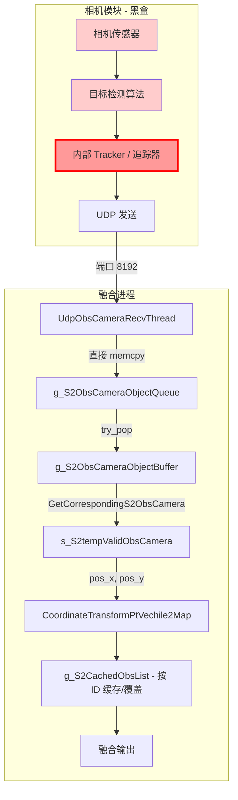

# S2 Camera 数据源追踪问题分析文档

## 一、问题现象回顾

| 帧 | 车辆 Map (X,Y) | 车辆 Heading | 目标 Map (X,Y) | 目标车体 init pos | 车辆MapY - 目标MapY |
|----|---------------|-------------|----------------|-------------------|---------------------|
| 1  | (2.36, 36.67) | -176.15°    | (4.04, 35.13)  | (1.42, 1.78)      | 1.54                |
| 2  | (2.36, 36.58) | -176.29°    | (4.04, 35.05)  | (1.42, 1.78)      | 1.53                |
| 3  | (2.36, 36.48) | -176.42°    | (4.05, 34.95)  | (1.42, 1.78)      | 1.53                |
| 4  | (2.35, 36.38) | -176.52°    | (4.05, 34.86)  | (1.42, 1.78)      | 1.52                |

- 车辆每帧向南移动约 0.10m，Heading 约 -176°（基本朝南）
- **目标在车体坐标系下的 `init pos` 始终为 `[1.42, 1.78]`，完全不变**
- 车辆与目标在 Map 系下的 Y 差几乎恒定（≈1.53m），说明目标是"跟着车走"

---

## 二、数据流链路分析



### 关键节点说明

| 节点 | 位置 | 说明 |
|------|------|------|
| `UdpObsCameraRecvThread` | `comm/messageDeal.cc:554` | UDP 接收线程，将原始字节直接 cast 为 `newS2AviodObject` |
| `iSetS2ObsCameraPacket` | `comm/messageDeal.cc:371` | 将收到的数据推入队列 |
| `g_S2ObsCameraObjectBuffer` | `src/data_buff.cpp:12` | 线程安全列表，存储历史相机数据帧 |
| `GetCorrespondingS2ObsCamera` | `src/fusion_process.cpp:80`（宏展开） | 按时间戳匹配对应帧 |
| `CoordinateTransformPtVechile2Map` | `src/coordinate.cpp:150` | 车体→IMU→Map 转换 |
| `g_S2CachedObsList` | `src/fusion_process.cpp:3643` | 按 obstacle ID 缓存的 `unordered_map` |

---

## 三、数据格式定义

```cpp
// comm/messageDeal.h

struct Point2D {
    float x;
    float y;
};

typedef struct {
    int id;
    float depth;           // X轴长度
    float width;           // Y轴长度
    float height;          // Z轴高度
    float pos_x;           // 中心点 X（假设为车体坐标系）
    float pos_y;           // 中心点 Y（假设为车体坐标系）
    float pos_z;           // 中心点 Z
    Point2D corners[4];    // 二维平面上的4个顶点
} S2obstacleBox;

typedef struct {
    unsigned long long timestamp;
    int return_val;
    int obs_num;
    S2obstacleBox obstacle[20];
} newS2AviodObject;
```

**关键事实：融合代码对 `pos_x`、`pos_y` 没有任何修改或过滤，直接作为车体坐标使用。**

---

## 四、融合侧数据消费逻辑

```cpp
// fusion_process.cpp 约第 3660-3780 行

// 1. 按 lidar 时间戳查对应 camera 帧
newS2AviodObject S2CameraData;
bool bHasCamera = GetCorrespondingS2ObsCamera(pstrLidar->ullTimestamp, &S2CameraData);

// 2. 遍历帧中所有障碍物
for(int i = 0; i < s_S2tempValidObsCamera.obs_num; i++) {
    float pos_x = s_S2tempValidObsCamera.obstacle[i].pos_x;  // ← 直接取原始数据
    float pos_y = s_S2tempValidObsCamera.obstacle[i].pos_y;

    // 3. 车体坐标 → 地图坐标
    CoordinateTransformPtVechile2Map(pos_x, pos_y, pstrLocfusion, &map_pos_x, &map_pos_y);

    // 4. 存入缓存（同 ID 直接覆盖）
    temp_S2CachedObs.init_x = pos_x;  // ← 日志打印的 init pos
    temp_S2CachedObs.init_y = pos_y;
    S2CachedObs temp_S2CachedObs;
    // ...
    g_S2CachedObsList[temp_S2CachedObs.id] = temp_S2CachedObs;  // 同ID覆盖
}
```

---

## 五、根本原因定位

### 5.1 排除融合代码的问题

`CoordinateTransformPtVechile2Map` 函数工作正常。验证方法：车辆与目标在 Map 系下的相对位置差恒定（≈1.53m），说明转换逻辑是正确的——它忠实地将**恒定的车体坐标**按**变化的车辆位姿**转换到了 Map 系。

### 5.2 问题根源：相机模块输出的 `pos_x/pos_y` 不随车辆移动变化

数据流中，从 UDP 接收到最终转换，**没有任何环节修改 `pos_x`、`pos_y` 的值**。`init_x=1.42, init_y=1.78` 就是相机模块直接发给融合进程的原始值。

因此问题一定出在相机模块（黑盒）内部。

---

## 六、相机模块排查方向

### 方向 1：Tracker 锁死位置（最可能）

```
相机模块内部流程推测：
┌──────────┐    ┌──────────┐    ┌──────────────┐
│ 检测算法  │ →  │  Tracker  │ →  │ UDP 输出帧   │
│ 每帧输出  │    │ 维持 ID   │    │ obstacle[i]  │
│ 检测结果  │    │ 关联匹配  │    │ .pos_x,pos_y │
└──────────┘    └──────────────┘    └──────────────┘
```

**如果 Tracker 使用首次关联时的检测位置作为输出位置，后续帧仅更新 ID 关联但不更新位置坐标**，就会出现我们观察到的现象：
- 第一帧检测到墙壁 → 分配 ID=10050，pos=(1.42, 1.78)
- 后续帧匹配到同一墙壁 → 维持 ID=10050，但 pos 仍是 (1.42, 1.78)

**排查方法**：在相机模块侧，对同一 ID 的目标，对比其"原始检测位置"和"Tracker 输出的位置"，确认 Tracker 是否正确更新了位置。

### 方向 2：相机输出坐标系不是瞬时车体系

相机模块可能维护了自己的"局部世界坐标系"（通过视觉 SLAM/里程计），输出的 `pos_x/pos_y` 是该局部世界系下的坐标而非车体系坐标。

**排查方法**：让车辆在空旷场地原地旋转（不移动），观察静态障碍物的 `pos_x/pos_y` 是否变化：
- 如果位置变化 → 说明是车体系（但随着旋转，静态物在车体系下会变）
- 如果位置不变 → 可能是局部世界系或 Tracker 锁死

### 方向 3：相机模块的 UDP 发送未更新

检查相机模块的 UDP 发送代码，确认 `obstacle[i].pos_x` 和 `obstacle[i].pos_y` 确实是每帧从最新检测结果中赋值的，而不是从某个缓存结构体中拷贝。

### 方向 4：相机模块的坐标系定义与融合侧不一致

确认相机模块输出的坐标原点、坐标轴方向是否与融合侧假定的"车体系"一致：
- 融合侧假设：x 向前，y 向左，原点在车辆后轴中心（或其他约定的参考点）
- 相机模块的实际输出坐标系可能不同

---

## 七、建议的排查日志

在相机模块侧（如果可以修改）添加以下日志，对比同一 ID 的每帧输出：

```cpp
// 伪代码 - 在相机模块的 Tracker 输出处添加
for each tracked_object:
    LOG("TRACKER: id=%d, raw_det_x=%.2f, raw_det_y=%.2f, tracked_x=%.2f, tracked_y=%.2f, frame=%d",
        obj.id, obj.raw_detection.x, obj.raw_detection.y,
        obj.tracked_position.x, obj.tracked_position.y, frame_count);
```

如果观察到 `tracked_x/y` 不变而 `raw_det_x/y` 在变化，就确认了 **Tracker 锁死位置**。

在融合侧，额外添加对 `corners[4]` 的日志：

```cpp
LOG_RAW("obstacle id=%d, pos=(%.2f, %.2f), corners: (%.2f,%.2f) (%.2f,%.2f) (%.2f,%.2f) (%.2f,%.2f)\n",
    s_S2tempValidObsCamera.obstacle[i].id, pos_x, pos_y,
    pt0.fX, pt0.fY, pt1.fX, pt1.fY, pt2.fX, pt2.fY, pt3.fX, pt3.fY);
```

如果 `corners` 也在随帧不变，则进一步确认相机模块整体输出没有更新；如果 `corners` 在变但 `pos` 不变，则说明是 Tracker 中心点未更新。

---

## 八、可能的修复方案（供后续参考）

| 方案 | 描述 | 适用场景 |
|------|------|---------|
| A. 让相机模块输出原始检测位置 | 绕过 Tracker，直接使用每帧检测结果的位置 | Tracker 锁死位置 |
| B. 融合侧做 ego-motion 补偿 | 对 `g_S2CachedObsList` 中未刷新的目标，用车辆位移反推其当前车体坐标 | 相机模块无法修改 |
| C. 让相机模块输出 Map 系坐标 | 如果相机有定位信息，直接输出 Map 坐标，跳过融合侧转换 | 相机有自身定位 |
| D. 不使用缓存，每帧全量输出 | 不依赖 `g_S2CachedObsList` 跨帧保持目标 | 相机帧率足够高 |

---

## 九、总结

```
问题链路：
相机模块 Tracker 输出恒定位置
  → UDP 字节流中 pos_x/pos_y 恒定
    → GetCorrespondingS2ObsCamera 取出恒定值
      → CoordinateTransformPtVechile2Map(恒定值, 变化的车辆位姿)
        → Map 坐标随车辆漂移 ❌
```

**下一步行动**：到相机模块的代码中，确认 Tracker 在关联到已存在目标时，是否正确更新了输出帧中 `obstacle[i].pos_x` 和 `obstacle[i].pos_y` 的值为最新检测结果的位置。
