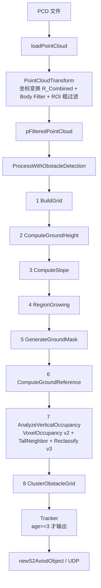

# 低矮障碍物漏检诊断工具（Diagnostic / Verification Tool）设计方案

> 版本：v1.0（设计阶段，未改算法）
> 原则：**复用现有 C++ 检测代码 → 记录中间状态 → Python 只做分析/汇总/可视化**
> 第一阶段目标：**看清"现在为什么漏检"，而不是"改算法让它检出来"。**

---

## 0. 结论摘要（TL;DR）

我通读了 `ElevationMapGroundFilter.h/.cpp`、`SuTengDriver.cpp`、`main.cpp`、
`ReadYamlFile.h/.cpp`、`Type.h`、`debug_config.yaml` 以及你放在根目录的
`(待排查)行进间roi_min_x的地方有一个障碍物.txt` 日志，结论如下：

1. **你项目里的真实 pipeline 与你的描述基本一致**，但有几个**和你例子不一致的硬编码/配置值**，诊断工具必须按真实值输出（详见 §2.4）：
   - `min_occupied_layers_obstacle = 1`（**不是 2**，头文件默认值，YAML 与 Init() 都没改）；
   - 有效 ROI X 起点 = **0.9 m**（`car_half_x=0.8 + body_filter_x_threshold=0.1`），所以"车前 0~4 m"实际是 `[0.9, 4.0] m`；
   - `near_range_boundary = 2.0 m`（你日志里旧版是 3.0 m）；
   - `layer_resolution = 0.05 m`、`kMinHeightRange = 0.02 m`（硬编码，不可配）；
   - Ground Reference 的 fallback 高度 = `-1.39 m`（来自 lidar.cfg 的 `fGroundHeight`）。

2. **好消息：GridCell 里已经几乎存齐了你需要的所有中间量**
   （`valid/min_z/max_z/mean_z/point_num/is_ground/height_range/occupied_layers/
   ground_reference_z/top_height/is_obstacle_candidate/is_vertical_structure/obstacle_label`），
   且 `GetGrid()` 已公开。**这意味着"每个 cell 的生命过程"绝大部分可以不改检测代码直接导出。**

3. **必须补的"唯一缺口"是每个 cell 的"失败原因/逐条判定记录"**
   （top/range/layers 各条件 actual vs threshold、TallNeighbor 是否取消、是否进 final cluster）。
   这个需要**最小侵入式**地在 `AnalyzeVerticalOccupancy()` / `TallNeighborFilter` /
   `ClusterObstacleGrid()` 里加 3 处记录代码（§6）。

4. 建议目录结构与命令（§7、§10）：
   ```
   tools/LowObstacleDiagnostic.cpp/.h      ← C++ 复用真实算法 + 导出中间态
   tools/diagnose_low_obstacle.py          ← Python 分析/汇总/可视化
   build/low_detection_diagnostic          ← 独立可执行
   ```

---

## 1. 当前真实 Pipeline（代码级）

以下流程全部来自 `include/ElevationMapGroundFilter.cpp` 与
`include/SuTengDriver.cpp`（PCD 模式走 `SutengDriver::Start()` → `ProcessWithObstacleDetection`）。



### 1.1 每一步在代码里的真实位置与行为

| # | Stage | 函数 | 关键行为（代码级） |
|---|-------|------|--------------------|
| 0 | 坐标变换+预过滤 | `SutengDriver::PointCloudTransform` | `dst.x <= expand_x(0.9) → 丢弃`；`dst.x >= roi_x_max(8.0) → 丢弃`；`dst.y <= roi_y_min(-3.0) / >= roi_y_max(3.0) → 丢弃`。**这是第一道过滤，0~0.9m 目标在此已被剔除。** |
| 1 | 建 Grid | `BuildGrid` | `WorldToGrid` 再次 ROI 过滤（`x∈[0.9,8)`、`y∈[-3,3)`）；`valid = point_num >= min_points_per_cell(=1)`；统计 `min_z/max_z/mean_z/point_num`。 |
| 2 | 地面高度 | `ComputeGroundHeight` | 占位函数，实际用 `min_z`（BuildGrid 已算）。 |
| 3 | 坡度 | `ComputeSlope` | 8 邻域 `max|Δz|/dist` 存 `cell.slope`。 |
| 4 | 区域生长 | `RegionGrowing` | 种子 = 前 3 列 `x∈[0.9,1.2)`；扩展条件（**skip>0 跨越逻辑已被注释，实际只做 skip=0**）：`valid && label==-1 && point_num>=1 && slope<=GetDynamicSlopeThreshold(cx) && |Δz|<=GetDynamicHeightDiffThreshold(cx)`。 |
| 5 | Ground Mask | `GenerateGroundMask` | `is_ground = valid && label>=0`。 |
| 6 | Ground Reference | `ComputeGroundReference` | 每列 ground cell `min_z` 中位数 → 无效列插值 → 全无时 fallback `-1.39` → 3 点滑动平滑（**无条件平滑所有列，含插值列**）→ 写回 `ground_reference_z`，并算 `top_height = max_z - ground_reference_z`。 |
| 7 | Voxel Occupancy v2 | `AnalyzeVerticalOccupancy` | ①`height_range=max_z-min_z`；②构建 `layer_histogram`（`layer_res=0.05`）；③`occupied_layers`；④Rule 0 `top_height<0`→跳过；⑤Rule 1 竖直结构 `height_range>0.5 && occ<=3`；⑥Rule 2 候选判定（详见 §2.1）；⑦TallNeighborFilter；⑧`ReclassifyPointCloud` v3（margin=0.05）。 |
| 8 | 聚类 | `ClusterObstacleGrid` | 8 邻域 BFS 连通 `is_obstacle_candidate`；`cluster_cells.size() < min_cluster_cells(3)` 的簇**不输出**。 |
| 9 | 跟踪 | `SuTengDriver` 的 `m_tracker` | `age < 3` 的轨迹不输出（`ProcessWithObstacleTracking` 内的 SimpleTracker 实际被注释，驱动用自己的 tracker）。 |

---

## 2. 决定"漏检"的关键判定（真实代码 + 真实参数值）

### 2.1 Voxel Occupancy Rule 2 —— 候选判定的真实代码

`AnalyzeVerticalOccupancy()` 第二遍遍历中的判定（顺序即代码顺序）：

```cpp
// 先确定分段（near/far），依据 cell 中心 x 与 near_range_boundary
if (cx < near_boundary)  { top_min=min_near; top_max=max_near; }
else                     { top_min=min_far;  top_max=max_far;  }

bool top_ok   = (cell.top_height >= top_min && cell.top_height <= top_max);
bool range_ok = (cell.height_range >= kMinHeightRange);   // kMinHeightRange = 0.02f 硬编码
bool layers_ok = (cell.occupied_layers >= min_occupied_layers_obstacle);

if (top_ok && range_ok && layers_ok) cell.is_obstacle_candidate = true;
```

> 注意：先判 `top_ok` → 再 `range_ok` → 再 `layers_ok`。这就是"第一失败点"应该采用的顺序（与你的需求 §九 一致）。

### 2.2 当前生效的**真实**参数（我核实过，非猜测）

| 参数 | 真实值 | 来源 |
|------|--------|------|
| `roi_x_min` / `roi_x_max` | 0.0 / 8.0 | debug_config.yaml |
| 有效 ROI X 起点 `m_effective_roi_x_min` | **0.9** | `max(roi_x_min, car_half_x+body_filter_x_threshold)=max(0, 0.8+0.1)` |
| `roi_y_min` / `roi_y_max` | -3.0 / 3.0 | debug_config.yaml |
| `grid_resolution` | 0.1 m | debug_config.yaml |
| `slope_threshold` / `height_diff_threshold` | 0.35 / 0.35 | debug_config.yaml |
| `min_points_per_cell` | 1 | debug_config.yaml |
| `car_half_x` / `car_half_y` | 0.8 / 0.4 | debug_config.yaml |
| `body_filter_x_threshold` | 0.1 | debug_config.yaml |
| `obstacle_top_height_min_near` / `max_near` | 0.10 / 0.40 | debug_config.yaml |
| `obstacle_top_height_min_far` / `max_far` | 0.0 / 0.50 | debug_config.yaml |
| `near_range_boundary` | **2.0** | debug_config.yaml（你旧日志 3.0） |
| `layer_resolution` | **0.05** | 头文件默认（不可配） |
| `min_occupied_layers_obstacle` | **1** | 头文件默认（**不是 2！** YAML/Init 都没覆盖） |
| `kMinHeightRange`（Rule2 range 阈值） | **0.02** | `AnalyzeVerticalOccupancy` 内 `constexpr`（硬编码） |
| `vertical_structure_height_min` | 0.5 | 头文件默认 |
| `max_occupied_layers_vertical` | 3 | 头文件默认 |
| `enable_tall_neighbor_filter` | true | 头文件默认 |
| `min_tall_neighbors_for_filter` | 2 | 头文件默认 |
| Tall 邻居高度阈值 | 0.5（=`obstacle_top_height_max_far`） | 代码 |
| `min_cluster_cells` | 3 | 头文件默认 |
| Ground Ref fallback | **-1.39** | lidar.cfg `fGroundHeight`（T05） |
| Reclassify margin | 0.05（=`layer_resolution`） | 代码 |

### 2.3 动态（随距离变化）阈值 —— 诊断必须按目标 x 区分

`RegionGrowing` 扩展时使用**邻居 cell 中心 x** 的动态阈值：

```cpp
// GetDynamicSlopeThreshold(x)
x < 3.5          → slope_threshold            = 0.35
x > roi_x_max    → 0.80
否则             → slope_threshold + (x - slope_threshold)*0.1   // ⚠ 注意：x=3.5 处不连续（疑似笔误）

// GetDynamicHeightDiffThreshold(x)
x < 3.5          → height_diff_threshold      = 0.35
x > roi_x_max    → 0.60
否则             → 0.35 + (x-3.5)*(0.60-0.35)/(8.0-3.5)         // 连续
```

诊断报告必须对目标区间的中心 x 打印"该位置实际使用的 slope/height_diff 阈值"，
**不能只打印全局阈值**（满足需求 §十八）。

### 2.4 与"你举的例子"不一致的地方（重要！）

| 你的描述 | 代码真实值 | 影响 |
|----------|-----------|------|
| `occupied_layers >= 2` | **`>= 1`** | 你例子里 `occupied_layers=1` 实际**会 PASS**，说明你那个 6cm 盒子的真正失败点在别处 |
| "车前 0~4 m" | 有效 ROI 从 **0.9 m** 开始 | 0~0.9 m 的目标在 `PointCloudTransform` 就被删 |
| 例子里 `top_height >= 0.05` | near 区间 min 是 **0.10**；far 区间 min 是 **0.0** | 阈值随 x 分段，不能写死 |
| `layer_resolution 0.05m` | 一致 | — |

> 结论：诊断工具必须**读真实配置 + 真实 cell 特征值**输出，绝不能照抄示例。

---

## 3. 每一步"现在已有 / 需要补充"的信息盘点

| Stage | 已有变量（真实） | 是否已有该信息 | 需要补充的 Debug 信息 |
|-------|-----------------|----------------|----------------------|
| Input / 预处理 | 点数、被 `PointCloudTransform` 删掉的点数 | ❌ 未统计 | 目标 ROI 内点数（原始 vs 进入 Grid） |
| BuildGrid | `cell.valid / point_num / min_z / max_z / mean_z` | ✅ 有 | 目标 ROI 覆盖哪些 cell；每个 cell 的 `(row,col)`、中心坐标 |
| ComputeSlope | `cell.slope` | ✅ 有 | 目标 cell 的动态 slope 阈值 |
| RegionGrowing | `cell.label`（>=0 表示被地面扩展） | ✅ 有 | 目标 cell 是否被扩展为地面、被哪条门控拦下 |
| GroundMask | `cell.is_ground` | ✅ 有 | — |
| GroundReference | `cell.ground_reference_z / top_height`；逐列中位数、插值、fallback 逻辑 | ⚠ 只有最终值 | ①该列 ground 参考来源（真实 cell 数 / 中位数 / 插值 / fallback）；②**目标区是否参与了本列 ground 中位数计算（污染告警）**；③平滑前 vs 平滑后 |
| VoxelOcc Rule0/1/2 | `height_range / occupied_layers / is_vertical_structure / is_obstacle_candidate` | ✅ 值有；❌ **缺"哪条没过 + actual vs threshold"** | 每条判定 `PASS/FAIL` + actual + threshold + FIRST_FAILURE |
| TallNeighbor | `is_obstacle_candidate` 是否被改回 false | ❌ 只记了计数日志 | 被取消的 cell：tall 邻居数、邻居 top_height、阈值 |
| Cluster | `obstacle_label`、`clusters[i].cell_indices` | ✅ 可推导 | 小簇被 `min_cluster_cells` 丢弃的 cell 集合（obstacle_label>=0 但不在最终簇） |
| Reclassify | ground_cloud / obstacle_cloud 点数 | ✅ 有 | 目标 ROI 内点被分到哪类 |
| Tracker | `age` | ✅ 有 | 目标簇是否因 age<3 未输出（属于最终输出层，非 cell 层） |

**结论：真正的缺口只有 3 处 ——**
1. Rule 2 的逐条 PASS/FAIL 记录；
2. TallNeighbor 取消原因（tall 邻居数）；
3. "被小簇过滤"的 cell 标记（final_obstacle）。

---

## 4. DiagnosticRecord 设计（基于真实 GridCell）

直接对现有 `GridCell` 做**派生包装**（不破坏原结构），新增一个诊断记录结构：

```cpp
// tools/LowObstacleDiagnostic.h
struct CellDiagnostic
{
    // —— 直接从真实 GridCell 拷贝（不重算）——
    int  row, col;              // grid 坐标（row→Y, col→X）
    float x_min, x_max;         // cell 四角世界坐标（由分辨率推导）
    float y_min, y_max;
    int  point_count;           // cell.point_num

    // —— 真实算法输出的特征值 ——
    bool  valid;                // cell.valid
    float min_z, max_z;         // cell.min_z / max_z
    float ground_reference_z;   // cell.ground_reference_z
    bool  is_ground;            // cell.is_ground
    float top_height;           // cell.top_height
    float height_range;         // cell.height_range
    int   occupied_layers;      // cell.occupied_layers
    bool  vertical;             // cell.is_vertical_structure
    bool  obstacle_candidate;   // cell.is_obstacle_candidate
    int   obstacle_label;       // cell.obstacle_label（聚类访问标记）

    // —— 诊断追加字段（需要 §6 的 3 处最小记录）——
    bool  final_obstacle;       // 是否属于最终输出的 cluster
    int   final_cluster_id;     // 属于哪个最终簇
    bool  cancelled_by_tall_neighbor;  // 是否被 TallNeighbor 取消
    int   tall_neighbor_count;         // 取消时统计到的 tall 邻居数

    // —— 逐条判定审计（每条 = 条件名 + actual + threshold + PASS/FAIL）——
    struct Check { std::string name; float actual; float threshold; bool pass; };
    std::vector<Check> checks;  // 按代码执行顺序排列

    // —— 生命周期阶段结论 ——
    std::string lost_at_stage;  // 第一失败点：InputFilter/GridValid/...
    std::string primary_reason; // 主失败条件名
    std::vector<std::string> secondary_reasons;
};
```

> 关键设计原则：`CellDiagnostic` 里的特征值（top_height / height_range / occupied_layers /
> ground_reference_z / is_ground...）**全部直接拷贝真实算法结果**，诊断工具**不做任何重算**；
> 诊断工具只把"特征值 vs 阈值"的布尔比较**重放一遍用于逐条审计**（这部分是纯比较，重放不改变算法行为，且阈值来源 = 同一份 `ElevationGridConfig`）。

---

## 5. 诊断工具目录结构

```
tools/
├── LowObstacleDiagnostic.h        # CellDiagnostic 结构 + CLI 参数定义
├── LowObstacleDiagnostic.cpp      # 主程序：读PCD→变换→复用真实算法→收集诊断→输出
└── diagnose_low_obstacle.py       # Python 分析器：读 JSON/CSV → 统计 → 可视化 → report.md

# 输出目录（默认 ./diagnostic_output/<frame名>/）
diagnostic_output/
├── report.txt                     # 人类可读全量报告
├── report.md                      # 汇总报告（Python 生成）
├── diagnostic.json                # 结构化数据（Python/agent 读取）
├── cell_diagnostic.csv            # 每个 cell 一行（含 fail_reason）
├── ground_mask.csv
├── obstacle_candidate.csv
├── final_obstacle.csv
├── diagnostic_top_view.png        # 俯视图：地面/候选/最终/被滤疑似/ROI
└── diagnostic_height.png          # top_height 高度图
```

---

## 6. 最小侵入式代码修改清单（第一阶段只做这些）

> 目的：**不改任何判定阈值，不改算法逻辑**，只加"记录/导出"。

### 修改 1（必做）：`ElevationMapGroundFilter.h`

在 `GridCell` 末尾追加 4 个**诊断用字段**（默认值不改变任何现有行为）：

```cpp
// ---- Diagnostic 追加（默认关闭，不影响在线性能）----
std::vector<std::string> diag_checks;   // 逐条 PASS/FAIL 文本（或存结构化）
bool  cancelled_by_tall_neighbor = false;
int   tall_neighbor_count = 0;
bool  final_obstacle = false;
```

> 可选更优：把 `kMinHeightRange=0.02` 提升为 `ElevationGridConfig` 字段
> `float min_height_range_obstacle = 0.02f;`，让工具能读到真实阈值（**不改数值，只改来源**）。

### 修改 2（必做）：`AnalyzeVerticalOccupancy()` Rule 2 处记录

在 `top_ok / range_ok / layers_ok` 判断处，追加（约 10 行）：

```cpp
cell.diag_checks.clear();
char buf[128];
snprintf(buf,sizeof(buf),"top_height: actual=%.3f th=[%.2f,%.2f] %s",
         cell.top_height, top_min, top_max, top_ok?"PASS":"FAIL");
cell.diag_checks.emplace_back(buf);
snprintf(buf,sizeof(buf),"height_range: actual=%.3f th=%.2f %s",
         cell.height_range, kMinHeightRange, range_ok?"PASS":"FAIL");
cell.diag_checks.emplace_back(buf);
snprintf(buf,sizeof(buf),"occupied_layers: actual=%d th=%d %s",
         cell.occupied_layers, min_occupied_layers_obstacle, layers_ok?"PASS":"FAIL");
cell.diag_checks.emplace_back(buf);
```

（Rule 0 / Rule 1 命中时也各写一条，例如 `"RULE0 depressed: top_height<0"`、`"RULE1 vertical_structure"`。）

### 修改 3（必做）：TallNeighborFilter 处记录

取消候选时已有 `tall_neighbor_count`，加两行：

```cpp
cell.cancelled_by_tall_neighbor = true;
cell.tall_neighbor_count = tall_neighbor_count;
```

### 修改 4（必做）：`ClusterObstacleGrid()` 记录 final_obstacle

输出簇构建后，把簇内 cell 标记为 final：

```cpp
for (int idx : cluster.cell_indices) m_vGridCell[idx].final_obstacle = true;
```

### 修改 5（建议）：新增导出接口（不改算法）

```cpp
// ElevationMapGroundFilter.h 追加（实现可直接在 .cpp 末尾，独立、无侵入）
std::vector<CellDiagnostic> ExportCellDiagnostics(
    const std::vector<GridCluster>& clusters) const;   // 组装 §4 的结构
```

### 明确**不**修改

- `min_occupied_layers_obstacle / obstacle_top_height_* / slope_threshold / height_diff_threshold`
  等所有检测阈值；
- `RegionGrowing / ComputeGroundReference / Reclassify` 任何判定逻辑；
- 动态阈值公式（`GetDynamicSlopeThreshold` 的 3.5m 不连续问题先记录、不改）。

---

## 7. 诊断工具工作流程（Mode A + Mode B）

```
C++ 端（复用真实代码）
  1) 解析 CLI：--pcd --yaml(可选) --lidarcfg(可选) --xmin/--xmax/--ymin/--ymax (ROI)
                --target-xmin/--target-xmax/--target-ymin/--target-ymax (目标区，可选)
                --json <path> --outdir <dir> --topview/--heightmap/--csv 开关
  2) 加载 PCD（pcl::io::loadPCDFile）
  3) 用与 SuTengDriver 完全一致的 R_Combined 变换 + Body Filter（复用同一份变换代码）
  4) 构造 ElevationGridConfig（读 debug_config.yaml + lidar.cfg，同 Init() 逻辑）
  5) 创建 ElevationMapGroundFilter，调用 ProcessWithObstacleDetection（真实算法）
  6) 调用 ExportCellDiagnostics() 收集全部 cell 诊断
  7) 输出：report.txt / *.csv / diagnostic.json / top_view.png / height.png

Python 端（只做分析，不重算）
  8) 读 diagnostic.json → 按目标 ROI 提取
  9) 自动判定 FIRST_FAILURE / PRIMARY / SECONDARY
 10) 生成 report.md + 统计（失败原因分布、参数告警）
```

### Mode A：指定 ROI（必做）

```
./low_detection_diagnostic --pcd frame_001.pcd \
    --target-xmin 0 --target-xmax 4 \
    --target-ymin -4 --target-ymax 4
```
输出目标 ROI 内每个 cell 的完整生命过程 + 逐条判定 + FIRST_FAILURE。

### Mode B：自动发现疑似漏检区域（第二阶段实现）

扫描所有 cell：`top_height >= 阈值(如 0.02)` 且 `!is_obstacle_candidate` 且 `!is_ground`（或 Mixed），
按连通域聚成 region，逐个报告"高了 X cm 却未成候选/未成簇 + 失败原因"。

---

## 8. 输出格式（对齐你的需求）

### 8.1 每 cell 判定（actual / threshold / result）

```
top_height:
    actual    = 0.041 m
    threshold = [0.100, 0.400] m   (NEAR band, cx=1.9 < near_boundary=2.0)
    result    = FAIL

height_range:
    actual    = 0.009 m
    threshold = 0.020 m
    result    = FAIL

occupied_layers:
    actual    = 1
    threshold = 1
    result    = PASS          ← 注意：真实阈值是 1，不是 2！
```

### 8.2 FIRST_FAILURE（按真实代码执行顺序）

Rule 2 内顺序 = `top → range → layers`；此前还有 Rule 0/1 与 Grid 有效性。

```
TARGET LOST AT: Voxel Occupancy (Rule 2)

FIRST FAILURE:
    height_range

SECONDARY:
    occupied_layers   (若实际 < 阈值)

PRIMARY REASON:
    height_range = 0.009 m < 0.020 m
```

### 8.3 Ground Reference 溯源 + 污染告警

```
Cell(row=37, col=49)  x=[4.85,4.95] y=[0.45,0.55]
    min_z = -1.263
    max_z = -1.204
    ground_reference_z = -1.263
    top_height = 0.059 m

Ground Reference 来源:
    列 col=49（x≈4.9m）共 40 个 ground cell
    median(min_z) = -1.263   (真实 cell 数: 40)
    状态: 真实中位数（非插值 / 非 fallback）
    平滑后: -1.262（3 点滑动窗口）

[WARNING] 目标区 cell 的 min_z(-1.263) 参与/接近本列 ground 中位数集合 →
    若该 cell 其实属于障碍物且被 RegionGrowing 误标为 ground，则 Ground Reference 被污染。
```

### 8.4 决策表 + Stage Summary + 失败分类（§十四~十九）

决策表：逐行 `条件 | actual | threshold | PASS/FAIL`；
Stage Summary：目标 ROI 在各阶段的点数/cell 数 + `TARGET LOST AT` 勾选；
失败分类：`PointCloudFiltering / InvalidCell / GroundRefContamination / GroundClassification /
TopHeightThreshold / HeightRangeThreshold / OccupiedLayerThreshold / TallNeighbor /
Reclassify / ClusterSizeFilter / ClusterHeightFilter / FinalROIFilter`（多标签）。

---

## 9. 可视化（§十三）

- `diagnostic_top_view.png`：X-Y 俯视图，颜色约定
  - Ground cell = 绿；Obstacle Candidate = 黄；Final Obstacle = 红；
  - 被滤疑似（top_height 高但未成候选）= 橙；Invalid = 灰；
  - ROI / 目标区 = 矩形框；坐标轴 + 刻度。
- `diagnostic_height.png`：`top_height`（或 `top_height - ground_ref`）热力图，
  直观看出 1~2cm / 5cm / 10cm / 判定为障碍物的分界。

可直接复用现有 `DebugViewer` 的 `WorldToPixel` 约定（x→col, y→row, scale 像素/米），
在诊断工具里新增这两张定制图（不改 DebugViewer）。

---

## 10. 最终命令（第一阶段可执行版）

```bash
# 构建
cd /home/zyl/echiev_low_lidar_detection
mkdir -p build && cd build
cmake .. && make low_detection_diagnostic -j

# Mode A：指定目标 ROI（车前 0~4m，横向 ±4m）
./low_detection_diagnostic \
    --pcd  ../iii_开始位置不能识别到.pcd \
    --yaml ../config/debug_config.yaml \
    --target-xmin 0 --target-xmax 4 \
    --target-ymin -4 --target-ymax 4 \
    --json diagnostic.json \
    --outdir diagnostic_output

# 只给具体小目标区（不手工挑点，只看结果）
./low_detection_diagnostic \
    --pcd  ../left_bottle.pcd \
    --target-xmin 4.5 --target-xmax 5.5 \
    --target-ymin 0.4 --target-ymax 0.8

# Python 汇总
python3 tools/diagnose_low_obstacle.py \
    --json diagnostic_output/diagnostic.json \
    --out diagnostic_output
```

> 说明：PCD 若已是车体坐标系（你线上保存的 `SavePcd(pFilteredPointCloud)`），
> 可加 `--no-transform` 跳过坐标变换；否则用 `--yaml`+`--lidarcfg` 复现驱动里的变换。

---

## 11. 第一阶段落地顺序（建议）

1. **§6 修改 1~5**（约 30 行，只加记录/导出，不动阈值）→ 编译通过，验证 `ExportCellDiagnostics`。
2. **`LowObstacleDiagnostic.cpp`**：先只做 Mode A + report.txt + JSON + CSV。
3. **`diagnose_low_obstacle.py`**：读 JSON → 决策表 / FIRST_FAILURE / Stage Summary / report.md。
4. **可视化两张图**（复用 DebugViewer 约定）。
5. 用你现有 `left_bottle.pcd / iii_开始位置不能识别到.pcd / (待排查)` 场景回归验证。
6. 再讨论 **Mode B 自动发现**，以及是否要针对"低矮平面单层目标"调整 `occupied_layers` 设计。

---

## 12. 附：设计时发现的"值得记录但先不改"的问题

- `GetDynamicSlopeThreshold` 在 `x=3.5` 处不连续（公式 `slope_threshold+(x-slope_threshold)*0.1` 疑似笔误，应可能是 `slope_threshold+(x-3.5)*斜率`）。
- `ComputeGroundReference` 的 3 点平滑**无条件作用于所有列**（包括插值列/fallback 列），可能把 fallback 值拉进真实列。
- 种子区域 `x∈[0.9,1.2)` 是"0~4m 漏检"的最危险区间：障碍物若落在这里会被直接标为 ground，从而污染该列 Ground Reference。
- `PointCloudTransform` 里 `dst.x <= 0.9` 直接丢弃，意味着"车前 0~0.9m"任何目标都进不了 Grid（诊断报告应明确给出这条）。
- 诊断工具所有"阈值 vs actual"必须来自**真实配置对象**，禁止硬编码示例数值。
